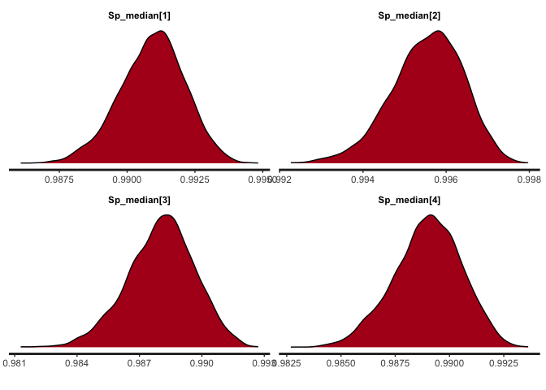

<!-- README.md is generated from README.Rmd. Please edit that file -->

# LCtesterror

<!-- badges: start -->
<!-- badges: end -->

The goal of LCtesterror is to estimate true prevalence from test data
accounting for unknown test error.

## Installation

You can install the development version of LCtesterror from
[GitHub](https://github.com/) with:

``` r
# install.packages("pak")
pak::pak("bristol-vaccine-centre/LCtesterror")
```

<!-- Need to render `README.Rmd` regularly, to keep `README.md` up-to-date. `devtools::build_readme()` is handy for this. 
If adding plots need to commit and push resulting figure files, so they display on GitHub and CRAN.
-->

## Example

Example:

``` r
library(LCtesterror)

 # Example (no test dependence, delay, or time included)

 # Simulate data
 sim_data <- sim.test.data(sim_size = 2000)
 
 # Simulated input parameters
 sim_data$test_parameters
#> # A tibble: 4 × 12
#>   test_id  sens  spec p_performed sens_sim disease_prev_sim test_positivity_sim test_coverage_sim
#>   <chr>   <dbl> <dbl>       <dbl>    <dbl>            <dbl>               <dbl>             <dbl>
#> 1 test1    0.99  0.99         1       0.99            0.214               0.220             1    
#> 2 test2    0.99  0.99         1       0.99            0.214               0.22              1    
#> 3 test3    0.98  0.98         0.8     0.98            0.214               0.217             0.799
#> 4 test4    0.98  0.98         0.8     0.98            0.214               0.227             0.792
#> # ℹ 4 more variables: disease_prev_RG_est <dbl>, overall_test_positivity_sim <dbl>, CI_lower <dbl>,
#> #   CI_upper <dbl>
 # Simulated true prevalence = 21.4%
 
 # Simulated test data
 head(sim_data$test_results)
#> # A tibble: 6 × 4
#>   test1 test2 test3 test4
#>   <dbl> <dbl> <dbl> <dbl>
#> 1     0     0    NA     0
#> 2     1     1    NA     1
#> 3     0     0     0     0
#> 4     0     0     0     0
#> 5     0     0    NA     0
#> 6     0     0     0    NA

# Run LC model using simulated test results to correct prevalence for test error
 fit <- run.LC.model(sim_data$test_results, num_tests = 4,
                       data_ID = "sim", model_name = "basic_sim",
                      dependency_groups = NULL, covariates = NULL,
                      iter=1000, chains=2, warmup=500)

 # View model outputs
 
 # Estimated prevalence
 fit$prev_mean
#> [1] "Mean prevalence: 21.4% (19.7-23.1%)"
 # The model correctly infers the simulated true prevalence
 
 # Estimated test sensitivity and specificity 
 fit$median_sens
#>                   mean      2.5%     97.5%
#> Se_median[1] 0.9862711 0.9753424 0.9946353
#> Se_median[2] 0.9902276 0.9807191 0.9969116
#> Se_median[3] 0.9860896 0.9739121 0.9949169
#> Se_median[4] 0.9877264 0.9752683 0.9957281
 fit$median_spec
#>                   mean      2.5%     97.5%
#> Sp_median[1] 0.9909367 0.9868193 0.9945893
#> Sp_median[2] 0.9922001 0.9882796 0.9953926
#> Sp_median[3] 0.9875901 0.9816856 0.9922411
#> Sp_median[4] 0.9813921 0.9746555 0.9871493
 
 # Stan model traceplots
 fit$traceplots
#> $traceplot_lp_warmup
```


    #> 
    #> $traceplot_lp


    #> 
    #> $stan_dens_prev


    #> 
    #> $stan_dens_Se_mean


    #> 
    #> $stan_dens_Sp_mean


    #> 
    #> $stan_dens_Se_median


    #> 
    #> $stan_dens_Sp_median



    #> Using LCtesterror version: 0.0.0.9000
