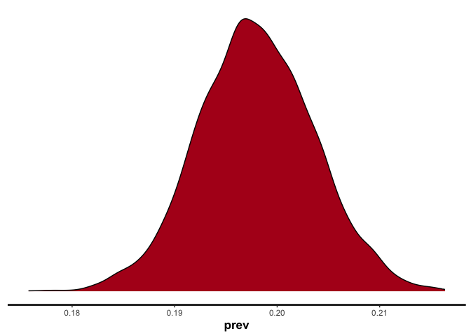
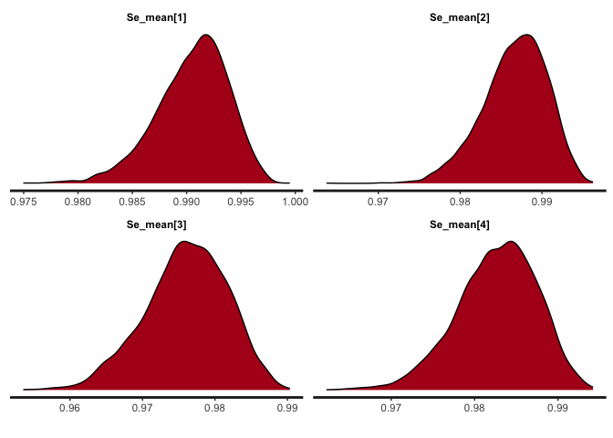

<!-- README.md is generated from README.Rmd. Please edit that file -->

# LCtesterror

<!-- badges: start -->
<!-- badges: end -->

The goal of LCtesterror is to estimate true prevalence from test data
accounting for unknown test error.

## Installation

You can install the development version of LCtesterror from
[GitHub](https://github.com/) with:

``` r
# install.packages("pak")
pak::pak("bristol-vaccine-centre/LCtesterror")
```

<!-- Need to render `README.Rmd` regularly, to keep `README.md` up-to-date. `devtools::build_readme()` is handy for this. 
If adding plots need to commit and push resulting figure files, so they display on GitHub and CRAN.
-->

## Example

Example:

``` r
library(LCtesterror)
 # Example (no test dependence, delay, or time included)
 # Simulate data
 sim_data <- sim.test.data(sim_size = 100)

# Run LC model using simulated test results to correct prevalence for test error
 fit <- run.LC.model(sim_data$test_results, num_tests = 4,
                       data_ID = "sim", model_name = "basic_sim",
                      dependency_groups = NULL, covariates = NULL,
                      iter=1000, chains=1, warmup=500)
#> [1] "test_names: 1, 2, 3, 4"
#> [1] "col_names_data: Individuals, test1, test2, test3, test4"
#> [1] "col_names_defined: N, 1, 2, 3, 4"
#> [1] "col_names: N, 1, 2, 3, 4"
#> [1] "numeric_cols: 1, 2, 3, 4"
#> [1] "test_result_data_long:"
#> # A tibble: 400 × 3
#>        N T         y
#>    <int> <chr> <dbl>
#>  1     1 1         0
#>  2     1 2         0
#>  3     1 3         0
#>  4     1 4         0
#>  5     2 1         1
#>  6     2 2         1
#>  7     2 3         1
#>  8     2 4         1
#>  9     3 1         0
#> 10     3 2         0
#> # ℹ 390 more rows
#> [1] "test_data_long (no delay data):"
#> # A tibble: 400 × 3
#>        N T         y
#>    <int> <chr> <dbl>
#>  1     1 1         0
#>  2     1 2         0
#>  3     1 3         0
#>  4     1 4         0
#>  5     2 1         1
#>  6     2 2         1
#>  7     2 3         1
#>  8     2 4         1
#>  9     3 1         0
#> 10     3 2         0
#> # ℹ 390 more rows
#> [1] "test_data_long (after removing NAs):"
#> # A tibble: 353 × 3
#>        N T         y
#>    <int> <chr> <dbl>
#>  1     1 1         0
#>  2     1 2         0
#>  3     1 3         0
#>  4     1 4         0
#>  5     2 1         1
#>  6     2 2         1
#>  7     2 3         1
#>  8     2 4         1
#>  9     3 1         0
#> 10     3 2         0
#> # ℹ 343 more rows
#> [1] "valid_groups: "
#> [1] "num_valid_groups: 0"
#> [1] "G: 0"
#> [1] "b_index: 0, 0, 0, 0"
#> [1] "add_dependency: FALSE"
#> [1] " dependency_group_existence: 0, 0, 0, 0"
#> [1] "\n  data {\n    int<lower=1> T; // Number of different tests\n    int<lower=1> N; // Number of individuals\n    int<lower=1> O; // Number of observations\n    array[O] int<lower=1, upper=T> tt; // Test index for each observation\n    array[O] int<lower=0, upper=1> y; // Test results (0/1)\n    int s[N]; // Number of tests per individual\n\n  // Dynamic prior parameters for sens/spec\n  real<lower=0> alpha_spec[T];\n  real<lower=0> beta_spec[T];\n  real<lower=0> alpha_sens[T];\n  real<lower=0> beta_sens[T];\n    } \n transformed data { \n} \n parameters { \n vector[N] RE; \nreal<lower=0,upper=1> a11;\n                     real<lower=0,upper=1> a21;\n                     real<lower=0,upper=1> a31;\n                     real<lower=0,upper=1> a41;\n                     real<lower=1-inv_logit(logit(a11)*2),upper=1> a12;\n                    real<lower=1-inv_logit(logit(a21)*2),upper=1> a22;\n                    real<lower=1-inv_logit(logit(a31)*2),upper=1> a32;\n                    real<lower=1-inv_logit(logit(a41)*2),upper=1> a42;\n                    \n    real<lower=0,upper=1> prev;\n      \n  }\n\n  transformed parameters {\n    simplex[2] theta;\n    vector[N] prob[T, 2];\n\n \n    theta[1] = 1 - prev;\n    theta[2] = prev;\n\n     prob[1, 1] = inv_logit(logit(1 - a11) + RE);\n                    prob[1, 2] = inv_logit(logit(a12) + RE);\n                    prob[2, 1] = inv_logit(logit(1 - a21) + RE);\n                    prob[2, 2] = inv_logit(logit(a22) + RE);\n                    prob[3, 1] = inv_logit(logit(1 - a31) + RE);\n                    prob[3, 2] = inv_logit(logit(a32) + RE);\n                    prob[4, 1] = inv_logit(logit(1 - a41) + RE);\n                    prob[4, 2] = inv_logit(logit(a42) + RE);\n                    \n     }\n\n  model {\n    real ps[2];\n    int pos;\n    vector[N] log_lik;\n    \n  target += beta_lpdf(a11 | alpha_spec[1], beta_spec[1]);\n  target += beta_lpdf(a12 | alpha_sens[1], beta_sens[1]);\n                          \n  target += beta_lpdf(a21 | alpha_spec[2], beta_spec[2]);\n  target += beta_lpdf(a22 | alpha_sens[2], beta_sens[2]);\n                          \n  target += beta_lpdf(a31 | alpha_spec[3], beta_spec[3]);\n  target += beta_lpdf(a32 | alpha_sens[3], beta_sens[3]);\n                          \n  target += beta_lpdf(a41 | alpha_spec[4], beta_spec[4]);\n  target += beta_lpdf(a42 | alpha_sens[4], beta_sens[4]);\n                          \n  prev ~ beta(1, 1);\n  \n    RE ~ normal(0, 1);\n\n    pos = 1;\n\n  for(n in 1:N){\n    for(k in 1:2){\n      ps[k] = log(theta[k]) + binomial_lpmf(segment(y, pos, s[n]) | 1, prob[segment(tt, pos, s[n]),k,n]);\n    }\n  target += log_sum_exp(ps);\n  pos = pos + s[n];\n  log_lik[n] = log_sum_exp(ps);\n\n   }\n }\n  generated quantities {\n    for (i in 1:1) {\n      print(\"Generating quantities1\");\n    }\n\n    real Se_mean[T];\n    real Sp_mean[T];\n    real Se_median[T];\n    real Sp_median[T];\n\n    for (i in 1:1) {\n      print(\"Generating quantities2\");\n    }\n\n    for (t in 1:T) {\n      print(\"Sp/Se loop - t =\", t);\n      Se_mean[t] = mean(prob[t,2,]);\n      Sp_mean[t] = mean(1 - prob[t,1,]);\n\n      // Median values\n      Se_median[t] = quantile(prob[t,2,], 0.5);\n      Sp_median[t] = quantile(1 - prob[t,1,], 0.5);\n    }\n\n  \n  }\n  "
#> 
#> SAMPLING FOR MODEL 'anon_model' NOW (CHAIN 1).
#> Chain 1: 
#> Chain 1: Gradient evaluation took 0.000505 seconds
#> Chain 1: 1000 transitions using 10 leapfrog steps per transition would take 5.05 seconds.
#> Chain 1: Adjust your expectations accordingly!
#> Chain 1: 
#> Chain 1: 
#> Chain 1: Iteration:   1 / 1000 [  0%]  (Warmup)
#> Chain 1: Generating quantities1
#> Generating quantities2
#> Sp/Se loop - t =1
#> Sp/Se loop - t =2
#> Sp/Se loop - t =3
#> Sp/Se loop - t =4
#> 
#> Chain 1: Generating quantities1
#> Generating quantities2
#> Sp/Se loop - t =1
#> Sp/Se loop - t =2
#> Sp/Se loop - t =3
#> Sp/Se loop - t =4
#> 
#> Chain 1: Generating quantities1
#> Generating quantities2
#> Sp/Se loop - t =1
#> Sp/Se loop - t =2
#> Sp/Se loop - t =3
#> Sp/Se loop - t =4
#> 
#> Chain 1: Generating quantities1
#> Generating quantities2
#> Sp/Se loop - t =1
#> Sp/Se loop - t =2
#> Sp/Se loop - t =3
#> Sp/Se loop - t =4
#> 
#> Chain 1: Generating quantities1
#> Generating quantities2
#> Sp/Se loop - t =1
#> Sp/Se loop - t =2
#> Sp/Se loop - t =3
#> Sp/Se loop - t =4
#> 
#> Chain 1: Generating quantities1
#> Generating quantities2
#> Sp/Se loop - t =1
#> Sp/Se loop - t =2
#> Sp/Se loop - t =3
#> Sp/Se loop - t =4
#> 
#> Chain 1: Generating quantities1
#> Generating quantities2
#> Sp/Se loop - t =1
#> Sp/Se loop - t =2
#> Sp/Se loop - t =3
#> Sp/Se loop - t =4
#> 
#> Chain 1: Generating quantities1
#> Generating quantities2
#> Sp/Se loop - t =1
#> Sp/Se loop - t =2
#> Sp/Se loop - t =3
#> Sp/Se loop - t =4
#> 
#> Chain 1: Generating quantities1
#> Generating quantities2
#> Sp/Se loop - t =1
#> Sp/Se loop - t =2
#> Sp/Se loop - t =3
#> Sp/Se loop - t =4
#> 
#> Chain 1: Generating quantities1
#> Generating quantities2
#> Sp/Se loop - t =1
#> Sp/Se loop - t =2
#> Sp/Se loop - t =3
#> Sp/Se loop - t =4
#> 
#> Chain 1: Generating quantities1
#> Generating quantities2
#> Sp/Se loop - t =1
#> Sp/Se loop - t =2
#> Sp/Se loop - t =3
#> Sp/Se loop - t =4
#> 
#> Chain 1: Generating quantities1
#> Generating quantities2
#> Sp/Se loop - t =1
#> Sp/Se loop - t =2
#> Sp/Se loop - t =3
#> Sp/Se loop - t =4
#> 
#> Chain 1: Generating quantities1
#> Generating quantities2
#> Sp/Se loop - t =1
#> Sp/Se loop - t =2
#> Sp/Se loop - t =3
#> Sp/Se loop - t =4
#> 
#> Chain 1: Generating quantities1
#> Generating quantities2
#> Sp/Se loop - t =1
#> Sp/Se loop - t =2
#> Sp/Se loop - t =3
#> Sp/Se loop - t =4
#> 
#> Chain 1: Generating quantities1
#> Generating quantities2
#> Sp/Se loop - t =1
#> Sp/Se loop - t =2
#> Sp/Se loop - t =3
#> Sp/Se loop - t =4
#> 
#> Chain 1: Generating quantities1
#> Generating quantities2
#> Sp/Se loop - t =1
#> Sp/Se loop - t =2
#> Sp/Se loop - t =3
#> Sp/Se loop - t =4
#> 
#> Chain 1: Generating quantities1
#> Generating quantities2
#> Sp/Se loop - t =1
#> Sp/Se loop - t =2
#> Sp/Se loop - t =3
#> Sp/Se loop - t =4
#> 
#> Chain 1: Generating quantities1
#> Generating quantities2
#> Sp/Se loop - t =1
#> Sp/Se loop - t =2
#> Sp/Se loop - t =3
#> Sp/Se loop - t =4
#> 
#> Chain 1: Generating quantities1
#> Generating quantities2
#> Sp/Se loop - t =1
#> Sp/Se loop - t =2
#> Sp/Se loop - t =3
#> Sp/Se loop - t =4
#> 
#> Chain 1: Generating quantities1
#> Generating quantities2
#> Sp/Se loop - t =1
#> Sp/Se loop - t =2
#> Sp/Se loop - t =3
#> Sp/Se loop - t =4
#> 
#> Chain 1: Generating quantities1
#> Generating quantities2
#> Sp/Se loop - t =1
#> Sp/Se loop - t =2
#> Sp/Se loop - t =3
#> Sp/Se loop - t =4
#> 
#> Chain 1: Generating quantities1
#> Generating quantities2
#> Sp/Se loop - t =1
#> Sp/Se loop - t =2
#> Sp/Se loop - t =3
#> Sp/Se loop - t =4
#> 
#> Chain 1: Generating quantities1
#> Generating quantities2
#> Sp/Se loop - t =1
#> Sp/Se loop - t =2
#> Sp/Se loop - t =3
#> Sp/Se loop - t =4
#> 
#> Chain 1: Generating quantities1
#> Generating quantities2
#> Sp/Se loop - t =1
#> Sp/Se loop - t =2
#> Sp/Se loop - t =3
#> Sp/Se loop - t =4
#> 
#> Chain 1: Generating quantities1
#> Generating quantities2
#> Sp/Se loop - t =1
#> Sp/Se loop - t =2
#> Sp/Se loop - t =3
#> Sp/Se loop - t =4
#> 
#> Chain 1: Generating quantities1
#> Generating quantities2
#> Sp/Se loop - t =1
#> Sp/Se loop - t =2
#> Sp/Se loop - t =3
#> Sp/Se loop - t =4
#> 
#> Chain 1: Generating quantities1
#> Generating quantities2
#> Sp/Se loop - t =1
#> Sp/Se loop - t =2
#> Sp/Se loop - t =3
#> Sp/Se loop - t =4
#> 
#> Chain 1: Generating quantities1
#> Generating quantities2
#> Sp/Se loop - t =1
#> Sp/Se loop - t =2
#> Sp/Se loop - t =3
#> Sp/Se loop - t =4
#> 
#> Chain 1: Generating quantities1
#> Generating quantities2
#> Sp/Se loop - t =1
#> Sp/Se loop - t =2
#> Sp/Se loop - t =3
#> Sp/Se loop - t =4
#> 
#> Chain 1: Generating quantities1
#> Generating quantities2
#> Sp/Se loop - t =1
#> Sp/Se loop - t =2
#> Sp/Se loop - t =3
#> Sp/Se loop - t =4
#> 
#> Chain 1: Generating quantities1
#> Generating quantities2
#> Sp/Se loop - t =1
#> Sp/Se loop - t =2
#> Sp/Se loop - t =3
#> Sp/Se loop - t =4
#> 
#> Chain 1: Generating quantities1
#> Generating quantities2
#> Sp/Se loop - t =1
#> Sp/Se loop - t =2
#> Sp/Se loop - t =3
#> Sp/Se loop - t =4
#> 
#> Chain 1: Generating quantities1
#> Generating quantities2
#> Sp/Se loop - t =1
#> Sp/Se loop - t =2
#> Sp/Se loop - t =3
#> Sp/Se loop - t =4
#> 
#> Chain 1: Generating quantities1
#> Generating quantities2
#> Sp/Se loop - t =1
#> Sp/Se loop - t =2
#> Sp/Se loop - t =3
#> Sp/Se loop - t =4
#> 
#> Chain 1: Generating quantities1
#> Generating quantities2
#> Sp/Se loop - t =1
#> Sp/Se loop - t =2
#> Sp/Se loop - t =3
#> Sp/Se loop - t =4
#> 
#> Chain 1: Generating quantities1
#> Generating quantities2
#> Sp/Se loop - t =1
#> Sp/Se loop - t =2
#> Sp/Se loop - t =3
#> Sp/Se loop - t =4
#> 
#> Chain 1: Generating quantities1
#> Generating quantities2
#> Sp/Se loop - t =1
#> Sp/Se loop - t =2
#> Sp/Se loop - t =3
#> Sp/Se loop - t =4
#> 
#> Chain 1: Generating quantities1
#> Generating quantities2
#> Sp/Se loop - t =1
#> Sp/Se loop - t =2
#> Sp/Se loop - t =3
#> Sp/Se loop - t =4
#> 
#> Chain 1: Generating quantities1
#> Generating quantities2
#> Sp/Se loop - t =1
#> Sp/Se loop - t =2
#> Sp/Se loop - t =3
#> Sp/Se loop - t =4
#> 
#> Chain 1: Generating quantities1
#> Generating quantities2
#> Sp/Se loop - t =1
#> Sp/Se loop - t =2
#> Sp/Se loop - t =3
#> Sp/Se loop - t =4
#> 
#> Chain 1: Generating quantities1
#> Generating quantities2
#> Sp/Se loop - t =1
#> Sp/Se loop - t =2
#> Sp/Se loop - t =3
#> Sp/Se loop - t =4
#> 
#> Chain 1: Generating quantities1
#> Generating quantities2
#> Sp/Se loop - t =1
#> Sp/Se loop - t =2
#> Sp/Se loop - t =3
#> Sp/Se loop - t =4
#> 
#> Chain 1: Generating quantities1
#> Generating quantities2
#> Sp/Se loop - t =1
#> Sp/Se loop - t =2
#> Sp/Se loop - t =3
#> Sp/Se loop - t =4
#> 
#> Chain 1: Generating quantities1
#> Generating quantities2
#> Sp/Se loop - t =1
#> Sp/Se loop - t =2
#> Sp/Se loop - t =3
#> Sp/Se loop - t =4
#> 
#> Chain 1: Generating quantities1
#> Generating quantities2
#> Sp/Se loop - t =1
#> Sp/Se loop - t =2
#> Sp/Se loop - t =3
#> Sp/Se loop - t =4
#> 
#> Chain 1: Generating quantities1
#> Generating quantities2
#> Sp/Se loop - t =1
#> Sp/Se loop - t =2
#> Sp/Se loop - t =3
#> Sp/Se loop - t =4
#> 
#> Chain 1: Generating quantities1
#> Generating quantities2
#> Sp/Se loop - t =1
#> Sp/Se loop - t =2
#> Sp/Se loop - t =3
#> Sp/Se loop - t =4
#> 
#> Chain 1: Generating quantities1
#> Generating quantities2
#> Sp/Se loop - t =1
#> Sp/Se loop - t =2
#> Sp/Se loop - t =3
#> Sp/Se loop - t =4
#> 
#> Chain 1: Generating quantities1
#> Generating quantities2
#> Sp/Se loop - t =1
#> Sp/Se loop - t =2
#> Sp/Se loop - t =3
#> Sp/Se loop - t =4
#> 
#> Chain 1: Generating quantities1
#> Generating quantities2
#> Sp/Se loop - t =1
#> Sp/Se loop - t =2
#> Sp/Se loop - t =3
#> Sp/Se loop - t =4
#> 
#> Chain 1: Generating quantities1
#> Generating quantities2
#> Sp/Se loop - t =1
#> Sp/Se loop - t =2
#> Sp/Se loop - t =3
#> Sp/Se loop - t =4
#> 
#> Chain 1: Generating quantities1
#> Generating quantities2
#> Sp/Se loop - t =1
#> Sp/Se loop - t =2
#> Sp/Se loop - t =3
#> Sp/Se loop - t =4
#> 
#> Chain 1: Generating quantities1
#> Generating quantities2
#> Sp/Se loop - t =1
#> Sp/Se loop - t =2
#> Sp/Se loop - t =3
#> Sp/Se loop - t =4
#> 
#> Chain 1: Generating quantities1
#> Generating quantities2
#> Sp/Se loop - t =1
#> Sp/Se loop - t =2
#> Sp/Se loop - t =3
#> Sp/Se loop - t =4
#> 
#> Chain 1: Generating quantities1
#> Generating quantities2
#> Sp/Se loop - t =1
#> Sp/Se loop - t =2
#> Sp/Se loop - t =3
#> Sp/Se loop - t =4
#> 
#> Chain 1: Generating quantities1
#> Generating quantities2
#> Sp/Se loop - t =1
#> Sp/Se loop - t =2
#> Sp/Se loop - t =3
#> Sp/Se loop - t =4
#> 
#> Chain 1: Generating quantities1
#> Generating quantities2
#> Sp/Se loop - t =1
#> Sp/Se loop - t =2
#> Sp/Se loop - t =3
#> Sp/Se loop - t =4
#> 
#> Chain 1: Generating quantities1
#> Generating quantities2
#> Sp/Se loop - t =1
#> Sp/Se loop - t =2
#> Sp/Se loop - t =3
#> Sp/Se loop - t =4
#> 
#> Chain 1: Generating quantities1
#> Generating quantities2
#> Sp/Se loop - t =1
#> Sp/Se loop - t =2
#> Sp/Se loop - t =3
#> Sp/Se loop - t =4
#> 
#> Chain 1: Generating quantities1
#> Generating quantities2
#> Sp/Se loop - t =1
#> Sp/Se loop - t =2
#> Sp/Se loop - t =3
#> Sp/Se loop - t =4
#> 
#> Chain 1: Generating quantities1
#> Generating quantities2
#> Sp/Se loop - t =1
#> Sp/Se loop - t =2
#> Sp/Se loop - t =3
#> Sp/Se loop - t =4
#> 
#> Chain 1: Generating quantities1
#> Generating quantities2
#> Sp/Se loop - t =1
#> Sp/Se loop - t =2
#> Sp/Se loop - t =3
#> Sp/Se loop - t =4
#> 
#> Chain 1: Generating quantities1
#> Generating quantities2
#> Sp/Se loop - t =1
#> Sp/Se loop - t =2
#> Sp/Se loop - t =3
#> Sp/Se loop - t =4
#> 
#> Chain 1: Generating quantities1
#> Generating quantities2
#> Sp/Se loop - t =1
#> Sp/Se loop - t =2
#> Sp/Se loop - t =3
#> Sp/Se loop - t =4
#> 
#> Chain 1: Generating quantities1
#> Generating quantities2
#> Sp/Se loop - t =1
#> Sp/Se loop - t =2
#> Sp/Se loop - t =3
#> Sp/Se loop - t =4
#> 
#> Chain 1: Generating quantities1
#> Generating quantities2
#> Sp/Se loop - t =1
#> Sp/Se loop - t =2
#> Sp/Se loop - t =3
#> Sp/Se loop - t =4
#> 
#> Chain 1: Generating quantities1
#> Generating quantities2
#> Sp/Se loop - t =1
#> Sp/Se loop - t =2
#> Sp/Se loop - t =3
#> Sp/Se loop - t =4
#> 
#> Chain 1: Generating quantities1
#> Generating quantities2
#> Sp/Se loop - t =1
#> Sp/Se loop - t =2
#> Sp/Se loop - t =3
#> Sp/Se loop - t =4
#> 
#> Chain 1: Generating quantities1
#> Generating quantities2
#> Sp/Se loop - t =1
#> Sp/Se loop - t =2
#> Sp/Se loop - t =3
#> Sp/Se loop - t =4
#> 
#> Chain 1: Generating quantities1
#> Generating quantities2
#> Sp/Se loop - t =1
#> Sp/Se loop - t =2
#> Sp/Se loop - t =3
#> Sp/Se loop - t =4
#> 
#> Chain 1: Generating quantities1
#> Generating quantities2
#> Sp/Se loop - t =1
#> Sp/Se loop - t =2
#> Sp/Se loop - t =3
#> Sp/Se loop - t =4
#> 
#> Chain 1: Generating quantities1
#> Generating quantities2
#> Sp/Se loop - t =1
#> Sp/Se loop - t =2
#> Sp/Se loop - t =3
#> Sp/Se loop - t =4
#> 
#> Chain 1: Generating quantities1
#> Generating quantities2
#> Sp/Se loop - t =1
#> Sp/Se loop - t =2
#> Sp/Se loop - t =3
#> Sp/Se loop - t =4
#> 
#> Chain 1: Generating quantities1
#> Generating quantities2
#> Sp/Se loop - t =1
#> Sp/Se loop - t =2
#> Sp/Se loop - t =3
#> Sp/Se loop - t =4
#> 
#> Chain 1: Generating quantities1
#> Generating quantities2
#> Sp/Se loop - t =1
#> Sp/Se loop - t =2
#> Sp/Se loop - t =3
#> Sp/Se loop - t =4
#> 
#> Chain 1: Generating quantities1
#> Generating quantities2
#> Sp/Se loop - t =1
#> Sp/Se loop - t =2
#> Sp/Se loop - t =3
#> Sp/Se loop - t =4
#> 
#> Chain 1: Generating quantities1
#> Generating quantities2
#> Sp/Se loop - t =1
#> Sp/Se loop - t =2
#> Sp/Se loop - t =3
#> Sp/Se loop - t =4
#> 
#> Chain 1: Generating quantities1
#> Generating quantities2
#> Sp/Se loop - t =1
#> Sp/Se loop - t =2
#> Sp/Se loop - t =3
#> Sp/Se loop - t =4
#> 
#> Chain 1: Generating quantities1
#> Generating quantities2
#> Sp/Se loop - t =1
#> Sp/Se loop - t =2
#> Sp/Se loop - t =3
#> Sp/Se loop - t =4
#> 
#> Chain 1: Generating quantities1
#> Generating quantities2
#> Sp/Se loop - t =1
#> Sp/Se loop - t =2
#> Sp/Se loop - t =3
#> Sp/Se loop - t =4
#> 
#> Chain 1: Generating quantities1
#> Generating quantities2
#> Sp/Se loop - t =1
#> Sp/Se loop - t =2
#> Sp/Se loop - t =3
#> Sp/Se loop - t =4
#> 
#> Chain 1: Generating quantities1
#> Generating quantities2
#> Sp/Se loop - t =1
#> Sp/Se loop - t =2
#> Sp/Se loop - t =3
#> Sp/Se loop - t =4
#> 
#> Chain 1: Generating quantities1
#> Generating quantities2
#> Sp/Se loop - t =1
#> Sp/Se loop - t =2
#> Sp/Se loop - t =3
#> Sp/Se loop - t =4
#> 
#> Chain 1: Generating quantities1
#> Generating quantities2
#> Sp/Se loop - t =1
#> Sp/Se loop - t =2
#> Sp/Se loop - t =3
#> Sp/Se loop - t =4
#> 
#> Chain 1: Generating quantities1
#> Generating quantities2
#> Sp/Se loop - t =1
#> Sp/Se loop - t =2
#> Sp/Se loop - t =3
#> Sp/Se loop - t =4
#> 
#> Chain 1: Generating quantities1
#> Generating quantities2
#> Sp/Se loop - t =1
#> Sp/Se loop - t =2
#> Sp/Se loop - t =3
#> Sp/Se loop - t =4
#> 
#> Chain 1: Generating quantities1
#> Generating quantities2
#> Sp/Se loop - t =1
#> Sp/Se loop - t =2
#> Sp/Se loop - t =3
#> Sp/Se loop - t =4
#> 
#> Chain 1: Generating quantities1
#> Generating quantities2
#> Sp/Se loop - t =1
#> Sp/Se loop - t =2
#> Sp/Se loop - t =3
#> Sp/Se loop - t =4
#> 
#> Chain 1: Generating quantities1
#> Generating quantities2
#> Sp/Se loop - t =1
#> Sp/Se loop - t =2
#> Sp/Se loop - t =3
#> Sp/Se loop - t =4
#> 
#> Chain 1: Generating quantities1
#> Generating quantities2
#> Sp/Se loop - t =1
#> Sp/Se loop - t =2
#> Sp/Se loop - t =3
#> Sp/Se loop - t =4
#> 
#> Chain 1: Generating quantities1
#> Generating quantities2
#> Sp/Se loop - t =1
#> Sp/Se loop - t =2
#> Sp/Se loop - t =3
#> Sp/Se loop - t =4
#> 
#> Chain 1: Generating quantities1
#> Generating quantities2
#> Sp/Se loop - t =1
#> Sp/Se loop - t =2
#> Sp/Se loop - t =3
#> Sp/Se loop - t =4
#> 
#> Chain 1: Generating quantities1
#> Generating quantities2
#> Sp/Se loop - t =1
#> Sp/Se loop - t =2
#> Sp/Se loop - t =3
#> Sp/Se loop - t =4
#> 
#> Chain 1: Generating quantities1
#> Generating quantities2
#> Sp/Se loop - t =1
#> Sp/Se loop - t =2
#> Sp/Se loop - t =3
#> Sp/Se loop - t =4
#> 
#> Chain 1: Generating quantities1
#> Generating quantities2
#> Sp/Se loop - t =1
#> Sp/Se loop - t =2
#> Sp/Se loop - t =3
#> Sp/Se loop - t =4
#> 
#> Chain 1: Generating quantities1
#> Generating quantities2
#> Sp/Se loop - t =1
#> Sp/Se loop - t =2
#> Sp/Se loop - t =3
#> Sp/Se loop - t =4
#> 
#> Chain 1: Generating quantities1
#> Generating quantities2
#> Sp/Se loop - t =1
#> Sp/Se loop - t =2
#> Sp/Se loop - t =3
#> Sp/Se loop - t =4
#> 
#> Chain 1: Generating quantities1
#> Generating quantities2
#> Sp/Se loop - t =1
#> Sp/Se loop - t =2
#> Sp/Se loop - t =3
#> Sp/Se loop - t =4
#> 
#> Chain 1: Generating quantities1
#> Generating quantities2
#> Sp/Se loop - t =1
#> Sp/Se loop - t =2
#> Sp/Se loop - t =3
#> Sp/Se loop - t =4
#> 
#> Chain 1: Iteration: 100 / 1000 [ 10%]  (Warmup)
#> Chain 1: Generating quantities1
#> Generating quantities2
#> Sp/Se loop - t =1
#> Sp/Se loop - t =2
#> Sp/Se loop - t =3
#> Sp/Se loop - t =4
#> 
#> Chain 1: Generating quantities1
#> Generating quantities2
#> Sp/Se loop - t =1
#> Sp/Se loop - t =2
#> Sp/Se loop - t =3
#> Sp/Se loop - t =4
#> 
#> Chain 1: Generating quantities1
#> Generating quantities2
#> Sp/Se loop - t =1
#> Sp/Se loop - t =2
#> Sp/Se loop - t =3
#> Sp/Se loop - t =4
#> 
#> Chain 1: Generating quantities1
#> Generating quantities2
#> Sp/Se loop - t =1
#> Sp/Se loop - t =2
#> Sp/Se loop - t =3
#> Sp/Se loop - t =4
#> 
#> Chain 1: Generating quantities1
#> Generating quantities2
#> Sp/Se loop - t =1
#> Sp/Se loop - t =2
#> Sp/Se loop - t =3
#> Sp/Se loop - t =4
#> 
#> Chain 1: Generating quantities1
#> Generating quantities2
#> Sp/Se loop - t =1
#> Sp/Se loop - t =2
#> Sp/Se loop - t =3
#> Sp/Se loop - t =4
#> 
#> Chain 1: Generating quantities1
#> Generating quantities2
#> Sp/Se loop - t =1
#> Sp/Se loop - t =2
#> Sp/Se loop - t =3
#> Sp/Se loop - t =4
#> 
#> Chain 1: Generating quantities1
#> Generating quantities2
#> Sp/Se loop - t =1
#> Sp/Se loop - t =2
#> Sp/Se loop - t =3
#> Sp/Se loop - t =4
#> 
#> Chain 1: Generating quantities1
#> Generating quantities2
#> Sp/Se loop - t =1
#> Sp/Se loop - t =2
#> Sp/Se loop - t =3
#> Sp/Se loop - t =4
#> 
#> Chain 1: Generating quantities1
#> Generating quantities2
#> Sp/Se loop - t =1
#> Sp/Se loop - t =2
#> Sp/Se loop - t =3
#> Sp/Se loop - t =4
#> 
#> Chain 1: Generating quantities1
#> Generating quantities2
#> Sp/Se loop - t =1
#> Sp/Se loop - t =2
#> Sp/Se loop - t =3
#> Sp/Se loop - t =4
#> 
#> Chain 1: Generating quantities1
#> Generating quantities2
#> Sp/Se loop - t =1
#> Sp/Se loop - t =2
#> Sp/Se loop - t =3
#> Sp/Se loop - t =4
#> 
#> Chain 1: Generating quantities1
#> Generating quantities2
#> Sp/Se loop - t =1
#> Sp/Se loop - t =2
#> Sp/Se loop - t =3
#> Sp/Se loop - t =4
#> 
#> Chain 1: Generating quantities1
#> Generating quantities2
#> Sp/Se loop - t =1
#> Sp/Se loop - t =2
#> Sp/Se loop - t =3
#> Sp/Se loop - t =4
#> 
#> Chain 1: Generating quantities1
#> Generating quantities2
#> Sp/Se loop - t =1
#> Sp/Se loop - t =2
#> Sp/Se loop - t =3
#> Sp/Se loop - t =4
#> 
#> Chain 1: Generating quantities1
#> Generating quantities2
#> Sp/Se loop - t =1
#> Sp/Se loop - t =2
#> Sp/Se loop - t =3
#> Sp/Se loop - t =4
#> 
#> Chain 1: Generating quantities1
#> Generating quantities2
#> Sp/Se loop - t =1
#> Sp/Se loop - t =2
#> Sp/Se loop - t =3
#> Sp/Se loop - t =4
#> 
#> Chain 1: Generating quantities1
#> Generating quantities2
#> Sp/Se loop - t =1
#> Sp/Se loop - t =2
#> Sp/Se loop - t =3
#> Sp/Se loop - t =4
#> 
#> Chain 1: Generating quantities1
#> Generating quantities2
#> Sp/Se loop - t =1
#> Sp/Se loop - t =2
#> Sp/Se loop - t =3
#> Sp/Se loop - t =4
#> 
#> Chain 1: Generating quantities1
#> Generating quantities2
#> Sp/Se loop - t =1
#> Sp/Se loop - t =2
#> Sp/Se loop - t =3
#> Sp/Se loop - t =4
#> 
#> Chain 1: Generating quantities1
#> Generating quantities2
#> Sp/Se loop - t =1
#> Sp/Se loop - t =2
#> Sp/Se loop - t =3
#> Sp/Se loop - t =4
#> 
#> Chain 1: Generating quantities1
#> Generating quantities2
#> Sp/Se loop - t =1
#> Sp/Se loop - t =2
#> Sp/Se loop - t =3
#> Sp/Se loop - t =4
#> 
#> Chain 1: Generating quantities1
#> Generating quantities2
#> Sp/Se loop - t =1
#> Sp/Se loop - t =2
#> Sp/Se loop - t =3
#> Sp/Se loop - t =4
#> 
#> Chain 1: Generating quantities1
#> Generating quantities2
#> Sp/Se loop - t =1
#> Sp/Se loop - t =2
#> Sp/Se loop - t =3
#> Sp/Se loop - t =4
#> 
#> Chain 1: Generating quantities1
#> Generating quantities2
#> Sp/Se loop - t =1
#> Sp/Se loop - t =2
#> Sp/Se loop - t =3
#> Sp/Se loop - t =4
#> 
#> Chain 1: Generating quantities1
#> Generating quantities2
#> Sp/Se loop - t =1
#> Sp/Se loop - t =2
#> Sp/Se loop - t =3
#> Sp/Se loop - t =4
#> 
#> Chain 1: Generating quantities1
#> Generating quantities2
#> Sp/Se loop - t =1
#> Sp/Se loop - t =2
#> Sp/Se loop - t =3
#> Sp/Se loop - t =4
#> 
#> Chain 1: Generating quantities1
#> Generating quantities2
#> Sp/Se loop - t =1
#> Sp/Se loop - t =2
#> Sp/Se loop - t =3
#> Sp/Se loop - t =4
#> 
#> Chain 1: Generating quantities1
#> Generating quantities2
#> Sp/Se loop - t =1
#> Sp/Se loop - t =2
#> Sp/Se loop - t =3
#> Sp/Se loop - t =4
#> 
#> Chain 1: Generating quantities1
#> Generating quantities2
#> Sp/Se loop - t =1
#> Sp/Se loop - t =2
#> Sp/Se loop - t =3
#> Sp/Se loop - t =4
#> 
#> Chain 1: Generating quantities1
#> Generating quantities2
#> Sp/Se loop - t =1
#> Sp/Se loop - t =2
#> Sp/Se loop - t =3
#> Sp/Se loop - t =4
#> 
#> Chain 1: Generating quantities1
#> Generating quantities2
#> Sp/Se loop - t =1
#> Sp/Se loop - t =2
#> Sp/Se loop - t =3
#> Sp/Se loop - t =4
#> 
#> Chain 1: Generating quantities1
#> Generating quantities2
#> Sp/Se loop - t =1
#> Sp/Se loop - t =2
#> Sp/Se loop - t =3
#> Sp/Se loop - t =4
#> 
#> Chain 1: Generating quantities1
#> Generating quantities2
#> Sp/Se loop - t =1
#> Sp/Se loop - t =2
#> Sp/Se loop - t =3
#> Sp/Se loop - t =4
#> 
#> Chain 1: Generating quantities1
#> Generating quantities2
#> Sp/Se loop - t =1
#> Sp/Se loop - t =2
#> Sp/Se loop - t =3
#> Sp/Se loop - t =4
#> 
#> Chain 1: Generating quantities1
#> Generating quantities2
#> Sp/Se loop - t =1
#> Sp/Se loop - t =2
#> Sp/Se loop - t =3
#> Sp/Se loop - t =4
#> 
#> Chain 1: Generating quantities1
#> Generating quantities2
#> Sp/Se loop - t =1
#> Sp/Se loop - t =2
#> Sp/Se loop - t =3
#> Sp/Se loop - t =4
#> 
#> Chain 1: Generating quantities1
#> Generating quantities2
#> Sp/Se loop - t =1
#> Sp/Se loop - t =2
#> Sp/Se loop - t =3
#> Sp/Se loop - t =4
#> 
#> Chain 1: Generating quantities1
#> Generating quantities2
#> Sp/Se loop - t =1
#> Sp/Se loop - t =2
#> Sp/Se loop - t =3
#> Sp/Se loop - t =4
#> 
#> Chain 1: Generating quantities1
#> Generating quantities2
#> Sp/Se loop - t =1
#> Sp/Se loop - t =2
#> Sp/Se loop - t =3
#> Sp/Se loop - t =4
#> 
#> Chain 1: Generating quantities1
#> Generating quantities2
#> Sp/Se loop - t =1
#> Sp/Se loop - t =2
#> Sp/Se loop - t =3
#> Sp/Se loop - t =4
#> 
#> Chain 1: Generating quantities1
#> Generating quantities2
#> Sp/Se loop - t =1
#> Sp/Se loop - t =2
#> Sp/Se loop - t =3
#> Sp/Se loop - t =4
#> 
#> Chain 1: Generating quantities1
#> Generating quantities2
#> Sp/Se loop - t =1
#> Sp/Se loop - t =2
#> Sp/Se loop - t =3
#> Sp/Se loop - t =4
#> 
#> Chain 1: Generating quantities1
#> Generating quantities2
#> Sp/Se loop - t =1
#> Sp/Se loop - t =2
#> Sp/Se loop - t =3
#> Sp/Se loop - t =4
#> 
#> Chain 1: Generating quantities1
#> Generating quantities2
#> Sp/Se loop - t =1
#> Sp/Se loop - t =2
#> Sp/Se loop - t =3
#> Sp/Se loop - t =4
#> 
#> Chain 1: Generating quantities1
#> Generating quantities2
#> Sp/Se loop - t =1
#> Sp/Se loop - t =2
#> Sp/Se loop - t =3
#> Sp/Se loop - t =4
#> 
#> Chain 1: Generating quantities1
#> Generating quantities2
#> Sp/Se loop - t =1
#> Sp/Se loop - t =2
#> Sp/Se loop - t =3
#> Sp/Se loop - t =4
#> 
#> Chain 1: Generating quantities1
#> Generating quantities2
#> Sp/Se loop - t =1
#> Sp/Se loop - t =2
#> Sp/Se loop - t =3
#> Sp/Se loop - t =4
#> 
#> Chain 1: Generating quantities1
#> Generating quantities2
#> Sp/Se loop - t =1
#> Sp/Se loop - t =2
#> Sp/Se loop - t =3
#> Sp/Se loop - t =4
#> 
#> Chain 1: Generating quantities1
#> Generating quantities2
#> Sp/Se loop - t =1
#> Sp/Se loop - t =2
#> Sp/Se loop - t =3
#> Sp/Se loop - t =4
#> 
#> Chain 1: Generating quantities1
#> Generating quantities2
#> Sp/Se loop - t =1
#> Sp/Se loop - t =2
#> Sp/Se loop - t =3
#> Sp/Se loop - t =4
#> 
#> Chain 1: Generating quantities1
#> Generating quantities2
#> Sp/Se loop - t =1
#> Sp/Se loop - t =2
#> Sp/Se loop - t =3
#> Sp/Se loop - t =4
#> 
#> Chain 1: Generating quantities1
#> Generating quantities2
#> Sp/Se loop - t =1
#> Sp/Se loop - t =2
#> Sp/Se loop - t =3
#> Sp/Se loop - t =4
#> 
#> Chain 1: Generating quantities1
#> Generating quantities2
#> Sp/Se loop - t =1
#> Sp/Se loop - t =2
#> Sp/Se loop - t =3
#> Sp/Se loop - t =4
#> 
#> Chain 1: Generating quantities1
#> Generating quantities2
#> Sp/Se loop - t =1
#> Sp/Se loop - t =2
#> Sp/Se loop - t =3
#> Sp/Se loop - t =4
#> 
#> Chain 1: Generating quantities1
#> Generating quantities2
#> Sp/Se loop - t =1
#> Sp/Se loop - t =2
#> Sp/Se loop - t =3
#> Sp/Se loop - t =4
#> 
#> Chain 1: Generating quantities1
#> Generating quantities2
#> Sp/Se loop - t =1
#> Sp/Se loop - t =2
#> Sp/Se loop - t =3
#> Sp/Se loop - t =4
#> 
#> Chain 1: Generating quantities1
#> Generating quantities2
#> Sp/Se loop - t =1
#> Sp/Se loop - t =2
#> Sp/Se loop - t =3
#> Sp/Se loop - t =4
#> 
#> Chain 1: Generating quantities1
#> Generating quantities2
#> Sp/Se loop - t =1
#> Sp/Se loop - t =2
#> Sp/Se loop - t =3
#> Sp/Se loop - t =4
#> 
#> Chain 1: Generating quantities1
#> Generating quantities2
#> Sp/Se loop - t =1
#> Sp/Se loop - t =2
#> Sp/Se loop - t =3
#> Sp/Se loop - t =4
#> 
#> Chain 1: Generating quantities1
#> Generating quantities2
#> Sp/Se loop - t =1
#> Sp/Se loop - t =2
#> Sp/Se loop - t =3
#> Sp/Se loop - t =4
#> 
#> Chain 1: Generating quantities1
#> Generating quantities2
#> Sp/Se loop - t =1
#> Sp/Se loop - t =2
#> Sp/Se loop - t =3
#> Sp/Se loop - t =4
#> 
#> Chain 1: Generating quantities1
#> Generating quantities2
#> Sp/Se loop - t =1
#> Sp/Se loop - t =2
#> Sp/Se loop - t =3
#> Sp/Se loop - t =4
#> 
#> Chain 1: Generating quantities1
#> Generating quantities2
#> Sp/Se loop - t =1
#> Sp/Se loop - t =2
#> Sp/Se loop - t =3
#> Sp/Se loop - t =4
#> 
#> Chain 1: Generating quantities1
#> Generating quantities2
#> Sp/Se loop - t =1
#> Sp/Se loop - t =2
#> Sp/Se loop - t =3
#> Sp/Se loop - t =4
#> 
#> Chain 1: Generating quantities1
#> Generating quantities2
#> Sp/Se loop - t =1
#> Sp/Se loop - t =2
#> Sp/Se loop - t =3
#> Sp/Se loop - t =4
#> 
#> Chain 1: Generating quantities1
#> Generating quantities2
#> Sp/Se loop - t =1
#> Sp/Se loop - t =2
#> Sp/Se loop - t =3
#> Sp/Se loop - t =4
#> 
#> Chain 1: Generating quantities1
#> Generating quantities2
#> Sp/Se loop - t =1
#> Sp/Se loop - t =2
#> Sp/Se loop - t =3
#> Sp/Se loop - t =4
#> 
#> Chain 1: Generating quantities1
#> Generating quantities2
#> Sp/Se loop - t =1
#> Sp/Se loop - t =2
#> Sp/Se loop - t =3
#> Sp/Se loop - t =4
#> 
#> Chain 1: Generating quantities1
#> Generating quantities2
#> Sp/Se loop - t =1
#> Sp/Se loop - t =2
#> Sp/Se loop - t =3
#> Sp/Se loop - t =4
#> 
#> Chain 1: Generating quantities1
#> Generating quantities2
#> Sp/Se loop - t =1
#> Sp/Se loop - t =2
#> Sp/Se loop - t =3
#> Sp/Se loop - t =4
#> 
#> Chain 1: Generating quantities1
#> Generating quantities2
#> Sp/Se loop - t =1
#> Sp/Se loop - t =2
#> Sp/Se loop - t =3
#> Sp/Se loop - t =4
#> 
#> Chain 1: Generating quantities1
#> Generating quantities2
#> Sp/Se loop - t =1
#> Sp/Se loop - t =2
#> Sp/Se loop - t =3
#> Sp/Se loop - t =4
#> 
#> Chain 1: Generating quantities1
#> Generating quantities2
#> Sp/Se loop - t =1
#> Sp/Se loop - t =2
#> Sp/Se loop - t =3
#> Sp/Se loop - t =4
#> 
#> Chain 1: Generating quantities1
#> Generating quantities2
#> Sp/Se loop - t =1
#> Sp/Se loop - t =2
#> Sp/Se loop - t =3
#> Sp/Se loop - t =4
#> 
#> Chain 1: Generating quantities1
#> Generating quantities2
#> Sp/Se loop - t =1
#> Sp/Se loop - t =2
#> Sp/Se loop - t =3
#> Sp/Se loop - t =4
#> 
#> Chain 1: Generating quantities1
#> Generating quantities2
#> Sp/Se loop - t =1
#> Sp/Se loop - t =2
#> Sp/Se loop - t =3
#> Sp/Se loop - t =4
#> 
#> Chain 1: Generating quantities1
#> Generating quantities2
#> Sp/Se loop - t =1
#> Sp/Se loop - t =2
#> Sp/Se loop - t =3
#> Sp/Se loop - t =4
#> 
#> Chain 1: Generating quantities1
#> Generating quantities2
#> Sp/Se loop - t =1
#> Sp/Se loop - t =2
#> Sp/Se loop - t =3
#> Sp/Se loop - t =4
#> 
#> Chain 1: Generating quantities1
#> Generating quantities2
#> Sp/Se loop - t =1
#> Sp/Se loop - t =2
#> Sp/Se loop - t =3
#> Sp/Se loop - t =4
#> 
#> Chain 1: Generating quantities1
#> Generating quantities2
#> Sp/Se loop - t =1
#> Sp/Se loop - t =2
#> Sp/Se loop - t =3
#> Sp/Se loop - t =4
#> 
#> Chain 1: Generating quantities1
#> Generating quantities2
#> Sp/Se loop - t =1
#> Sp/Se loop - t =2
#> Sp/Se loop - t =3
#> Sp/Se loop - t =4
#> 
#> Chain 1: Generating quantities1
#> Generating quantities2
#> Sp/Se loop - t =1
#> Sp/Se loop - t =2
#> Sp/Se loop - t =3
#> Sp/Se loop - t =4
#> 
#> Chain 1: Generating quantities1
#> Generating quantities2
#> Sp/Se loop - t =1
#> Sp/Se loop - t =2
#> Sp/Se loop - t =3
#> Sp/Se loop - t =4
#> 
#> Chain 1: Generating quantities1
#> Generating quantities2
#> Sp/Se loop - t =1
#> Sp/Se loop - t =2
#> Sp/Se loop - t =3
#> Sp/Se loop - t =4
#> 
#> Chain 1: Generating quantities1
#> Generating quantities2
#> Sp/Se loop - t =1
#> Sp/Se loop - t =2
#> Sp/Se loop - t =3
#> Sp/Se loop - t =4
#> 
#> Chain 1: Generating quantities1
#> Generating quantities2
#> Sp/Se loop - t =1
#> Sp/Se loop - t =2
#> Sp/Se loop - t =3
#> Sp/Se loop - t =4
#> 
#> Chain 1: Generating quantities1
#> Generating quantities2
#> Sp/Se loop - t =1
#> Sp/Se loop - t =2
#> Sp/Se loop - t =3
#> Sp/Se loop - t =4
#> 
#> Chain 1: Generating quantities1
#> Generating quantities2
#> Sp/Se loop - t =1
#> Sp/Se loop - t =2
#> Sp/Se loop - t =3
#> Sp/Se loop - t =4
#> 
#> Chain 1: Generating quantities1
#> Generating quantities2
#> Sp/Se loop - t =1
#> Sp/Se loop - t =2
#> Sp/Se loop - t =3
#> Sp/Se loop - t =4
#> 
#> Chain 1: Generating quantities1
#> Generating quantities2
#> Sp/Se loop - t =1
#> Sp/Se loop - t =2
#> Sp/Se loop - t =3
#> Sp/Se loop - t =4
#> 
#> Chain 1: Generating quantities1
#> Generating quantities2
#> Sp/Se loop - t =1
#> Sp/Se loop - t =2
#> Sp/Se loop - t =3
#> Sp/Se loop - t =4
#> 
#> Chain 1: Generating quantities1
#> Generating quantities2
#> Sp/Se loop - t =1
#> Sp/Se loop - t =2
#> Sp/Se loop - t =3
#> Sp/Se loop - t =4
#> 
#> Chain 1: Generating quantities1
#> Generating quantities2
#> Sp/Se loop - t =1
#> Sp/Se loop - t =2
#> Sp/Se loop - t =3
#> Sp/Se loop - t =4
#> 
#> Chain 1: Generating quantities1
#> Generating quantities2
#> Sp/Se loop - t =1
#> Sp/Se loop - t =2
#> Sp/Se loop - t =3
#> Sp/Se loop - t =4
#> 
#> Chain 1: Generating quantities1
#> Generating quantities2
#> Sp/Se loop - t =1
#> Sp/Se loop - t =2
#> Sp/Se loop - t =3
#> Sp/Se loop - t =4
#> 
#> Chain 1: Generating quantities1
#> Generating quantities2
#> Sp/Se loop - t =1
#> Sp/Se loop - t =2
#> Sp/Se loop - t =3
#> Sp/Se loop - t =4
#> 
#> Chain 1: Generating quantities1
#> Generating quantities2
#> Sp/Se loop - t =1
#> Sp/Se loop - t =2
#> Sp/Se loop - t =3
#> Sp/Se loop - t =4
#> 
#> Chain 1: Generating quantities1
#> Generating quantities2
#> Sp/Se loop - t =1
#> Sp/Se loop - t =2
#> Sp/Se loop - t =3
#> Sp/Se loop - t =4
#> 
#> Chain 1: Generating quantities1
#> Generating quantities2
#> Sp/Se loop - t =1
#> Sp/Se loop - t =2
#> Sp/Se loop - t =3
#> Sp/Se loop - t =4
#> 
#> Chain 1: Iteration: 200 / 1000 [ 20%]  (Warmup)
#> Chain 1: Generating quantities1
#> Generating quantities2
#> Sp/Se loop - t =1
#> Sp/Se loop - t =2
#> Sp/Se loop - t =3
#> Sp/Se loop - t =4
#> 
#> Chain 1: Generating quantities1
#> Generating quantities2
#> Sp/Se loop - t =1
#> Sp/Se loop - t =2
#> Sp/Se loop - t =3
#> Sp/Se loop - t =4
#> 
#> Chain 1: Generating quantities1
#> Generating quantities2
#> Sp/Se loop - t =1
#> Sp/Se loop - t =2
#> Sp/Se loop - t =3
#> Sp/Se loop - t =4
#> 
#> Chain 1: Generating quantities1
#> Generating quantities2
#> Sp/Se loop - t =1
#> Sp/Se loop - t =2
#> Sp/Se loop - t =3
#> Sp/Se loop - t =4
#> 
#> Chain 1: Generating quantities1
#> Generating quantities2
#> Sp/Se loop - t =1
#> Sp/Se loop - t =2
#> Sp/Se loop - t =3
#> Sp/Se loop - t =4
#> 
#> Chain 1: Generating quantities1
#> Generating quantities2
#> Sp/Se loop - t =1
#> Sp/Se loop - t =2
#> Sp/Se loop - t =3
#> Sp/Se loop - t =4
#> 
#> Chain 1: Generating quantities1
#> Generating quantities2
#> Sp/Se loop - t =1
#> Sp/Se loop - t =2
#> Sp/Se loop - t =3
#> Sp/Se loop - t =4
#> 
#> Chain 1: Generating quantities1
#> Generating quantities2
#> Sp/Se loop - t =1
#> Sp/Se loop - t =2
#> Sp/Se loop - t =3
#> Sp/Se loop - t =4
#> 
#> Chain 1: Generating quantities1
#> Generating quantities2
#> Sp/Se loop - t =1
#> Sp/Se loop - t =2
#> Sp/Se loop - t =3
#> Sp/Se loop - t =4
#> 
#> Chain 1: Generating quantities1
#> Generating quantities2
#> Sp/Se loop - t =1
#> Sp/Se loop - t =2
#> Sp/Se loop - t =3
#> Sp/Se loop - t =4
#> 
#> Chain 1: Generating quantities1
#> Generating quantities2
#> Sp/Se loop - t =1
#> Sp/Se loop - t =2
#> Sp/Se loop - t =3
#> Sp/Se loop - t =4
#> 
#> Chain 1: Generating quantities1
#> Generating quantities2
#> Sp/Se loop - t =1
#> Sp/Se loop - t =2
#> Sp/Se loop - t =3
#> Sp/Se loop - t =4
#> 
#> Chain 1: Generating quantities1
#> Generating quantities2
#> Sp/Se loop - t =1
#> Sp/Se loop - t =2
#> Sp/Se loop - t =3
#> Sp/Se loop - t =4
#> 
#> Chain 1: Generating quantities1
#> Generating quantities2
#> Sp/Se loop - t =1
#> Sp/Se loop - t =2
#> Sp/Se loop - t =3
#> Sp/Se loop - t =4
#> 
#> Chain 1: Generating quantities1
#> Generating quantities2
#> Sp/Se loop - t =1
#> Sp/Se loop - t =2
#> Sp/Se loop - t =3
#> Sp/Se loop - t =4
#> 
#> Chain 1: Generating quantities1
#> Generating quantities2
#> Sp/Se loop - t =1
#> Sp/Se loop - t =2
#> Sp/Se loop - t =3
#> Sp/Se loop - t =4
#> 
#> Chain 1: Generating quantities1
#> Generating quantities2
#> Sp/Se loop - t =1
#> Sp/Se loop - t =2
#> Sp/Se loop - t =3
#> Sp/Se loop - t =4
#> 
#> Chain 1: Generating quantities1
#> Generating quantities2
#> Sp/Se loop - t =1
#> Sp/Se loop - t =2
#> Sp/Se loop - t =3
#> Sp/Se loop - t =4
#> 
#> Chain 1: Generating quantities1
#> Generating quantities2
#> Sp/Se loop - t =1
#> Sp/Se loop - t =2
#> Sp/Se loop - t =3
#> Sp/Se loop - t =4
#> 
#> Chain 1: Generating quantities1
#> Generating quantities2
#> Sp/Se loop - t =1
#> Sp/Se loop - t =2
#> Sp/Se loop - t =3
#> Sp/Se loop - t =4
#> 
#> Chain 1: Generating quantities1
#> Generating quantities2
#> Sp/Se loop - t =1
#> Sp/Se loop - t =2
#> Sp/Se loop - t =3
#> Sp/Se loop - t =4
#> 
#> Chain 1: Generating quantities1
#> Generating quantities2
#> Sp/Se loop - t =1
#> Sp/Se loop - t =2
#> Sp/Se loop - t =3
#> Sp/Se loop - t =4
#> 
#> Chain 1: Generating quantities1
#> Generating quantities2
#> Sp/Se loop - t =1
#> Sp/Se loop - t =2
#> Sp/Se loop - t =3
#> Sp/Se loop - t =4
#> 
#> Chain 1: Generating quantities1
#> Generating quantities2
#> Sp/Se loop - t =1
#> Sp/Se loop - t =2
#> Sp/Se loop - t =3
#> Sp/Se loop - t =4
#> 
#> Chain 1: Generating quantities1
#> Generating quantities2
#> Sp/Se loop - t =1
#> Sp/Se loop - t =2
#> Sp/Se loop - t =3
#> Sp/Se loop - t =4
#> 
#> Chain 1: Generating quantities1
#> Generating quantities2
#> Sp/Se loop - t =1
#> Sp/Se loop - t =2
#> Sp/Se loop - t =3
#> Sp/Se loop - t =4
#> 
#> Chain 1: Generating quantities1
#> Generating quantities2
#> Sp/Se loop - t =1
#> Sp/Se loop - t =2
#> Sp/Se loop - t =3
#> Sp/Se loop - t =4
#> 
#> Chain 1: Generating quantities1
#> Generating quantities2
#> Sp/Se loop - t =1
#> Sp/Se loop - t =2
#> Sp/Se loop - t =3
#> Sp/Se loop - t =4
#> 
#> Chain 1: Generating quantities1
#> Generating quantities2
#> Sp/Se loop - t =1
#> Sp/Se loop - t =2
#> Sp/Se loop - t =3
#> Sp/Se loop - t =4
#> 
#> Chain 1: Generating quantities1
#> Generating quantities2
#> Sp/Se loop - t =1
#> Sp/Se loop - t =2
#> Sp/Se loop - t =3
#> Sp/Se loop - t =4
#> 
#> Chain 1: Generating quantities1
#> Generating quantities2
#> Sp/Se loop - t =1
#> Sp/Se loop - t =2
#> Sp/Se loop - t =3
#> Sp/Se loop - t =4
#> 
#> Chain 1: Generating quantities1
#> Generating quantities2
#> Sp/Se loop - t =1
#> Sp/Se loop - t =2
#> Sp/Se loop - t =3
#> Sp/Se loop - t =4
#> 
#> Chain 1: Generating quantities1
#> Generating quantities2
#> Sp/Se loop - t =1
#> Sp/Se loop - t =2
#> Sp/Se loop - t =3
#> Sp/Se loop - t =4
#> 
#> Chain 1: Generating quantities1
#> Generating quantities2
#> Sp/Se loop - t =1
#> Sp/Se loop - t =2
#> Sp/Se loop - t =3
#> Sp/Se loop - t =4
#> 
#> Chain 1: Generating quantities1
#> Generating quantities2
#> Sp/Se loop - t =1
#> Sp/Se loop - t =2
#> Sp/Se loop - t =3
#> Sp/Se loop - t =4
#> 
#> Chain 1: Generating quantities1
#> Generating quantities2
#> Sp/Se loop - t =1
#> Sp/Se loop - t =2
#> Sp/Se loop - t =3
#> Sp/Se loop - t =4
#> 
#> Chain 1: Generating quantities1
#> Generating quantities2
#> Sp/Se loop - t =1
#> Sp/Se loop - t =2
#> Sp/Se loop - t =3
#> Sp/Se loop - t =4
#> 
#> Chain 1: Generating quantities1
#> Generating quantities2
#> Sp/Se loop - t =1
#> Sp/Se loop - t =2
#> Sp/Se loop - t =3
#> Sp/Se loop - t =4
#> 
#> Chain 1: Generating quantities1
#> Generating quantities2
#> Sp/Se loop - t =1
#> Sp/Se loop - t =2
#> Sp/Se loop - t =3
#> Sp/Se loop - t =4
#> 
#> Chain 1: Generating quantities1
#> Generating quantities2
#> Sp/Se loop - t =1
#> Sp/Se loop - t =2
#> Sp/Se loop - t =3
#> Sp/Se loop - t =4
#> 
#> Chain 1: Generating quantities1
#> Generating quantities2
#> Sp/Se loop - t =1
#> Sp/Se loop - t =2
#> Sp/Se loop - t =3
#> Sp/Se loop - t =4
#> 
#> Chain 1: Generating quantities1
#> Generating quantities2
#> Sp/Se loop - t =1
#> Sp/Se loop - t =2
#> Sp/Se loop - t =3
#> Sp/Se loop - t =4
#> 
#> Chain 1: Generating quantities1
#> Generating quantities2
#> Sp/Se loop - t =1
#> Sp/Se loop - t =2
#> Sp/Se loop - t =3
#> Sp/Se loop - t =4
#> 
#> Chain 1: Generating quantities1
#> Generating quantities2
#> Sp/Se loop - t =1
#> Sp/Se loop - t =2
#> Sp/Se loop - t =3
#> Sp/Se loop - t =4
#> 
#> Chain 1: Generating quantities1
#> Generating quantities2
#> Sp/Se loop - t =1
#> Sp/Se loop - t =2
#> Sp/Se loop - t =3
#> Sp/Se loop - t =4
#> 
#> Chain 1: Generating quantities1
#> Generating quantities2
#> Sp/Se loop - t =1
#> Sp/Se loop - t =2
#> Sp/Se loop - t =3
#> Sp/Se loop - t =4
#> 
#> Chain 1: Generating quantities1
#> Generating quantities2
#> Sp/Se loop - t =1
#> Sp/Se loop - t =2
#> Sp/Se loop - t =3
#> Sp/Se loop - t =4
#> 
#> Chain 1: Generating quantities1
#> Generating quantities2
#> Sp/Se loop - t =1
#> Sp/Se loop - t =2
#> Sp/Se loop - t =3
#> Sp/Se loop - t =4
#> 
#> Chain 1: Generating quantities1
#> Generating quantities2
#> Sp/Se loop - t =1
#> Sp/Se loop - t =2
#> Sp/Se loop - t =3
#> Sp/Se loop - t =4
#> 
#> Chain 1: Generating quantities1
#> Generating quantities2
#> Sp/Se loop - t =1
#> Sp/Se loop - t =2
#> Sp/Se loop - t =3
#> Sp/Se loop - t =4
#> 
#> Chain 1: Generating quantities1
#> Generating quantities2
#> Sp/Se loop - t =1
#> Sp/Se loop - t =2
#> Sp/Se loop - t =3
#> Sp/Se loop - t =4
#> 
#> Chain 1: Generating quantities1
#> Generating quantities2
#> Sp/Se loop - t =1
#> Sp/Se loop - t =2
#> Sp/Se loop - t =3
#> Sp/Se loop - t =4
#> 
#> Chain 1: Generating quantities1
#> Generating quantities2
#> Sp/Se loop - t =1
#> Sp/Se loop - t =2
#> Sp/Se loop - t =3
#> Sp/Se loop - t =4
#> 
#> Chain 1: Generating quantities1
#> Generating quantities2
#> Sp/Se loop - t =1
#> Sp/Se loop - t =2
#> Sp/Se loop - t =3
#> Sp/Se loop - t =4
#> 
#> Chain 1: Generating quantities1
#> Generating quantities2
#> Sp/Se loop - t =1
#> Sp/Se loop - t =2
#> Sp/Se loop - t =3
#> Sp/Se loop - t =4
#> 
#> Chain 1: Generating quantities1
#> Generating quantities2
#> Sp/Se loop - t =1
#> Sp/Se loop - t =2
#> Sp/Se loop - t =3
#> Sp/Se loop - t =4
#> 
#> Chain 1: Generating quantities1
#> Generating quantities2
#> Sp/Se loop - t =1
#> Sp/Se loop - t =2
#> Sp/Se loop - t =3
#> Sp/Se loop - t =4
#> 
#> Chain 1: Generating quantities1
#> Generating quantities2
#> Sp/Se loop - t =1
#> Sp/Se loop - t =2
#> Sp/Se loop - t =3
#> Sp/Se loop - t =4
#> 
#> Chain 1: Generating quantities1
#> Generating quantities2
#> Sp/Se loop - t =1
#> Sp/Se loop - t =2
#> Sp/Se loop - t =3
#> Sp/Se loop - t =4
#> 
#> Chain 1: Generating quantities1
#> Generating quantities2
#> Sp/Se loop - t =1
#> Sp/Se loop - t =2
#> Sp/Se loop - t =3
#> Sp/Se loop - t =4
#> 
#> Chain 1: Generating quantities1
#> Generating quantities2
#> Sp/Se loop - t =1
#> Sp/Se loop - t =2
#> Sp/Se loop - t =3
#> Sp/Se loop - t =4
#> 
#> Chain 1: Generating quantities1
#> Generating quantities2
#> Sp/Se loop - t =1
#> Sp/Se loop - t =2
#> Sp/Se loop - t =3
#> Sp/Se loop - t =4
#> 
#> Chain 1: Generating quantities1
#> Generating quantities2
#> Sp/Se loop - t =1
#> Sp/Se loop - t =2
#> Sp/Se loop - t =3
#> Sp/Se loop - t =4
#> 
#> Chain 1: Generating quantities1
#> Generating quantities2
#> Sp/Se loop - t =1
#> Sp/Se loop - t =2
#> Sp/Se loop - t =3
#> Sp/Se loop - t =4
#> 
#> Chain 1: Generating quantities1
#> Generating quantities2
#> Sp/Se loop - t =1
#> Sp/Se loop - t =2
#> Sp/Se loop - t =3
#> Sp/Se loop - t =4
#> 
#> Chain 1: Generating quantities1
#> Generating quantities2
#> Sp/Se loop - t =1
#> Sp/Se loop - t =2
#> Sp/Se loop - t =3
#> Sp/Se loop - t =4
#> 
#> Chain 1: Generating quantities1
#> Generating quantities2
#> Sp/Se loop - t =1
#> Sp/Se loop - t =2
#> Sp/Se loop - t =3
#> Sp/Se loop - t =4
#> 
#> Chain 1: Generating quantities1
#> Generating quantities2
#> Sp/Se loop - t =1
#> Sp/Se loop - t =2
#> Sp/Se loop - t =3
#> Sp/Se loop - t =4
#> 
#> Chain 1: Generating quantities1
#> Generating quantities2
#> Sp/Se loop - t =1
#> Sp/Se loop - t =2
#> Sp/Se loop - t =3
#> Sp/Se loop - t =4
#> 
#> Chain 1: Generating quantities1
#> Generating quantities2
#> Sp/Se loop - t =1
#> Sp/Se loop - t =2
#> Sp/Se loop - t =3
#> Sp/Se loop - t =4
#> 
#> Chain 1: Generating quantities1
#> Generating quantities2
#> Sp/Se loop - t =1
#> Sp/Se loop - t =2
#> Sp/Se loop - t =3
#> Sp/Se loop - t =4
#> 
#> Chain 1: Generating quantities1
#> Generating quantities2
#> Sp/Se loop - t =1
#> Sp/Se loop - t =2
#> Sp/Se loop - t =3
#> Sp/Se loop - t =4
#> 
#> Chain 1: Generating quantities1
#> Generating quantities2
#> Sp/Se loop - t =1
#> Sp/Se loop - t =2
#> Sp/Se loop - t =3
#> Sp/Se loop - t =4
#> 
#> Chain 1: Generating quantities1
#> Generating quantities2
#> Sp/Se loop - t =1
#> Sp/Se loop - t =2
#> Sp/Se loop - t =3
#> Sp/Se loop - t =4
#> 
#> Chain 1: Generating quantities1
#> Generating quantities2
#> Sp/Se loop - t =1
#> Sp/Se loop - t =2
#> Sp/Se loop - t =3
#> Sp/Se loop - t =4
#> 
#> Chain 1: Generating quantities1
#> Generating quantities2
#> Sp/Se loop - t =1
#> Sp/Se loop - t =2
#> Sp/Se loop - t =3
#> Sp/Se loop - t =4
#> 
#> Chain 1: Generating quantities1
#> Generating quantities2
#> Sp/Se loop - t =1
#> Sp/Se loop - t =2
#> Sp/Se loop - t =3
#> Sp/Se loop - t =4
#> 
#> Chain 1: Generating quantities1
#> Generating quantities2
#> Sp/Se loop - t =1
#> Sp/Se loop - t =2
#> Sp/Se loop - t =3
#> Sp/Se loop - t =4
#> 
#> Chain 1: Generating quantities1
#> Generating quantities2
#> Sp/Se loop - t =1
#> Sp/Se loop - t =2
#> Sp/Se loop - t =3
#> Sp/Se loop - t =4
#> 
#> Chain 1: Generating quantities1
#> Generating quantities2
#> Sp/Se loop - t =1
#> Sp/Se loop - t =2
#> Sp/Se loop - t =3
#> Sp/Se loop - t =4
#> 
#> Chain 1: Generating quantities1
#> Generating quantities2
#> Sp/Se loop - t =1
#> Sp/Se loop - t =2
#> Sp/Se loop - t =3
#> Sp/Se loop - t =4
#> 
#> Chain 1: Generating quantities1
#> Generating quantities2
#> Sp/Se loop - t =1
#> Sp/Se loop - t =2
#> Sp/Se loop - t =3
#> Sp/Se loop - t =4
#> 
#> Chain 1: Generating quantities1
#> Generating quantities2
#> Sp/Se loop - t =1
#> Sp/Se loop - t =2
#> Sp/Se loop - t =3
#> Sp/Se loop - t =4
#> 
#> Chain 1: Generating quantities1
#> Generating quantities2
#> Sp/Se loop - t =1
#> Sp/Se loop - t =2
#> Sp/Se loop - t =3
#> Sp/Se loop - t =4
#> 
#> Chain 1: Generating quantities1
#> Generating quantities2
#> Sp/Se loop - t =1
#> Sp/Se loop - t =2
#> Sp/Se loop - t =3
#> Sp/Se loop - t =4
#> 
#> Chain 1: Generating quantities1
#> Generating quantities2
#> Sp/Se loop - t =1
#> Sp/Se loop - t =2
#> Sp/Se loop - t =3
#> Sp/Se loop - t =4
#> 
#> Chain 1: Generating quantities1
#> Generating quantities2
#> Sp/Se loop - t =1
#> Sp/Se loop - t =2
#> Sp/Se loop - t =3
#> Sp/Se loop - t =4
#> 
#> Chain 1: Generating quantities1
#> Generating quantities2
#> Sp/Se loop - t =1
#> Sp/Se loop - t =2
#> Sp/Se loop - t =3
#> Sp/Se loop - t =4
#> 
#> Chain 1: Generating quantities1
#> Generating quantities2
#> Sp/Se loop - t =1
#> Sp/Se loop - t =2
#> Sp/Se loop - t =3
#> Sp/Se loop - t =4
#> 
#> Chain 1: Generating quantities1
#> Generating quantities2
#> Sp/Se loop - t =1
#> Sp/Se loop - t =2
#> Sp/Se loop - t =3
#> Sp/Se loop - t =4
#> 
#> Chain 1: Generating quantities1
#> Generating quantities2
#> Sp/Se loop - t =1
#> Sp/Se loop - t =2
#> Sp/Se loop - t =3
#> Sp/Se loop - t =4
#> 
#> Chain 1: Generating quantities1
#> Generating quantities2
#> Sp/Se loop - t =1
#> Sp/Se loop - t =2
#> Sp/Se loop - t =3
#> Sp/Se loop - t =4
#> 
#> Chain 1: Generating quantities1
#> Generating quantities2
#> Sp/Se loop - t =1
#> Sp/Se loop - t =2
#> Sp/Se loop - t =3
#> Sp/Se loop - t =4
#> 
#> Chain 1: Generating quantities1
#> Generating quantities2
#> Sp/Se loop - t =1
#> Sp/Se loop - t =2
#> Sp/Se loop - t =3
#> Sp/Se loop - t =4
#> 
#> Chain 1: Generating quantities1
#> Generating quantities2
#> Sp/Se loop - t =1
#> Sp/Se loop - t =2
#> Sp/Se loop - t =3
#> Sp/Se loop - t =4
#> 
#> Chain 1: Generating quantities1
#> Generating quantities2
#> Sp/Se loop - t =1
#> Sp/Se loop - t =2
#> Sp/Se loop - t =3
#> Sp/Se loop - t =4
#> 
#> Chain 1: Generating quantities1
#> Generating quantities2
#> Sp/Se loop - t =1
#> Sp/Se loop - t =2
#> Sp/Se loop - t =3
#> Sp/Se loop - t =4
#> 
#> Chain 1: Generating quantities1
#> Generating quantities2
#> Sp/Se loop - t =1
#> Sp/Se loop - t =2
#> Sp/Se loop - t =3
#> Sp/Se loop - t =4
#> 
#> Chain 1: Generating quantities1
#> Generating quantities2
#> Sp/Se loop - t =1
#> Sp/Se loop - t =2
#> Sp/Se loop - t =3
#> Sp/Se loop - t =4
#> 
#> Chain 1: Generating quantities1
#> Generating quantities2
#> Sp/Se loop - t =1
#> Sp/Se loop - t =2
#> Sp/Se loop - t =3
#> Sp/Se loop - t =4
#> 
#> Chain 1: Iteration: 300 / 1000 [ 30%]  (Warmup)
#> Chain 1: Generating quantities1
#> Generating quantities2
#> Sp/Se loop - t =1
#> Sp/Se loop - t =2
#> Sp/Se loop - t =3
#> Sp/Se loop - t =4
#> 
#> Chain 1: Generating quantities1
#> Generating quantities2
#> Sp/Se loop - t =1
#> Sp/Se loop - t =2
#> Sp/Se loop - t =3
#> Sp/Se loop - t =4
#> 
#> Chain 1: Generating quantities1
#> Generating quantities2
#> Sp/Se loop - t =1
#> Sp/Se loop - t =2
#> Sp/Se loop - t =3
#> Sp/Se loop - t =4
#> 
#> Chain 1: Generating quantities1
#> Generating quantities2
#> Sp/Se loop - t =1
#> Sp/Se loop - t =2
#> Sp/Se loop - t =3
#> Sp/Se loop - t =4
#> 
#> Chain 1: Generating quantities1
#> Generating quantities2
#> Sp/Se loop - t =1
#> Sp/Se loop - t =2
#> Sp/Se loop - t =3
#> Sp/Se loop - t =4
#> 
#> Chain 1: Generating quantities1
#> Generating quantities2
#> Sp/Se loop - t =1
#> Sp/Se loop - t =2
#> Sp/Se loop - t =3
#> Sp/Se loop - t =4
#> 
#> Chain 1: Generating quantities1
#> Generating quantities2
#> Sp/Se loop - t =1
#> Sp/Se loop - t =2
#> Sp/Se loop - t =3
#> Sp/Se loop - t =4
#> 
#> Chain 1: Generating quantities1
#> Generating quantities2
#> Sp/Se loop - t =1
#> Sp/Se loop - t =2
#> Sp/Se loop - t =3
#> Sp/Se loop - t =4
#> 
#> Chain 1: Generating quantities1
#> Generating quantities2
#> Sp/Se loop - t =1
#> Sp/Se loop - t =2
#> Sp/Se loop - t =3
#> Sp/Se loop - t =4
#> 
#> Chain 1: Generating quantities1
#> Generating quantities2
#> Sp/Se loop - t =1
#> Sp/Se loop - t =2
#> Sp/Se loop - t =3
#> Sp/Se loop - t =4
#> 
#> Chain 1: Generating quantities1
#> Generating quantities2
#> Sp/Se loop - t =1
#> Sp/Se loop - t =2
#> Sp/Se loop - t =3
#> Sp/Se loop - t =4
#> 
#> Chain 1: Generating quantities1
#> Generating quantities2
#> Sp/Se loop - t =1
#> Sp/Se loop - t =2
#> Sp/Se loop - t =3
#> Sp/Se loop - t =4
#> 
#> Chain 1: Generating quantities1
#> Generating quantities2
#> Sp/Se loop - t =1
#> Sp/Se loop - t =2
#> Sp/Se loop - t =3
#> Sp/Se loop - t =4
#> 
#> Chain 1: Generating quantities1
#> Generating quantities2
#> Sp/Se loop - t =1
#> Sp/Se loop - t =2
#> Sp/Se loop - t =3
#> Sp/Se loop - t =4
#> 
#> Chain 1: Generating quantities1
#> Generating quantities2
#> Sp/Se loop - t =1
#> Sp/Se loop - t =2
#> Sp/Se loop - t =3
#> Sp/Se loop - t =4
#> 
#> Chain 1: Generating quantities1
#> Generating quantities2
#> Sp/Se loop - t =1
#> Sp/Se loop - t =2
#> Sp/Se loop - t =3
#> Sp/Se loop - t =4
#> 
#> Chain 1: Generating quantities1
#> Generating quantities2
#> Sp/Se loop - t =1
#> Sp/Se loop - t =2
#> Sp/Se loop - t =3
#> Sp/Se loop - t =4
#> 
#> Chain 1: Generating quantities1
#> Generating quantities2
#> Sp/Se loop - t =1
#> Sp/Se loop - t =2
#> Sp/Se loop - t =3
#> Sp/Se loop - t =4
#> 
#> Chain 1: Generating quantities1
#> Generating quantities2
#> Sp/Se loop - t =1
#> Sp/Se loop - t =2
#> Sp/Se loop - t =3
#> Sp/Se loop - t =4
#> 
#> Chain 1: Generating quantities1
#> Generating quantities2
#> Sp/Se loop - t =1
#> Sp/Se loop - t =2
#> Sp/Se loop - t =3
#> Sp/Se loop - t =4
#> 
#> Chain 1: Generating quantities1
#> Generating quantities2
#> Sp/Se loop - t =1
#> Sp/Se loop - t =2
#> Sp/Se loop - t =3
#> Sp/Se loop - t =4
#> 
#> Chain 1: Generating quantities1
#> Generating quantities2
#> Sp/Se loop - t =1
#> Sp/Se loop - t =2
#> Sp/Se loop - t =3
#> Sp/Se loop - t =4
#> 
#> Chain 1: Generating quantities1
#> Generating quantities2
#> Sp/Se loop - t =1
#> Sp/Se loop - t =2
#> Sp/Se loop - t =3
#> Sp/Se loop - t =4
#> 
#> Chain 1: Generating quantities1
#> Generating quantities2
#> Sp/Se loop - t =1
#> Sp/Se loop - t =2
#> Sp/Se loop - t =3
#> Sp/Se loop - t =4
#> 
#> Chain 1: Generating quantities1
#> Generating quantities2
#> Sp/Se loop - t =1
#> Sp/Se loop - t =2
#> Sp/Se loop - t =3
#> Sp/Se loop - t =4
#> 
#> Chain 1: Generating quantities1
#> Generating quantities2
#> Sp/Se loop - t =1
#> Sp/Se loop - t =2
#> Sp/Se loop - t =3
#> Sp/Se loop - t =4
#> 
#> Chain 1: Generating quantities1
#> Generating quantities2
#> Sp/Se loop - t =1
#> Sp/Se loop - t =2
#> Sp/Se loop - t =3
#> Sp/Se loop - t =4
#> 
#> Chain 1: Generating quantities1
#> Generating quantities2
#> Sp/Se loop - t =1
#> Sp/Se loop - t =2
#> Sp/Se loop - t =3
#> Sp/Se loop - t =4
#> 
#> Chain 1: Generating quantities1
#> Generating quantities2
#> Sp/Se loop - t =1
#> Sp/Se loop - t =2
#> Sp/Se loop - t =3
#> Sp/Se loop - t =4
#> 
#> Chain 1: Generating quantities1
#> Generating quantities2
#> Sp/Se loop - t =1
#> Sp/Se loop - t =2
#> Sp/Se loop - t =3
#> Sp/Se loop - t =4
#> 
#> Chain 1: Generating quantities1
#> Generating quantities2
#> Sp/Se loop - t =1
#> Sp/Se loop - t =2
#> Sp/Se loop - t =3
#> Sp/Se loop - t =4
#> 
#> Chain 1: Generating quantities1
#> Generating quantities2
#> Sp/Se loop - t =1
#> Sp/Se loop - t =2
#> Sp/Se loop - t =3
#> Sp/Se loop - t =4
#> 
#> Chain 1: Generating quantities1
#> Generating quantities2
#> Sp/Se loop - t =1
#> Sp/Se loop - t =2
#> Sp/Se loop - t =3
#> Sp/Se loop - t =4
#> 
#> Chain 1: Generating quantities1
#> Generating quantities2
#> Sp/Se loop - t =1
#> Sp/Se loop - t =2
#> Sp/Se loop - t =3
#> Sp/Se loop - t =4
#> 
#> Chain 1: Generating quantities1
#> Generating quantities2
#> Sp/Se loop - t =1
#> Sp/Se loop - t =2
#> Sp/Se loop - t =3
#> Sp/Se loop - t =4
#> 
#> Chain 1: Generating quantities1
#> Generating quantities2
#> Sp/Se loop - t =1
#> Sp/Se loop - t =2
#> Sp/Se loop - t =3
#> Sp/Se loop - t =4
#> 
#> Chain 1: Generating quantities1
#> Generating quantities2
#> Sp/Se loop - t =1
#> Sp/Se loop - t =2
#> Sp/Se loop - t =3
#> Sp/Se loop - t =4
#> 
#> Chain 1: Generating quantities1
#> Generating quantities2
#> Sp/Se loop - t =1
#> Sp/Se loop - t =2
#> Sp/Se loop - t =3
#> Sp/Se loop - t =4
#> 
#> Chain 1: Generating quantities1
#> Generating quantities2
#> Sp/Se loop - t =1
#> Sp/Se loop - t =2
#> Sp/Se loop - t =3
#> Sp/Se loop - t =4
#> 
#> Chain 1: Generating quantities1
#> Generating quantities2
#> Sp/Se loop - t =1
#> Sp/Se loop - t =2
#> Sp/Se loop - t =3
#> Sp/Se loop - t =4
#> 
#> Chain 1: Generating quantities1
#> Generating quantities2
#> Sp/Se loop - t =1
#> Sp/Se loop - t =2
#> Sp/Se loop - t =3
#> Sp/Se loop - t =4
#> 
#> Chain 1: Generating quantities1
#> Generating quantities2
#> Sp/Se loop - t =1
#> Sp/Se loop - t =2
#> Sp/Se loop - t =3
#> Sp/Se loop - t =4
#> 
#> Chain 1: Generating quantities1
#> Generating quantities2
#> Sp/Se loop - t =1
#> Sp/Se loop - t =2
#> Sp/Se loop - t =3
#> Sp/Se loop - t =4
#> 
#> Chain 1: Generating quantities1
#> Generating quantities2
#> Sp/Se loop - t =1
#> Sp/Se loop - t =2
#> Sp/Se loop - t =3
#> Sp/Se loop - t =4
#> 
#> Chain 1: Generating quantities1
#> Generating quantities2
#> Sp/Se loop - t =1
#> Sp/Se loop - t =2
#> Sp/Se loop - t =3
#> Sp/Se loop - t =4
#> 
#> Chain 1: Generating quantities1
#> Generating quantities2
#> Sp/Se loop - t =1
#> Sp/Se loop - t =2
#> Sp/Se loop - t =3
#> Sp/Se loop - t =4
#> 
#> Chain 1: Generating quantities1
#> Generating quantities2
#> Sp/Se loop - t =1
#> Sp/Se loop - t =2
#> Sp/Se loop - t =3
#> Sp/Se loop - t =4
#> 
#> Chain 1: Generating quantities1
#> Generating quantities2
#> Sp/Se loop - t =1
#> Sp/Se loop - t =2
#> Sp/Se loop - t =3
#> Sp/Se loop - t =4
#> 
#> Chain 1: Generating quantities1
#> Generating quantities2
#> Sp/Se loop - t =1
#> Sp/Se loop - t =2
#> Sp/Se loop - t =3
#> Sp/Se loop - t =4
#> 
#> Chain 1: Generating quantities1
#> Generating quantities2
#> Sp/Se loop - t =1
#> Sp/Se loop - t =2
#> Sp/Se loop - t =3
#> Sp/Se loop - t =4
#> 
#> Chain 1: Generating quantities1
#> Generating quantities2
#> Sp/Se loop - t =1
#> Sp/Se loop - t =2
#> Sp/Se loop - t =3
#> Sp/Se loop - t =4
#> 
#> Chain 1: Generating quantities1
#> Generating quantities2
#> Sp/Se loop - t =1
#> Sp/Se loop - t =2
#> Sp/Se loop - t =3
#> Sp/Se loop - t =4
#> 
#> Chain 1: Generating quantities1
#> Generating quantities2
#> Sp/Se loop - t =1
#> Sp/Se loop - t =2
#> Sp/Se loop - t =3
#> Sp/Se loop - t =4
#> 
#> Chain 1: Generating quantities1
#> Generating quantities2
#> Sp/Se loop - t =1
#> Sp/Se loop - t =2
#> Sp/Se loop - t =3
#> Sp/Se loop - t =4
#> 
#> Chain 1: Generating quantities1
#> Generating quantities2
#> Sp/Se loop - t =1
#> Sp/Se loop - t =2
#> Sp/Se loop - t =3
#> Sp/Se loop - t =4
#> 
#> Chain 1: Generating quantities1
#> Generating quantities2
#> Sp/Se loop - t =1
#> Sp/Se loop - t =2
#> Sp/Se loop - t =3
#> Sp/Se loop - t =4
#> 
#> Chain 1: Generating quantities1
#> Generating quantities2
#> Sp/Se loop - t =1
#> Sp/Se loop - t =2
#> Sp/Se loop - t =3
#> Sp/Se loop - t =4
#> 
#> Chain 1: Generating quantities1
#> Generating quantities2
#> Sp/Se loop - t =1
#> Sp/Se loop - t =2
#> Sp/Se loop - t =3
#> Sp/Se loop - t =4
#> 
#> Chain 1: Generating quantities1
#> Generating quantities2
#> Sp/Se loop - t =1
#> Sp/Se loop - t =2
#> Sp/Se loop - t =3
#> Sp/Se loop - t =4
#> 
#> Chain 1: Generating quantities1
#> Generating quantities2
#> Sp/Se loop - t =1
#> Sp/Se loop - t =2
#> Sp/Se loop - t =3
#> Sp/Se loop - t =4
#> 
#> Chain 1: Generating quantities1
#> Generating quantities2
#> Sp/Se loop - t =1
#> Sp/Se loop - t =2
#> Sp/Se loop - t =3
#> Sp/Se loop - t =4
#> 
#> Chain 1: Generating quantities1
#> Generating quantities2
#> Sp/Se loop - t =1
#> Sp/Se loop - t =2
#> Sp/Se loop - t =3
#> Sp/Se loop - t =4
#> 
#> Chain 1: Generating quantities1
#> Generating quantities2
#> Sp/Se loop - t =1
#> Sp/Se loop - t =2
#> Sp/Se loop - t =3
#> Sp/Se loop - t =4
#> 
#> Chain 1: Generating quantities1
#> Generating quantities2
#> Sp/Se loop - t =1
#> Sp/Se loop - t =2
#> Sp/Se loop - t =3
#> Sp/Se loop - t =4
#> 
#> Chain 1: Generating quantities1
#> Generating quantities2
#> Sp/Se loop - t =1
#> Sp/Se loop - t =2
#> Sp/Se loop - t =3
#> Sp/Se loop - t =4
#> 
#> Chain 1: Generating quantities1
#> Generating quantities2
#> Sp/Se loop - t =1
#> Sp/Se loop - t =2
#> Sp/Se loop - t =3
#> Sp/Se loop - t =4
#> 
#> Chain 1: Generating quantities1
#> Generating quantities2
#> Sp/Se loop - t =1
#> Sp/Se loop - t =2
#> Sp/Se loop - t =3
#> Sp/Se loop - t =4
#> 
#> Chain 1: Generating quantities1
#> Generating quantities2
#> Sp/Se loop - t =1
#> Sp/Se loop - t =2
#> Sp/Se loop - t =3
#> Sp/Se loop - t =4
#> 
#> Chain 1: Generating quantities1
#> Generating quantities2
#> Sp/Se loop - t =1
#> Sp/Se loop - t =2
#> Sp/Se loop - t =3
#> Sp/Se loop - t =4
#> 
#> Chain 1: Generating quantities1
#> Generating quantities2
#> Sp/Se loop - t =1
#> Sp/Se loop - t =2
#> Sp/Se loop - t =3
#> Sp/Se loop - t =4
#> 
#> Chain 1: Generating quantities1
#> Generating quantities2
#> Sp/Se loop - t =1
#> Sp/Se loop - t =2
#> Sp/Se loop - t =3
#> Sp/Se loop - t =4
#> 
#> Chain 1: Generating quantities1
#> Generating quantities2
#> Sp/Se loop - t =1
#> Sp/Se loop - t =2
#> Sp/Se loop - t =3
#> Sp/Se loop - t =4
#> 
#> Chain 1: Generating quantities1
#> Generating quantities2
#> Sp/Se loop - t =1
#> Sp/Se loop - t =2
#> Sp/Se loop - t =3
#> Sp/Se loop - t =4
#> 
#> Chain 1: Generating quantities1
#> Generating quantities2
#> Sp/Se loop - t =1
#> Sp/Se loop - t =2
#> Sp/Se loop - t =3
#> Sp/Se loop - t =4
#> 
#> Chain 1: Generating quantities1
#> Generating quantities2
#> Sp/Se loop - t =1
#> Sp/Se loop - t =2
#> Sp/Se loop - t =3
#> Sp/Se loop - t =4
#> 
#> Chain 1: Generating quantities1
#> Generating quantities2
#> Sp/Se loop - t =1
#> Sp/Se loop - t =2
#> Sp/Se loop - t =3
#> Sp/Se loop - t =4
#> 
#> Chain 1: Generating quantities1
#> Generating quantities2
#> Sp/Se loop - t =1
#> Sp/Se loop - t =2
#> Sp/Se loop - t =3
#> Sp/Se loop - t =4
#> 
#> Chain 1: Generating quantities1
#> Generating quantities2
#> Sp/Se loop - t =1
#> Sp/Se loop - t =2
#> Sp/Se loop - t =3
#> Sp/Se loop - t =4
#> 
#> Chain 1: Generating quantities1
#> Generating quantities2
#> Sp/Se loop - t =1
#> Sp/Se loop - t =2
#> Sp/Se loop - t =3
#> Sp/Se loop - t =4
#> 
#> Chain 1: Generating quantities1
#> Generating quantities2
#> Sp/Se loop - t =1
#> Sp/Se loop - t =2
#> Sp/Se loop - t =3
#> Sp/Se loop - t =4
#> 
#> Chain 1: Generating quantities1
#> Generating quantities2
#> Sp/Se loop - t =1
#> Sp/Se loop - t =2
#> Sp/Se loop - t =3
#> Sp/Se loop - t =4
#> 
#> Chain 1: Generating quantities1
#> Generating quantities2
#> Sp/Se loop - t =1
#> Sp/Se loop - t =2
#> Sp/Se loop - t =3
#> Sp/Se loop - t =4
#> 
#> Chain 1: Generating quantities1
#> Generating quantities2
#> Sp/Se loop - t =1
#> Sp/Se loop - t =2
#> Sp/Se loop - t =3
#> Sp/Se loop - t =4
#> 
#> Chain 1: Generating quantities1
#> Generating quantities2
#> Sp/Se loop - t =1
#> Sp/Se loop - t =2
#> Sp/Se loop - t =3
#> Sp/Se loop - t =4
#> 
#> Chain 1: Generating quantities1
#> Generating quantities2
#> Sp/Se loop - t =1
#> Sp/Se loop - t =2
#> Sp/Se loop - t =3
#> Sp/Se loop - t =4
#> 
#> Chain 1: Generating quantities1
#> Generating quantities2
#> Sp/Se loop - t =1
#> Sp/Se loop - t =2
#> Sp/Se loop - t =3
#> Sp/Se loop - t =4
#> 
#> Chain 1: Generating quantities1
#> Generating quantities2
#> Sp/Se loop - t =1
#> Sp/Se loop - t =2
#> Sp/Se loop - t =3
#> Sp/Se loop - t =4
#> 
#> Chain 1: Generating quantities1
#> Generating quantities2
#> Sp/Se loop - t =1
#> Sp/Se loop - t =2
#> Sp/Se loop - t =3
#> Sp/Se loop - t =4
#> 
#> Chain 1: Generating quantities1
#> Generating quantities2
#> Sp/Se loop - t =1
#> Sp/Se loop - t =2
#> Sp/Se loop - t =3
#> Sp/Se loop - t =4
#> 
#> Chain 1: Generating quantities1
#> Generating quantities2
#> Sp/Se loop - t =1
#> Sp/Se loop - t =2
#> Sp/Se loop - t =3
#> Sp/Se loop - t =4
#> 
#> Chain 1: Generating quantities1
#> Generating quantities2
#> Sp/Se loop - t =1
#> Sp/Se loop - t =2
#> Sp/Se loop - t =3
#> Sp/Se loop - t =4
#> 
#> Chain 1: Generating quantities1
#> Generating quantities2
#> Sp/Se loop - t =1
#> Sp/Se loop - t =2
#> Sp/Se loop - t =3
#> Sp/Se loop - t =4
#> 
#> Chain 1: Generating quantities1
#> Generating quantities2
#> Sp/Se loop - t =1
#> Sp/Se loop - t =2
#> Sp/Se loop - t =3
#> Sp/Se loop - t =4
#> 
#> Chain 1: Generating quantities1
#> Generating quantities2
#> Sp/Se loop - t =1
#> Sp/Se loop - t =2
#> Sp/Se loop - t =3
#> Sp/Se loop - t =4
#> 
#> Chain 1: Generating quantities1
#> Generating quantities2
#> Sp/Se loop - t =1
#> Sp/Se loop - t =2
#> Sp/Se loop - t =3
#> Sp/Se loop - t =4
#> 
#> Chain 1: Generating quantities1
#> Generating quantities2
#> Sp/Se loop - t =1
#> Sp/Se loop - t =2
#> Sp/Se loop - t =3
#> Sp/Se loop - t =4
#> 
#> Chain 1: Generating quantities1
#> Generating quantities2
#> Sp/Se loop - t =1
#> Sp/Se loop - t =2
#> Sp/Se loop - t =3
#> Sp/Se loop - t =4
#> 
#> Chain 1: Generating quantities1
#> Generating quantities2
#> Sp/Se loop - t =1
#> Sp/Se loop - t =2
#> Sp/Se loop - t =3
#> Sp/Se loop - t =4
#> 
#> Chain 1: Generating quantities1
#> Generating quantities2
#> Sp/Se loop - t =1
#> Sp/Se loop - t =2
#> Sp/Se loop - t =3
#> Sp/Se loop - t =4
#> 
#> Chain 1: Generating quantities1
#> Generating quantities2
#> Sp/Se loop - t =1
#> Sp/Se loop - t =2
#> Sp/Se loop - t =3
#> Sp/Se loop - t =4
#> 
#> Chain 1: Iteration: 400 / 1000 [ 40%]  (Warmup)
#> Chain 1: Generating quantities1
#> Generating quantities2
#> Sp/Se loop - t =1
#> Sp/Se loop - t =2
#> Sp/Se loop - t =3
#> Sp/Se loop - t =4
#> 
#> Chain 1: Generating quantities1
#> Generating quantities2
#> Sp/Se loop - t =1
#> Sp/Se loop - t =2
#> Sp/Se loop - t =3
#> Sp/Se loop - t =4
#> 
#> Chain 1: Generating quantities1
#> Generating quantities2
#> Sp/Se loop - t =1
#> Sp/Se loop - t =2
#> Sp/Se loop - t =3
#> Sp/Se loop - t =4
#> 
#> Chain 1: Generating quantities1
#> Generating quantities2
#> Sp/Se loop - t =1
#> Sp/Se loop - t =2
#> Sp/Se loop - t =3
#> Sp/Se loop - t =4
#> 
#> Chain 1: Generating quantities1
#> Generating quantities2
#> Sp/Se loop - t =1
#> Sp/Se loop - t =2
#> Sp/Se loop - t =3
#> Sp/Se loop - t =4
#> 
#> Chain 1: Generating quantities1
#> Generating quantities2
#> Sp/Se loop - t =1
#> Sp/Se loop - t =2
#> Sp/Se loop - t =3
#> Sp/Se loop - t =4
#> 
#> Chain 1: Generating quantities1
#> Generating quantities2
#> Sp/Se loop - t =1
#> Sp/Se loop - t =2
#> Sp/Se loop - t =3
#> Sp/Se loop - t =4
#> 
#> Chain 1: Generating quantities1
#> Generating quantities2
#> Sp/Se loop - t =1
#> Sp/Se loop - t =2
#> Sp/Se loop - t =3
#> Sp/Se loop - t =4
#> 
#> Chain 1: Generating quantities1
#> Generating quantities2
#> Sp/Se loop - t =1
#> Sp/Se loop - t =2
#> Sp/Se loop - t =3
#> Sp/Se loop - t =4
#> 
#> Chain 1: Generating quantities1
#> Generating quantities2
#> Sp/Se loop - t =1
#> Sp/Se loop - t =2
#> Sp/Se loop - t =3
#> Sp/Se loop - t =4
#> 
#> Chain 1: Generating quantities1
#> Generating quantities2
#> Sp/Se loop - t =1
#> Sp/Se loop - t =2
#> Sp/Se loop - t =3
#> Sp/Se loop - t =4
#> 
#> Chain 1: Generating quantities1
#> Generating quantities2
#> Sp/Se loop - t =1
#> Sp/Se loop - t =2
#> Sp/Se loop - t =3
#> Sp/Se loop - t =4
#> 
#> Chain 1: Generating quantities1
#> Generating quantities2
#> Sp/Se loop - t =1
#> Sp/Se loop - t =2
#> Sp/Se loop - t =3
#> Sp/Se loop - t =4
#> 
#> Chain 1: Generating quantities1
#> Generating quantities2
#> Sp/Se loop - t =1
#> Sp/Se loop - t =2
#> Sp/Se loop - t =3
#> Sp/Se loop - t =4
#> 
#> Chain 1: Generating quantities1
#> Generating quantities2
#> Sp/Se loop - t =1
#> Sp/Se loop - t =2
#> Sp/Se loop - t =3
#> Sp/Se loop - t =4
#> 
#> Chain 1: Generating quantities1
#> Generating quantities2
#> Sp/Se loop - t =1
#> Sp/Se loop - t =2
#> Sp/Se loop - t =3
#> Sp/Se loop - t =4
#> 
#> Chain 1: Generating quantities1
#> Generating quantities2
#> Sp/Se loop - t =1
#> Sp/Se loop - t =2
#> Sp/Se loop - t =3
#> Sp/Se loop - t =4
#> 
#> Chain 1: Generating quantities1
#> Generating quantities2
#> Sp/Se loop - t =1
#> Sp/Se loop - t =2
#> Sp/Se loop - t =3
#> Sp/Se loop - t =4
#> 
#> Chain 1: Generating quantities1
#> Generating quantities2
#> Sp/Se loop - t =1
#> Sp/Se loop - t =2
#> Sp/Se loop - t =3
#> Sp/Se loop - t =4
#> 
#> Chain 1: Generating quantities1
#> Generating quantities2
#> Sp/Se loop - t =1
#> Sp/Se loop - t =2
#> Sp/Se loop - t =3
#> Sp/Se loop - t =4
#> 
#> Chain 1: Generating quantities1
#> Generating quantities2
#> Sp/Se loop - t =1
#> Sp/Se loop - t =2
#> Sp/Se loop - t =3
#> Sp/Se loop - t =4
#> 
#> Chain 1: Generating quantities1
#> Generating quantities2
#> Sp/Se loop - t =1
#> Sp/Se loop - t =2
#> Sp/Se loop - t =3
#> Sp/Se loop - t =4
#> 
#> Chain 1: Generating quantities1
#> Generating quantities2
#> Sp/Se loop - t =1
#> Sp/Se loop - t =2
#> Sp/Se loop - t =3
#> Sp/Se loop - t =4
#> 
#> Chain 1: Generating quantities1
#> Generating quantities2
#> Sp/Se loop - t =1
#> Sp/Se loop - t =2
#> Sp/Se loop - t =3
#> Sp/Se loop - t =4
#> 
#> Chain 1: Generating quantities1
#> Generating quantities2
#> Sp/Se loop - t =1
#> Sp/Se loop - t =2
#> Sp/Se loop - t =3
#> Sp/Se loop - t =4
#> 
#> Chain 1: Generating quantities1
#> Generating quantities2
#> Sp/Se loop - t =1
#> Sp/Se loop - t =2
#> Sp/Se loop - t =3
#> Sp/Se loop - t =4
#> 
#> Chain 1: Generating quantities1
#> Generating quantities2
#> Sp/Se loop - t =1
#> Sp/Se loop - t =2
#> Sp/Se loop - t =3
#> Sp/Se loop - t =4
#> 
#> Chain 1: Generating quantities1
#> Generating quantities2
#> Sp/Se loop - t =1
#> Sp/Se loop - t =2
#> Sp/Se loop - t =3
#> Sp/Se loop - t =4
#> 
#> Chain 1: Generating quantities1
#> Generating quantities2
#> Sp/Se loop - t =1
#> Sp/Se loop - t =2
#> Sp/Se loop - t =3
#> Sp/Se loop - t =4
#> 
#> Chain 1: Generating quantities1
#> Generating quantities2
#> Sp/Se loop - t =1
#> Sp/Se loop - t =2
#> Sp/Se loop - t =3
#> Sp/Se loop - t =4
#> 
#> Chain 1: Generating quantities1
#> Generating quantities2
#> Sp/Se loop - t =1
#> Sp/Se loop - t =2
#> Sp/Se loop - t =3
#> Sp/Se loop - t =4
#> 
#> Chain 1: Generating quantities1
#> Generating quantities2
#> Sp/Se loop - t =1
#> Sp/Se loop - t =2
#> Sp/Se loop - t =3
#> Sp/Se loop - t =4
#> 
#> Chain 1: Generating quantities1
#> Generating quantities2
#> Sp/Se loop - t =1
#> Sp/Se loop - t =2
#> Sp/Se loop - t =3
#> Sp/Se loop - t =4
#> 
#> Chain 1: Generating quantities1
#> Generating quantities2
#> Sp/Se loop - t =1
#> Sp/Se loop - t =2
#> Sp/Se loop - t =3
#> Sp/Se loop - t =4
#> 
#> Chain 1: Generating quantities1
#> Generating quantities2
#> Sp/Se loop - t =1
#> Sp/Se loop - t =2
#> Sp/Se loop - t =3
#> Sp/Se loop - t =4
#> 
#> Chain 1: Generating quantities1
#> Generating quantities2
#> Sp/Se loop - t =1
#> Sp/Se loop - t =2
#> Sp/Se loop - t =3
#> Sp/Se loop - t =4
#> 
#> Chain 1: Generating quantities1
#> Generating quantities2
#> Sp/Se loop - t =1
#> Sp/Se loop - t =2
#> Sp/Se loop - t =3
#> Sp/Se loop - t =4
#> 
#> Chain 1: Generating quantities1
#> Generating quantities2
#> Sp/Se loop - t =1
#> Sp/Se loop - t =2
#> Sp/Se loop - t =3
#> Sp/Se loop - t =4
#> 
#> Chain 1: Generating quantities1
#> Generating quantities2
#> Sp/Se loop - t =1
#> Sp/Se loop - t =2
#> Sp/Se loop - t =3
#> Sp/Se loop - t =4
#> 
#> Chain 1: Generating quantities1
#> Generating quantities2
#> Sp/Se loop - t =1
#> Sp/Se loop - t =2
#> Sp/Se loop - t =3
#> Sp/Se loop - t =4
#> 
#> Chain 1: Generating quantities1
#> Generating quantities2
#> Sp/Se loop - t =1
#> Sp/Se loop - t =2
#> Sp/Se loop - t =3
#> Sp/Se loop - t =4
#> 
#> Chain 1: Generating quantities1
#> Generating quantities2
#> Sp/Se loop - t =1
#> Sp/Se loop - t =2
#> Sp/Se loop - t =3
#> Sp/Se loop - t =4
#> 
#> Chain 1: Generating quantities1
#> Generating quantities2
#> Sp/Se loop - t =1
#> Sp/Se loop - t =2
#> Sp/Se loop - t =3
#> Sp/Se loop - t =4
#> 
#> Chain 1: Generating quantities1
#> Generating quantities2
#> Sp/Se loop - t =1
#> Sp/Se loop - t =2
#> Sp/Se loop - t =3
#> Sp/Se loop - t =4
#> 
#> Chain 1: Generating quantities1
#> Generating quantities2
#> Sp/Se loop - t =1
#> Sp/Se loop - t =2
#> Sp/Se loop - t =3
#> Sp/Se loop - t =4
#> 
#> Chain 1: Generating quantities1
#> Generating quantities2
#> Sp/Se loop - t =1
#> Sp/Se loop - t =2
#> Sp/Se loop - t =3
#> Sp/Se loop - t =4
#> 
#> Chain 1: Generating quantities1
#> Generating quantities2
#> Sp/Se loop - t =1
#> Sp/Se loop - t =2
#> Sp/Se loop - t =3
#> Sp/Se loop - t =4
#> 
#> Chain 1: Generating quantities1
#> Generating quantities2
#> Sp/Se loop - t =1
#> Sp/Se loop - t =2
#> Sp/Se loop - t =3
#> Sp/Se loop - t =4
#> 
#> Chain 1: Generating quantities1
#> Generating quantities2
#> Sp/Se loop - t =1
#> Sp/Se loop - t =2
#> Sp/Se loop - t =3
#> Sp/Se loop - t =4
#> 
#> Chain 1: Generating quantities1
#> Generating quantities2
#> Sp/Se loop - t =1
#> Sp/Se loop - t =2
#> Sp/Se loop - t =3
#> Sp/Se loop - t =4
#> 
#> Chain 1: Generating quantities1
#> Generating quantities2
#> Sp/Se loop - t =1
#> Sp/Se loop - t =2
#> Sp/Se loop - t =3
#> Sp/Se loop - t =4
#> 
#> Chain 1: Generating quantities1
#> Generating quantities2
#> Sp/Se loop - t =1
#> Sp/Se loop - t =2
#> Sp/Se loop - t =3
#> Sp/Se loop - t =4
#> 
#> Chain 1: Generating quantities1
#> Generating quantities2
#> Sp/Se loop - t =1
#> Sp/Se loop - t =2
#> Sp/Se loop - t =3
#> Sp/Se loop - t =4
#> 
#> Chain 1: Generating quantities1
#> Generating quantities2
#> Sp/Se loop - t =1
#> Sp/Se loop - t =2
#> Sp/Se loop - t =3
#> Sp/Se loop - t =4
#> 
#> Chain 1: Generating quantities1
#> Generating quantities2
#> Sp/Se loop - t =1
#> Sp/Se loop - t =2
#> Sp/Se loop - t =3
#> Sp/Se loop - t =4
#> 
#> Chain 1: Generating quantities1
#> Generating quantities2
#> Sp/Se loop - t =1
#> Sp/Se loop - t =2
#> Sp/Se loop - t =3
#> Sp/Se loop - t =4
#> 
#> Chain 1: Generating quantities1
#> Generating quantities2
#> Sp/Se loop - t =1
#> Sp/Se loop - t =2
#> Sp/Se loop - t =3
#> Sp/Se loop - t =4
#> 
#> Chain 1: Generating quantities1
#> Generating quantities2
#> Sp/Se loop - t =1
#> Sp/Se loop - t =2
#> Sp/Se loop - t =3
#> Sp/Se loop - t =4
#> 
#> Chain 1: Generating quantities1
#> Generating quantities2
#> Sp/Se loop - t =1
#> Sp/Se loop - t =2
#> Sp/Se loop - t =3
#> Sp/Se loop - t =4
#> 
#> Chain 1: Generating quantities1
#> Generating quantities2
#> Sp/Se loop - t =1
#> Sp/Se loop - t =2
#> Sp/Se loop - t =3
#> Sp/Se loop - t =4
#> 
#> Chain 1: Generating quantities1
#> Generating quantities2
#> Sp/Se loop - t =1
#> Sp/Se loop - t =2
#> Sp/Se loop - t =3
#> Sp/Se loop - t =4
#> 
#> Chain 1: Generating quantities1
#> Generating quantities2
#> Sp/Se loop - t =1
#> Sp/Se loop - t =2
#> Sp/Se loop - t =3
#> Sp/Se loop - t =4
#> 
#> Chain 1: Generating quantities1
#> Generating quantities2
#> Sp/Se loop - t =1
#> Sp/Se loop - t =2
#> Sp/Se loop - t =3
#> Sp/Se loop - t =4
#> 
#> Chain 1: Generating quantities1
#> Generating quantities2
#> Sp/Se loop - t =1
#> Sp/Se loop - t =2
#> Sp/Se loop - t =3
#> Sp/Se loop - t =4
#> 
#> Chain 1: Generating quantities1
#> Generating quantities2
#> Sp/Se loop - t =1
#> Sp/Se loop - t =2
#> Sp/Se loop - t =3
#> Sp/Se loop - t =4
#> 
#> Chain 1: Generating quantities1
#> Generating quantities2
#> Sp/Se loop - t =1
#> Sp/Se loop - t =2
#> Sp/Se loop - t =3
#> Sp/Se loop - t =4
#> 
#> Chain 1: Generating quantities1
#> Generating quantities2
#> Sp/Se loop - t =1
#> Sp/Se loop - t =2
#> Sp/Se loop - t =3
#> Sp/Se loop - t =4
#> 
#> Chain 1: Generating quantities1
#> Generating quantities2
#> Sp/Se loop - t =1
#> Sp/Se loop - t =2
#> Sp/Se loop - t =3
#> Sp/Se loop - t =4
#> 
#> Chain 1: Generating quantities1
#> Generating quantities2
#> Sp/Se loop - t =1
#> Sp/Se loop - t =2
#> Sp/Se loop - t =3
#> Sp/Se loop - t =4
#> 
#> Chain 1: Generating quantities1
#> Generating quantities2
#> Sp/Se loop - t =1
#> Sp/Se loop - t =2
#> Sp/Se loop - t =3
#> Sp/Se loop - t =4
#> 
#> Chain 1: Generating quantities1
#> Generating quantities2
#> Sp/Se loop - t =1
#> Sp/Se loop - t =2
#> Sp/Se loop - t =3
#> Sp/Se loop - t =4
#> 
#> Chain 1: Generating quantities1
#> Generating quantities2
#> Sp/Se loop - t =1
#> Sp/Se loop - t =2
#> Sp/Se loop - t =3
#> Sp/Se loop - t =4
#> 
#> Chain 1: Generating quantities1
#> Generating quantities2
#> Sp/Se loop - t =1
#> Sp/Se loop - t =2
#> Sp/Se loop - t =3
#> Sp/Se loop - t =4
#> 
#> Chain 1: Generating quantities1
#> Generating quantities2
#> Sp/Se loop - t =1
#> Sp/Se loop - t =2
#> Sp/Se loop - t =3
#> Sp/Se loop - t =4
#> 
#> Chain 1: Generating quantities1
#> Generating quantities2
#> Sp/Se loop - t =1
#> Sp/Se loop - t =2
#> Sp/Se loop - t =3
#> Sp/Se loop - t =4
#> 
#> Chain 1: Generating quantities1
#> Generating quantities2
#> Sp/Se loop - t =1
#> Sp/Se loop - t =2
#> Sp/Se loop - t =3
#> Sp/Se loop - t =4
#> 
#> Chain 1: Generating quantities1
#> Generating quantities2
#> Sp/Se loop - t =1
#> Sp/Se loop - t =2
#> Sp/Se loop - t =3
#> Sp/Se loop - t =4
#> 
#> Chain 1: Generating quantities1
#> Generating quantities2
#> Sp/Se loop - t =1
#> Sp/Se loop - t =2
#> Sp/Se loop - t =3
#> Sp/Se loop - t =4
#> 
#> Chain 1: Generating quantities1
#> Generating quantities2
#> Sp/Se loop - t =1
#> Sp/Se loop - t =2
#> Sp/Se loop - t =3
#> Sp/Se loop - t =4
#> 
#> Chain 1: Generating quantities1
#> Generating quantities2
#> Sp/Se loop - t =1
#> Sp/Se loop - t =2
#> Sp/Se loop - t =3
#> Sp/Se loop - t =4
#> 
#> Chain 1: Generating quantities1
#> Generating quantities2
#> Sp/Se loop - t =1
#> Sp/Se loop - t =2
#> Sp/Se loop - t =3
#> Sp/Se loop - t =4
#> 
#> Chain 1: Generating quantities1
#> Generating quantities2
#> Sp/Se loop - t =1
#> Sp/Se loop - t =2
#> Sp/Se loop - t =3
#> Sp/Se loop - t =4
#> 
#> Chain 1: Generating quantities1
#> Generating quantities2
#> Sp/Se loop - t =1
#> Sp/Se loop - t =2
#> Sp/Se loop - t =3
#> Sp/Se loop - t =4
#> 
#> Chain 1: Generating quantities1
#> Generating quantities2
#> Sp/Se loop - t =1
#> Sp/Se loop - t =2
#> Sp/Se loop - t =3
#> Sp/Se loop - t =4
#> 
#> Chain 1: Generating quantities1
#> Generating quantities2
#> Sp/Se loop - t =1
#> Sp/Se loop - t =2
#> Sp/Se loop - t =3
#> Sp/Se loop - t =4
#> 
#> Chain 1: Generating quantities1
#> Generating quantities2
#> Sp/Se loop - t =1
#> Sp/Se loop - t =2
#> Sp/Se loop - t =3
#> Sp/Se loop - t =4
#> 
#> Chain 1: Generating quantities1
#> Generating quantities2
#> Sp/Se loop - t =1
#> Sp/Se loop - t =2
#> Sp/Se loop - t =3
#> Sp/Se loop - t =4
#> 
#> Chain 1: Generating quantities1
#> Generating quantities2
#> Sp/Se loop - t =1
#> Sp/Se loop - t =2
#> Sp/Se loop - t =3
#> Sp/Se loop - t =4
#> 
#> Chain 1: Generating quantities1
#> Generating quantities2
#> Sp/Se loop - t =1
#> Sp/Se loop - t =2
#> Sp/Se loop - t =3
#> Sp/Se loop - t =4
#> 
#> Chain 1: Generating quantities1
#> Generating quantities2
#> Sp/Se loop - t =1
#> Sp/Se loop - t =2
#> Sp/Se loop - t =3
#> Sp/Se loop - t =4
#> 
#> Chain 1: Generating quantities1
#> Generating quantities2
#> Sp/Se loop - t =1
#> Sp/Se loop - t =2
#> Sp/Se loop - t =3
#> Sp/Se loop - t =4
#> 
#> Chain 1: Generating quantities1
#> Generating quantities2
#> Sp/Se loop - t =1
#> Sp/Se loop - t =2
#> Sp/Se loop - t =3
#> Sp/Se loop - t =4
#> 
#> Chain 1: Generating quantities1
#> Generating quantities2
#> Sp/Se loop - t =1
#> Sp/Se loop - t =2
#> Sp/Se loop - t =3
#> Sp/Se loop - t =4
#> 
#> Chain 1: Generating quantities1
#> Generating quantities2
#> Sp/Se loop - t =1
#> Sp/Se loop - t =2
#> Sp/Se loop - t =3
#> Sp/Se loop - t =4
#> 
#> Chain 1: Generating quantities1
#> Generating quantities2
#> Sp/Se loop - t =1
#> Sp/Se loop - t =2
#> Sp/Se loop - t =3
#> Sp/Se loop - t =4
#> 
#> Chain 1: Generating quantities1
#> Generating quantities2
#> Sp/Se loop - t =1
#> Sp/Se loop - t =2
#> Sp/Se loop - t =3
#> Sp/Se loop - t =4
#> 
#> Chain 1: Generating quantities1
#> Generating quantities2
#> Sp/Se loop - t =1
#> Sp/Se loop - t =2
#> Sp/Se loop - t =3
#> Sp/Se loop - t =4
#> 
#> Chain 1: Generating quantities1
#> Generating quantities2
#> Sp/Se loop - t =1
#> Sp/Se loop - t =2
#> Sp/Se loop - t =3
#> Sp/Se loop - t =4
#> 
#> Chain 1: Generating quantities1
#> Generating quantities2
#> Sp/Se loop - t =1
#> Sp/Se loop - t =2
#> Sp/Se loop - t =3
#> Sp/Se loop - t =4
#> 
#> Chain 1: Generating quantities1
#> Generating quantities2
#> Sp/Se loop - t =1
#> Sp/Se loop - t =2
#> Sp/Se loop - t =3
#> Sp/Se loop - t =4
#> 
#> Chain 1: Iteration: 500 / 1000 [ 50%]  (Warmup)
#> Chain 1: Generating quantities1
#> Generating quantities2
#> Sp/Se loop - t =1
#> Sp/Se loop - t =2
#> Sp/Se loop - t =3
#> Sp/Se loop - t =4
#> 
#> Chain 1: Iteration: 501 / 1000 [ 50%]  (Sampling)
#> Chain 1: Generating quantities1
#> Generating quantities2
#> Sp/Se loop - t =1
#> Sp/Se loop - t =2
#> Sp/Se loop - t =3
#> Sp/Se loop - t =4
#> 
#> Chain 1: Generating quantities1
#> Generating quantities2
#> Sp/Se loop - t =1
#> Sp/Se loop - t =2
#> Sp/Se loop - t =3
#> Sp/Se loop - t =4
#> 
#> Chain 1: Generating quantities1
#> Generating quantities2
#> Sp/Se loop - t =1
#> Sp/Se loop - t =2
#> Sp/Se loop - t =3
#> Sp/Se loop - t =4
#> 
#> Chain 1: Generating quantities1
#> Generating quantities2
#> Sp/Se loop - t =1
#> Sp/Se loop - t =2
#> Sp/Se loop - t =3
#> Sp/Se loop - t =4
#> 
#> Chain 1: Generating quantities1
#> Generating quantities2
#> Sp/Se loop - t =1
#> Sp/Se loop - t =2
#> Sp/Se loop - t =3
#> Sp/Se loop - t =4
#> 
#> Chain 1: Generating quantities1
#> Generating quantities2
#> Sp/Se loop - t =1
#> Sp/Se loop - t =2
#> Sp/Se loop - t =3
#> Sp/Se loop - t =4
#> 
#> Chain 1: Generating quantities1
#> Generating quantities2
#> Sp/Se loop - t =1
#> Sp/Se loop - t =2
#> Sp/Se loop - t =3
#> Sp/Se loop - t =4
#> 
#> Chain 1: Generating quantities1
#> Generating quantities2
#> Sp/Se loop - t =1
#> Sp/Se loop - t =2
#> Sp/Se loop - t =3
#> Sp/Se loop - t =4
#> 
#> Chain 1: Generating quantities1
#> Generating quantities2
#> Sp/Se loop - t =1
#> Sp/Se loop - t =2
#> Sp/Se loop - t =3
#> Sp/Se loop - t =4
#> 
#> Chain 1: Generating quantities1
#> Generating quantities2
#> Sp/Se loop - t =1
#> Sp/Se loop - t =2
#> Sp/Se loop - t =3
#> Sp/Se loop - t =4
#> 
#> Chain 1: Generating quantities1
#> Generating quantities2
#> Sp/Se loop - t =1
#> Sp/Se loop - t =2
#> Sp/Se loop - t =3
#> Sp/Se loop - t =4
#> 
#> Chain 1: Generating quantities1
#> Generating quantities2
#> Sp/Se loop - t =1
#> Sp/Se loop - t =2
#> Sp/Se loop - t =3
#> Sp/Se loop - t =4
#> 
#> Chain 1: Generating quantities1
#> Generating quantities2
#> Sp/Se loop - t =1
#> Sp/Se loop - t =2
#> Sp/Se loop - t =3
#> Sp/Se loop - t =4
#> 
#> Chain 1: Generating quantities1
#> Generating quantities2
#> Sp/Se loop - t =1
#> Sp/Se loop - t =2
#> Sp/Se loop - t =3
#> Sp/Se loop - t =4
#> 
#> Chain 1: Generating quantities1
#> Generating quantities2
#> Sp/Se loop - t =1
#> Sp/Se loop - t =2
#> Sp/Se loop - t =3
#> Sp/Se loop - t =4
#> 
#> Chain 1: Generating quantities1
#> Generating quantities2
#> Sp/Se loop - t =1
#> Sp/Se loop - t =2
#> Sp/Se loop - t =3
#> Sp/Se loop - t =4
#> 
#> Chain 1: Generating quantities1
#> Generating quantities2
#> Sp/Se loop - t =1
#> Sp/Se loop - t =2
#> Sp/Se loop - t =3
#> Sp/Se loop - t =4
#> 
#> Chain 1: Generating quantities1
#> Generating quantities2
#> Sp/Se loop - t =1
#> Sp/Se loop - t =2
#> Sp/Se loop - t =3
#> Sp/Se loop - t =4
#> 
#> Chain 1: Generating quantities1
#> Generating quantities2
#> Sp/Se loop - t =1
#> Sp/Se loop - t =2
#> Sp/Se loop - t =3
#> Sp/Se loop - t =4
#> 
#> Chain 1: Generating quantities1
#> Generating quantities2
#> Sp/Se loop - t =1
#> Sp/Se loop - t =2
#> Sp/Se loop - t =3
#> Sp/Se loop - t =4
#> 
#> Chain 1: Generating quantities1
#> Generating quantities2
#> Sp/Se loop - t =1
#> Sp/Se loop - t =2
#> Sp/Se loop - t =3
#> Sp/Se loop - t =4
#> 
#> Chain 1: Generating quantities1
#> Generating quantities2
#> Sp/Se loop - t =1
#> Sp/Se loop - t =2
#> Sp/Se loop - t =3
#> Sp/Se loop - t =4
#> 
#> Chain 1: Generating quantities1
#> Generating quantities2
#> Sp/Se loop - t =1
#> Sp/Se loop - t =2
#> Sp/Se loop - t =3
#> Sp/Se loop - t =4
#> 
#> Chain 1: Generating quantities1
#> Generating quantities2
#> Sp/Se loop - t =1
#> Sp/Se loop - t =2
#> Sp/Se loop - t =3
#> Sp/Se loop - t =4
#> 
#> Chain 1: Generating quantities1
#> Generating quantities2
#> Sp/Se loop - t =1
#> Sp/Se loop - t =2
#> Sp/Se loop - t =3
#> Sp/Se loop - t =4
#> 
#> Chain 1: Generating quantities1
#> Generating quantities2
#> Sp/Se loop - t =1
#> Sp/Se loop - t =2
#> Sp/Se loop - t =3
#> Sp/Se loop - t =4
#> 
#> Chain 1: Generating quantities1
#> Generating quantities2
#> Sp/Se loop - t =1
#> Sp/Se loop - t =2
#> Sp/Se loop - t =3
#> Sp/Se loop - t =4
#> 
#> Chain 1: Generating quantities1
#> Generating quantities2
#> Sp/Se loop - t =1
#> Sp/Se loop - t =2
#> Sp/Se loop - t =3
#> Sp/Se loop - t =4
#> 
#> Chain 1: Generating quantities1
#> Generating quantities2
#> Sp/Se loop - t =1
#> Sp/Se loop - t =2
#> Sp/Se loop - t =3
#> Sp/Se loop - t =4
#> 
#> Chain 1: Generating quantities1
#> Generating quantities2
#> Sp/Se loop - t =1
#> Sp/Se loop - t =2
#> Sp/Se loop - t =3
#> Sp/Se loop - t =4
#> 
#> Chain 1: Generating quantities1
#> Generating quantities2
#> Sp/Se loop - t =1
#> Sp/Se loop - t =2
#> Sp/Se loop - t =3
#> Sp/Se loop - t =4
#> 
#> Chain 1: Generating quantities1
#> Generating quantities2
#> Sp/Se loop - t =1
#> Sp/Se loop - t =2
#> Sp/Se loop - t =3
#> Sp/Se loop - t =4
#> 
#> Chain 1: Generating quantities1
#> Generating quantities2
#> Sp/Se loop - t =1
#> Sp/Se loop - t =2
#> Sp/Se loop - t =3
#> Sp/Se loop - t =4
#> 
#> Chain 1: Generating quantities1
#> Generating quantities2
#> Sp/Se loop - t =1
#> Sp/Se loop - t =2
#> Sp/Se loop - t =3
#> Sp/Se loop - t =4
#> 
#> Chain 1: Generating quantities1
#> Generating quantities2
#> Sp/Se loop - t =1
#> Sp/Se loop - t =2
#> Sp/Se loop - t =3
#> Sp/Se loop - t =4
#> 
#> Chain 1: Generating quantities1
#> Generating quantities2
#> Sp/Se loop - t =1
#> Sp/Se loop - t =2
#> Sp/Se loop - t =3
#> Sp/Se loop - t =4
#> 
#> Chain 1: Generating quantities1
#> Generating quantities2
#> Sp/Se loop - t =1
#> Sp/Se loop - t =2
#> Sp/Se loop - t =3
#> Sp/Se loop - t =4
#> 
#> Chain 1: Generating quantities1
#> Generating quantities2
#> Sp/Se loop - t =1
#> Sp/Se loop - t =2
#> Sp/Se loop - t =3
#> Sp/Se loop - t =4
#> 
#> Chain 1: Generating quantities1
#> Generating quantities2
#> Sp/Se loop - t =1
#> Sp/Se loop - t =2
#> Sp/Se loop - t =3
#> Sp/Se loop - t =4
#> 
#> Chain 1: Generating quantities1
#> Generating quantities2
#> Sp/Se loop - t =1
#> Sp/Se loop - t =2
#> Sp/Se loop - t =3
#> Sp/Se loop - t =4
#> 
#> Chain 1: Generating quantities1
#> Generating quantities2
#> Sp/Se loop - t =1
#> Sp/Se loop - t =2
#> Sp/Se loop - t =3
#> Sp/Se loop - t =4
#> 
#> Chain 1: Generating quantities1
#> Generating quantities2
#> Sp/Se loop - t =1
#> Sp/Se loop - t =2
#> Sp/Se loop - t =3
#> Sp/Se loop - t =4
#> 
#> Chain 1: Generating quantities1
#> Generating quantities2
#> Sp/Se loop - t =1
#> Sp/Se loop - t =2
#> Sp/Se loop - t =3
#> Sp/Se loop - t =4
#> 
#> Chain 1: Generating quantities1
#> Generating quantities2
#> Sp/Se loop - t =1
#> Sp/Se loop - t =2
#> Sp/Se loop - t =3
#> Sp/Se loop - t =4
#> 
#> Chain 1: Generating quantities1
#> Generating quantities2
#> Sp/Se loop - t =1
#> Sp/Se loop - t =2
#> Sp/Se loop - t =3
#> Sp/Se loop - t =4
#> 
#> Chain 1: Generating quantities1
#> Generating quantities2
#> Sp/Se loop - t =1
#> Sp/Se loop - t =2
#> Sp/Se loop - t =3
#> Sp/Se loop - t =4
#> 
#> Chain 1: Generating quantities1
#> Generating quantities2
#> Sp/Se loop - t =1
#> Sp/Se loop - t =2
#> Sp/Se loop - t =3
#> Sp/Se loop - t =4
#> 
#> Chain 1: Generating quantities1
#> Generating quantities2
#> Sp/Se loop - t =1
#> Sp/Se loop - t =2
#> Sp/Se loop - t =3
#> Sp/Se loop - t =4
#> 
#> Chain 1: Generating quantities1
#> Generating quantities2
#> Sp/Se loop - t =1
#> Sp/Se loop - t =2
#> Sp/Se loop - t =3
#> Sp/Se loop - t =4
#> 
#> Chain 1: Generating quantities1
#> Generating quantities2
#> Sp/Se loop - t =1
#> Sp/Se loop - t =2
#> Sp/Se loop - t =3
#> Sp/Se loop - t =4
#> 
#> Chain 1: Generating quantities1
#> Generating quantities2
#> Sp/Se loop - t =1
#> Sp/Se loop - t =2
#> Sp/Se loop - t =3
#> Sp/Se loop - t =4
#> 
#> Chain 1: Generating quantities1
#> Generating quantities2
#> Sp/Se loop - t =1
#> Sp/Se loop - t =2
#> Sp/Se loop - t =3
#> Sp/Se loop - t =4
#> 
#> Chain 1: Generating quantities1
#> Generating quantities2
#> Sp/Se loop - t =1
#> Sp/Se loop - t =2
#> Sp/Se loop - t =3
#> Sp/Se loop - t =4
#> 
#> Chain 1: Generating quantities1
#> Generating quantities2
#> Sp/Se loop - t =1
#> Sp/Se loop - t =2
#> Sp/Se loop - t =3
#> Sp/Se loop - t =4
#> 
#> Chain 1: Generating quantities1
#> Generating quantities2
#> Sp/Se loop - t =1
#> Sp/Se loop - t =2
#> Sp/Se loop - t =3
#> Sp/Se loop - t =4
#> 
#> Chain 1: Generating quantities1
#> Generating quantities2
#> Sp/Se loop - t =1
#> Sp/Se loop - t =2
#> Sp/Se loop - t =3
#> Sp/Se loop - t =4
#> 
#> Chain 1: Generating quantities1
#> Generating quantities2
#> Sp/Se loop - t =1
#> Sp/Se loop - t =2
#> Sp/Se loop - t =3
#> Sp/Se loop - t =4
#> 
#> Chain 1: Generating quantities1
#> Generating quantities2
#> Sp/Se loop - t =1
#> Sp/Se loop - t =2
#> Sp/Se loop - t =3
#> Sp/Se loop - t =4
#> 
#> Chain 1: Generating quantities1
#> Generating quantities2
#> Sp/Se loop - t =1
#> Sp/Se loop - t =2
#> Sp/Se loop - t =3
#> Sp/Se loop - t =4
#> 
#> Chain 1: Generating quantities1
#> Generating quantities2
#> Sp/Se loop - t =1
#> Sp/Se loop - t =2
#> Sp/Se loop - t =3
#> Sp/Se loop - t =4
#> 
#> Chain 1: Generating quantities1
#> Generating quantities2
#> Sp/Se loop - t =1
#> Sp/Se loop - t =2
#> Sp/Se loop - t =3
#> Sp/Se loop - t =4
#> 
#> Chain 1: Generating quantities1
#> Generating quantities2
#> Sp/Se loop - t =1
#> Sp/Se loop - t =2
#> Sp/Se loop - t =3
#> Sp/Se loop - t =4
#> 
#> Chain 1: Generating quantities1
#> Generating quantities2
#> Sp/Se loop - t =1
#> Sp/Se loop - t =2
#> Sp/Se loop - t =3
#> Sp/Se loop - t =4
#> 
#> Chain 1: Generating quantities1
#> Generating quantities2
#> Sp/Se loop - t =1
#> Sp/Se loop - t =2
#> Sp/Se loop - t =3
#> Sp/Se loop - t =4
#> 
#> Chain 1: Generating quantities1
#> Generating quantities2
#> Sp/Se loop - t =1
#> Sp/Se loop - t =2
#> Sp/Se loop - t =3
#> Sp/Se loop - t =4
#> 
#> Chain 1: Generating quantities1
#> Generating quantities2
#> Sp/Se loop - t =1
#> Sp/Se loop - t =2
#> Sp/Se loop - t =3
#> Sp/Se loop - t =4
#> 
#> Chain 1: Generating quantities1
#> Generating quantities2
#> Sp/Se loop - t =1
#> Sp/Se loop - t =2
#> Sp/Se loop - t =3
#> Sp/Se loop - t =4
#> 
#> Chain 1: Generating quantities1
#> Generating quantities2
#> Sp/Se loop - t =1
#> Sp/Se loop - t =2
#> Sp/Se loop - t =3
#> Sp/Se loop - t =4
#> 
#> Chain 1: Generating quantities1
#> Generating quantities2
#> Sp/Se loop - t =1
#> Sp/Se loop - t =2
#> Sp/Se loop - t =3
#> Sp/Se loop - t =4
#> 
#> Chain 1: Generating quantities1
#> Generating quantities2
#> Sp/Se loop - t =1
#> Sp/Se loop - t =2
#> Sp/Se loop - t =3
#> Sp/Se loop - t =4
#> 
#> Chain 1: Generating quantities1
#> Generating quantities2
#> Sp/Se loop - t =1
#> Sp/Se loop - t =2
#> Sp/Se loop - t =3
#> Sp/Se loop - t =4
#> 
#> Chain 1: Generating quantities1
#> Generating quantities2
#> Sp/Se loop - t =1
#> Sp/Se loop - t =2
#> Sp/Se loop - t =3
#> Sp/Se loop - t =4
#> 
#> Chain 1: Generating quantities1
#> Generating quantities2
#> Sp/Se loop - t =1
#> Sp/Se loop - t =2
#> Sp/Se loop - t =3
#> Sp/Se loop - t =4
#> 
#> Chain 1: Generating quantities1
#> Generating quantities2
#> Sp/Se loop - t =1
#> Sp/Se loop - t =2
#> Sp/Se loop - t =3
#> Sp/Se loop - t =4
#> 
#> Chain 1: Generating quantities1
#> Generating quantities2
#> Sp/Se loop - t =1
#> Sp/Se loop - t =2
#> Sp/Se loop - t =3
#> Sp/Se loop - t =4
#> 
#> Chain 1: Generating quantities1
#> Generating quantities2
#> Sp/Se loop - t =1
#> Sp/Se loop - t =2
#> Sp/Se loop - t =3
#> Sp/Se loop - t =4
#> 
#> Chain 1: Generating quantities1
#> Generating quantities2
#> Sp/Se loop - t =1
#> Sp/Se loop - t =2
#> Sp/Se loop - t =3
#> Sp/Se loop - t =4
#> 
#> Chain 1: Generating quantities1
#> Generating quantities2
#> Sp/Se loop - t =1
#> Sp/Se loop - t =2
#> Sp/Se loop - t =3
#> Sp/Se loop - t =4
#> 
#> Chain 1: Generating quantities1
#> Generating quantities2
#> Sp/Se loop - t =1
#> Sp/Se loop - t =2
#> Sp/Se loop - t =3
#> Sp/Se loop - t =4
#> 
#> Chain 1: Generating quantities1
#> Generating quantities2
#> Sp/Se loop - t =1
#> Sp/Se loop - t =2
#> Sp/Se loop - t =3
#> Sp/Se loop - t =4
#> 
#> Chain 1: Generating quantities1
#> Generating quantities2
#> Sp/Se loop - t =1
#> Sp/Se loop - t =2
#> Sp/Se loop - t =3
#> Sp/Se loop - t =4
#> 
#> Chain 1: Generating quantities1
#> Generating quantities2
#> Sp/Se loop - t =1
#> Sp/Se loop - t =2
#> Sp/Se loop - t =3
#> Sp/Se loop - t =4
#> 
#> Chain 1: Generating quantities1
#> Generating quantities2
#> Sp/Se loop - t =1
#> Sp/Se loop - t =2
#> Sp/Se loop - t =3
#> Sp/Se loop - t =4
#> 
#> Chain 1: Generating quantities1
#> Generating quantities2
#> Sp/Se loop - t =1
#> Sp/Se loop - t =2
#> Sp/Se loop - t =3
#> Sp/Se loop - t =4
#> 
#> Chain 1: Generating quantities1
#> Generating quantities2
#> Sp/Se loop - t =1
#> Sp/Se loop - t =2
#> Sp/Se loop - t =3
#> Sp/Se loop - t =4
#> 
#> Chain 1: Generating quantities1
#> Generating quantities2
#> Sp/Se loop - t =1
#> Sp/Se loop - t =2
#> Sp/Se loop - t =3
#> Sp/Se loop - t =4
#> 
#> Chain 1: Generating quantities1
#> Generating quantities2
#> Sp/Se loop - t =1
#> Sp/Se loop - t =2
#> Sp/Se loop - t =3
#> Sp/Se loop - t =4
#> 
#> Chain 1: Generating quantities1
#> Generating quantities2
#> Sp/Se loop - t =1
#> Sp/Se loop - t =2
#> Sp/Se loop - t =3
#> Sp/Se loop - t =4
#> 
#> Chain 1: Generating quantities1
#> Generating quantities2
#> Sp/Se loop - t =1
#> Sp/Se loop - t =2
#> Sp/Se loop - t =3
#> Sp/Se loop - t =4
#> 
#> Chain 1: Generating quantities1
#> Generating quantities2
#> Sp/Se loop - t =1
#> Sp/Se loop - t =2
#> Sp/Se loop - t =3
#> Sp/Se loop - t =4
#> 
#> Chain 1: Generating quantities1
#> Generating quantities2
#> Sp/Se loop - t =1
#> Sp/Se loop - t =2
#> Sp/Se loop - t =3
#> Sp/Se loop - t =4
#> 
#> Chain 1: Generating quantities1
#> Generating quantities2
#> Sp/Se loop - t =1
#> Sp/Se loop - t =2
#> Sp/Se loop - t =3
#> Sp/Se loop - t =4
#> 
#> Chain 1: Generating quantities1
#> Generating quantities2
#> Sp/Se loop - t =1
#> Sp/Se loop - t =2
#> Sp/Se loop - t =3
#> Sp/Se loop - t =4
#> 
#> Chain 1: Generating quantities1
#> Generating quantities2
#> Sp/Se loop - t =1
#> Sp/Se loop - t =2
#> Sp/Se loop - t =3
#> Sp/Se loop - t =4
#> 
#> Chain 1: Generating quantities1
#> Generating quantities2
#> Sp/Se loop - t =1
#> Sp/Se loop - t =2
#> Sp/Se loop - t =3
#> Sp/Se loop - t =4
#> 
#> Chain 1: Generating quantities1
#> Generating quantities2
#> Sp/Se loop - t =1
#> Sp/Se loop - t =2
#> Sp/Se loop - t =3
#> Sp/Se loop - t =4
#> 
#> Chain 1: Generating quantities1
#> Generating quantities2
#> Sp/Se loop - t =1
#> Sp/Se loop - t =2
#> Sp/Se loop - t =3
#> Sp/Se loop - t =4
#> 
#> Chain 1: Generating quantities1
#> Generating quantities2
#> Sp/Se loop - t =1
#> Sp/Se loop - t =2
#> Sp/Se loop - t =3
#> Sp/Se loop - t =4
#> 
#> Chain 1: Generating quantities1
#> Generating quantities2
#> Sp/Se loop - t =1
#> Sp/Se loop - t =2
#> Sp/Se loop - t =3
#> Sp/Se loop - t =4
#> 
#> Chain 1: Iteration: 600 / 1000 [ 60%]  (Sampling)
#> Chain 1: Generating quantities1
#> Generating quantities2
#> Sp/Se loop - t =1
#> Sp/Se loop - t =2
#> Sp/Se loop - t =3
#> Sp/Se loop - t =4
#> 
#> Chain 1: Generating quantities1
#> Generating quantities2
#> Sp/Se loop - t =1
#> Sp/Se loop - t =2
#> Sp/Se loop - t =3
#> Sp/Se loop - t =4
#> 
#> Chain 1: Generating quantities1
#> Generating quantities2
#> Sp/Se loop - t =1
#> Sp/Se loop - t =2
#> Sp/Se loop - t =3
#> Sp/Se loop - t =4
#> 
#> Chain 1: Generating quantities1
#> Generating quantities2
#> Sp/Se loop - t =1
#> Sp/Se loop - t =2
#> Sp/Se loop - t =3
#> Sp/Se loop - t =4
#> 
#> Chain 1: Generating quantities1
#> Generating quantities2
#> Sp/Se loop - t =1
#> Sp/Se loop - t =2
#> Sp/Se loop - t =3
#> Sp/Se loop - t =4
#> 
#> Chain 1: Generating quantities1
#> Generating quantities2
#> Sp/Se loop - t =1
#> Sp/Se loop - t =2
#> Sp/Se loop - t =3
#> Sp/Se loop - t =4
#> 
#> Chain 1: Generating quantities1
#> Generating quantities2
#> Sp/Se loop - t =1
#> Sp/Se loop - t =2
#> Sp/Se loop - t =3
#> Sp/Se loop - t =4
#> 
#> Chain 1: Generating quantities1
#> Generating quantities2
#> Sp/Se loop - t =1
#> Sp/Se loop - t =2
#> Sp/Se loop - t =3
#> Sp/Se loop - t =4
#> 
#> Chain 1: Generating quantities1
#> Generating quantities2
#> Sp/Se loop - t =1
#> Sp/Se loop - t =2
#> Sp/Se loop - t =3
#> Sp/Se loop - t =4
#> 
#> Chain 1: Generating quantities1
#> Generating quantities2
#> Sp/Se loop - t =1
#> Sp/Se loop - t =2
#> Sp/Se loop - t =3
#> Sp/Se loop - t =4
#> 
#> Chain 1: Generating quantities1
#> Generating quantities2
#> Sp/Se loop - t =1
#> Sp/Se loop - t =2
#> Sp/Se loop - t =3
#> Sp/Se loop - t =4
#> 
#> Chain 1: Generating quantities1
#> Generating quantities2
#> Sp/Se loop - t =1
#> Sp/Se loop - t =2
#> Sp/Se loop - t =3
#> Sp/Se loop - t =4
#> 
#> Chain 1: Generating quantities1
#> Generating quantities2
#> Sp/Se loop - t =1
#> Sp/Se loop - t =2
#> Sp/Se loop - t =3
#> Sp/Se loop - t =4
#> 
#> Chain 1: Generating quantities1
#> Generating quantities2
#> Sp/Se loop - t =1
#> Sp/Se loop - t =2
#> Sp/Se loop - t =3
#> Sp/Se loop - t =4
#> 
#> Chain 1: Generating quantities1
#> Generating quantities2
#> Sp/Se loop - t =1
#> Sp/Se loop - t =2
#> Sp/Se loop - t =3
#> Sp/Se loop - t =4
#> 
#> Chain 1: Generating quantities1
#> Generating quantities2
#> Sp/Se loop - t =1
#> Sp/Se loop - t =2
#> Sp/Se loop - t =3
#> Sp/Se loop - t =4
#> 
#> Chain 1: Generating quantities1
#> Generating quantities2
#> Sp/Se loop - t =1
#> Sp/Se loop - t =2
#> Sp/Se loop - t =3
#> Sp/Se loop - t =4
#> 
#> Chain 1: Generating quantities1
#> Generating quantities2
#> Sp/Se loop - t =1
#> Sp/Se loop - t =2
#> Sp/Se loop - t =3
#> Sp/Se loop - t =4
#> 
#> Chain 1: Generating quantities1
#> Generating quantities2
#> Sp/Se loop - t =1
#> Sp/Se loop - t =2
#> Sp/Se loop - t =3
#> Sp/Se loop - t =4
#> 
#> Chain 1: Generating quantities1
#> Generating quantities2
#> Sp/Se loop - t =1
#> Sp/Se loop - t =2
#> Sp/Se loop - t =3
#> Sp/Se loop - t =4
#> 
#> Chain 1: Generating quantities1
#> Generating quantities2
#> Sp/Se loop - t =1
#> Sp/Se loop - t =2
#> Sp/Se loop - t =3
#> Sp/Se loop - t =4
#> 
#> Chain 1: Generating quantities1
#> Generating quantities2
#> Sp/Se loop - t =1
#> Sp/Se loop - t =2
#> Sp/Se loop - t =3
#> Sp/Se loop - t =4
#> 
#> Chain 1: Generating quantities1
#> Generating quantities2
#> Sp/Se loop - t =1
#> Sp/Se loop - t =2
#> Sp/Se loop - t =3
#> Sp/Se loop - t =4
#> 
#> Chain 1: Generating quantities1
#> Generating quantities2
#> Sp/Se loop - t =1
#> Sp/Se loop - t =2
#> Sp/Se loop - t =3
#> Sp/Se loop - t =4
#> 
#> Chain 1: Generating quantities1
#> Generating quantities2
#> Sp/Se loop - t =1
#> Sp/Se loop - t =2
#> Sp/Se loop - t =3
#> Sp/Se loop - t =4
#> 
#> Chain 1: Generating quantities1
#> Generating quantities2
#> Sp/Se loop - t =1
#> Sp/Se loop - t =2
#> Sp/Se loop - t =3
#> Sp/Se loop - t =4
#> 
#> Chain 1: Generating quantities1
#> Generating quantities2
#> Sp/Se loop - t =1
#> Sp/Se loop - t =2
#> Sp/Se loop - t =3
#> Sp/Se loop - t =4
#> 
#> Chain 1: Generating quantities1
#> Generating quantities2
#> Sp/Se loop - t =1
#> Sp/Se loop - t =2
#> Sp/Se loop - t =3
#> Sp/Se loop - t =4
#> 
#> Chain 1: Generating quantities1
#> Generating quantities2
#> Sp/Se loop - t =1
#> Sp/Se loop - t =2
#> Sp/Se loop - t =3
#> Sp/Se loop - t =4
#> 
#> Chain 1: Generating quantities1
#> Generating quantities2
#> Sp/Se loop - t =1
#> Sp/Se loop - t =2
#> Sp/Se loop - t =3
#> Sp/Se loop - t =4
#> 
#> Chain 1: Generating quantities1
#> Generating quantities2
#> Sp/Se loop - t =1
#> Sp/Se loop - t =2
#> Sp/Se loop - t =3
#> Sp/Se loop - t =4
#> 
#> Chain 1: Generating quantities1
#> Generating quantities2
#> Sp/Se loop - t =1
#> Sp/Se loop - t =2
#> Sp/Se loop - t =3
#> Sp/Se loop - t =4
#> 
#> Chain 1: Generating quantities1
#> Generating quantities2
#> Sp/Se loop - t =1
#> Sp/Se loop - t =2
#> Sp/Se loop - t =3
#> Sp/Se loop - t =4
#> 
#> Chain 1: Generating quantities1
#> Generating quantities2
#> Sp/Se loop - t =1
#> Sp/Se loop - t =2
#> Sp/Se loop - t =3
#> Sp/Se loop - t =4
#> 
#> Chain 1: Generating quantities1
#> Generating quantities2
#> Sp/Se loop - t =1
#> Sp/Se loop - t =2
#> Sp/Se loop - t =3
#> Sp/Se loop - t =4
#> 
#> Chain 1: Generating quantities1
#> Generating quantities2
#> Sp/Se loop - t =1
#> Sp/Se loop - t =2
#> Sp/Se loop - t =3
#> Sp/Se loop - t =4
#> 
#> Chain 1: Generating quantities1
#> Generating quantities2
#> Sp/Se loop - t =1
#> Sp/Se loop - t =2
#> Sp/Se loop - t =3
#> Sp/Se loop - t =4
#> 
#> Chain 1: Generating quantities1
#> Generating quantities2
#> Sp/Se loop - t =1
#> Sp/Se loop - t =2
#> Sp/Se loop - t =3
#> Sp/Se loop - t =4
#> 
#> Chain 1: Generating quantities1
#> Generating quantities2
#> Sp/Se loop - t =1
#> Sp/Se loop - t =2
#> Sp/Se loop - t =3
#> Sp/Se loop - t =4
#> 
#> Chain 1: Generating quantities1
#> Generating quantities2
#> Sp/Se loop - t =1
#> Sp/Se loop - t =2
#> Sp/Se loop - t =3
#> Sp/Se loop - t =4
#> 
#> Chain 1: Generating quantities1
#> Generating quantities2
#> Sp/Se loop - t =1
#> Sp/Se loop - t =2
#> Sp/Se loop - t =3
#> Sp/Se loop - t =4
#> 
#> Chain 1: Generating quantities1
#> Generating quantities2
#> Sp/Se loop - t =1
#> Sp/Se loop - t =2
#> Sp/Se loop - t =3
#> Sp/Se loop - t =4
#> 
#> Chain 1: Generating quantities1
#> Generating quantities2
#> Sp/Se loop - t =1
#> Sp/Se loop - t =2
#> Sp/Se loop - t =3
#> Sp/Se loop - t =4
#> 
#> Chain 1: Generating quantities1
#> Generating quantities2
#> Sp/Se loop - t =1
#> Sp/Se loop - t =2
#> Sp/Se loop - t =3
#> Sp/Se loop - t =4
#> 
#> Chain 1: Generating quantities1
#> Generating quantities2
#> Sp/Se loop - t =1
#> Sp/Se loop - t =2
#> Sp/Se loop - t =3
#> Sp/Se loop - t =4
#> 
#> Chain 1: Generating quantities1
#> Generating quantities2
#> Sp/Se loop - t =1
#> Sp/Se loop - t =2
#> Sp/Se loop - t =3
#> Sp/Se loop - t =4
#> 
#> Chain 1: Generating quantities1
#> Generating quantities2
#> Sp/Se loop - t =1
#> Sp/Se loop - t =2
#> Sp/Se loop - t =3
#> Sp/Se loop - t =4
#> 
#> Chain 1: Generating quantities1
#> Generating quantities2
#> Sp/Se loop - t =1
#> Sp/Se loop - t =2
#> Sp/Se loop - t =3
#> Sp/Se loop - t =4
#> 
#> Chain 1: Generating quantities1
#> Generating quantities2
#> Sp/Se loop - t =1
#> Sp/Se loop - t =2
#> Sp/Se loop - t =3
#> Sp/Se loop - t =4
#> 
#> Chain 1: Generating quantities1
#> Generating quantities2
#> Sp/Se loop - t =1
#> Sp/Se loop - t =2
#> Sp/Se loop - t =3
#> Sp/Se loop - t =4
#> 
#> Chain 1: Generating quantities1
#> Generating quantities2
#> Sp/Se loop - t =1
#> Sp/Se loop - t =2
#> Sp/Se loop - t =3
#> Sp/Se loop - t =4
#> 
#> Chain 1: Generating quantities1
#> Generating quantities2
#> Sp/Se loop - t =1
#> Sp/Se loop - t =2
#> Sp/Se loop - t =3
#> Sp/Se loop - t =4
#> 
#> Chain 1: Generating quantities1
#> Generating quantities2
#> Sp/Se loop - t =1
#> Sp/Se loop - t =2
#> Sp/Se loop - t =3
#> Sp/Se loop - t =4
#> 
#> Chain 1: Generating quantities1
#> Generating quantities2
#> Sp/Se loop - t =1
#> Sp/Se loop - t =2
#> Sp/Se loop - t =3
#> Sp/Se loop - t =4
#> 
#> Chain 1: Generating quantities1
#> Generating quantities2
#> Sp/Se loop - t =1
#> Sp/Se loop - t =2
#> Sp/Se loop - t =3
#> Sp/Se loop - t =4
#> 
#> Chain 1: Generating quantities1
#> Generating quantities2
#> Sp/Se loop - t =1
#> Sp/Se loop - t =2
#> Sp/Se loop - t =3
#> Sp/Se loop - t =4
#> 
#> Chain 1: Generating quantities1
#> Generating quantities2
#> Sp/Se loop - t =1
#> Sp/Se loop - t =2
#> Sp/Se loop - t =3
#> Sp/Se loop - t =4
#> 
#> Chain 1: Generating quantities1
#> Generating quantities2
#> Sp/Se loop - t =1
#> Sp/Se loop - t =2
#> Sp/Se loop - t =3
#> Sp/Se loop - t =4
#> 
#> Chain 1: Generating quantities1
#> Generating quantities2
#> Sp/Se loop - t =1
#> Sp/Se loop - t =2
#> Sp/Se loop - t =3
#> Sp/Se loop - t =4
#> 
#> Chain 1: Generating quantities1
#> Generating quantities2
#> Sp/Se loop - t =1
#> Sp/Se loop - t =2
#> Sp/Se loop - t =3
#> Sp/Se loop - t =4
#> 
#> Chain 1: Generating quantities1
#> Generating quantities2
#> Sp/Se loop - t =1
#> Sp/Se loop - t =2
#> Sp/Se loop - t =3
#> Sp/Se loop - t =4
#> 
#> Chain 1: Generating quantities1
#> Generating quantities2
#> Sp/Se loop - t =1
#> Sp/Se loop - t =2
#> Sp/Se loop - t =3
#> Sp/Se loop - t =4
#> 
#> Chain 1: Generating quantities1
#> Generating quantities2
#> Sp/Se loop - t =1
#> Sp/Se loop - t =2
#> Sp/Se loop - t =3
#> Sp/Se loop - t =4
#> 
#> Chain 1: Generating quantities1
#> Generating quantities2
#> Sp/Se loop - t =1
#> Sp/Se loop - t =2
#> Sp/Se loop - t =3
#> Sp/Se loop - t =4
#> 
#> Chain 1: Generating quantities1
#> Generating quantities2
#> Sp/Se loop - t =1
#> Sp/Se loop - t =2
#> Sp/Se loop - t =3
#> Sp/Se loop - t =4
#> 
#> Chain 1: Generating quantities1
#> Generating quantities2
#> Sp/Se loop - t =1
#> Sp/Se loop - t =2
#> Sp/Se loop - t =3
#> Sp/Se loop - t =4
#> 
#> Chain 1: Generating quantities1
#> Generating quantities2
#> Sp/Se loop - t =1
#> Sp/Se loop - t =2
#> Sp/Se loop - t =3
#> Sp/Se loop - t =4
#> 
#> Chain 1: Generating quantities1
#> Generating quantities2
#> Sp/Se loop - t =1
#> Sp/Se loop - t =2
#> Sp/Se loop - t =3
#> Sp/Se loop - t =4
#> 
#> Chain 1: Generating quantities1
#> Generating quantities2
#> Sp/Se loop - t =1
#> Sp/Se loop - t =2
#> Sp/Se loop - t =3
#> Sp/Se loop - t =4
#> 
#> Chain 1: Generating quantities1
#> Generating quantities2
#> Sp/Se loop - t =1
#> Sp/Se loop - t =2
#> Sp/Se loop - t =3
#> Sp/Se loop - t =4
#> 
#> Chain 1: Generating quantities1
#> Generating quantities2
#> Sp/Se loop - t =1
#> Sp/Se loop - t =2
#> Sp/Se loop - t =3
#> Sp/Se loop - t =4
#> 
#> Chain 1: Generating quantities1
#> Generating quantities2
#> Sp/Se loop - t =1
#> Sp/Se loop - t =2
#> Sp/Se loop - t =3
#> Sp/Se loop - t =4
#> 
#> Chain 1: Generating quantities1
#> Generating quantities2
#> Sp/Se loop - t =1
#> Sp/Se loop - t =2
#> Sp/Se loop - t =3
#> Sp/Se loop - t =4
#> 
#> Chain 1: Generating quantities1
#> Generating quantities2
#> Sp/Se loop - t =1
#> Sp/Se loop - t =2
#> Sp/Se loop - t =3
#> Sp/Se loop - t =4
#> 
#> Chain 1: Generating quantities1
#> Generating quantities2
#> Sp/Se loop - t =1
#> Sp/Se loop - t =2
#> Sp/Se loop - t =3
#> Sp/Se loop - t =4
#> 
#> Chain 1: Generating quantities1
#> Generating quantities2
#> Sp/Se loop - t =1
#> Sp/Se loop - t =2
#> Sp/Se loop - t =3
#> Sp/Se loop - t =4
#> 
#> Chain 1: Generating quantities1
#> Generating quantities2
#> Sp/Se loop - t =1
#> Sp/Se loop - t =2
#> Sp/Se loop - t =3
#> Sp/Se loop - t =4
#> 
#> Chain 1: Generating quantities1
#> Generating quantities2
#> Sp/Se loop - t =1
#> Sp/Se loop - t =2
#> Sp/Se loop - t =3
#> Sp/Se loop - t =4
#> 
#> Chain 1: Generating quantities1
#> Generating quantities2
#> Sp/Se loop - t =1
#> Sp/Se loop - t =2
#> Sp/Se loop - t =3
#> Sp/Se loop - t =4
#> 
#> Chain 1: Generating quantities1
#> Generating quantities2
#> Sp/Se loop - t =1
#> Sp/Se loop - t =2
#> Sp/Se loop - t =3
#> Sp/Se loop - t =4
#> 
#> Chain 1: Generating quantities1
#> Generating quantities2
#> Sp/Se loop - t =1
#> Sp/Se loop - t =2
#> Sp/Se loop - t =3
#> Sp/Se loop - t =4
#> 
#> Chain 1: Generating quantities1
#> Generating quantities2
#> Sp/Se loop - t =1
#> Sp/Se loop - t =2
#> Sp/Se loop - t =3
#> Sp/Se loop - t =4
#> 
#> Chain 1: Generating quantities1
#> Generating quantities2
#> Sp/Se loop - t =1
#> Sp/Se loop - t =2
#> Sp/Se loop - t =3
#> Sp/Se loop - t =4
#> 
#> Chain 1: Generating quantities1
#> Generating quantities2
#> Sp/Se loop - t =1
#> Sp/Se loop - t =2
#> Sp/Se loop - t =3
#> Sp/Se loop - t =4
#> 
#> Chain 1: Generating quantities1
#> Generating quantities2
#> Sp/Se loop - t =1
#> Sp/Se loop - t =2
#> Sp/Se loop - t =3
#> Sp/Se loop - t =4
#> 
#> Chain 1: Generating quantities1
#> Generating quantities2
#> Sp/Se loop - t =1
#> Sp/Se loop - t =2
#> Sp/Se loop - t =3
#> Sp/Se loop - t =4
#> 
#> Chain 1: Generating quantities1
#> Generating quantities2
#> Sp/Se loop - t =1
#> Sp/Se loop - t =2
#> Sp/Se loop - t =3
#> Sp/Se loop - t =4
#> 
#> Chain 1: Generating quantities1
#> Generating quantities2
#> Sp/Se loop - t =1
#> Sp/Se loop - t =2
#> Sp/Se loop - t =3
#> Sp/Se loop - t =4
#> 
#> Chain 1: Generating quantities1
#> Generating quantities2
#> Sp/Se loop - t =1
#> Sp/Se loop - t =2
#> Sp/Se loop - t =3
#> Sp/Se loop - t =4
#> 
#> Chain 1: Generating quantities1
#> Generating quantities2
#> Sp/Se loop - t =1
#> Sp/Se loop - t =2
#> Sp/Se loop - t =3
#> Sp/Se loop - t =4
#> 
#> Chain 1: Generating quantities1
#> Generating quantities2
#> Sp/Se loop - t =1
#> Sp/Se loop - t =2
#> Sp/Se loop - t =3
#> Sp/Se loop - t =4
#> 
#> Chain 1: Generating quantities1
#> Generating quantities2
#> Sp/Se loop - t =1
#> Sp/Se loop - t =2
#> Sp/Se loop - t =3
#> Sp/Se loop - t =4
#> 
#> Chain 1: Generating quantities1
#> Generating quantities2
#> Sp/Se loop - t =1
#> Sp/Se loop - t =2
#> Sp/Se loop - t =3
#> Sp/Se loop - t =4
#> 
#> Chain 1: Generating quantities1
#> Generating quantities2
#> Sp/Se loop - t =1
#> Sp/Se loop - t =2
#> Sp/Se loop - t =3
#> Sp/Se loop - t =4
#> 
#> Chain 1: Generating quantities1
#> Generating quantities2
#> Sp/Se loop - t =1
#> Sp/Se loop - t =2
#> Sp/Se loop - t =3
#> Sp/Se loop - t =4
#> 
#> Chain 1: Generating quantities1
#> Generating quantities2
#> Sp/Se loop - t =1
#> Sp/Se loop - t =2
#> Sp/Se loop - t =3
#> Sp/Se loop - t =4
#> 
#> Chain 1: Generating quantities1
#> Generating quantities2
#> Sp/Se loop - t =1
#> Sp/Se loop - t =2
#> Sp/Se loop - t =3
#> Sp/Se loop - t =4
#> 
#> Chain 1: Generating quantities1
#> Generating quantities2
#> Sp/Se loop - t =1
#> Sp/Se loop - t =2
#> Sp/Se loop - t =3
#> Sp/Se loop - t =4
#> 
#> Chain 1: Generating quantities1
#> Generating quantities2
#> Sp/Se loop - t =1
#> Sp/Se loop - t =2
#> Sp/Se loop - t =3
#> Sp/Se loop - t =4
#> 
#> Chain 1: Generating quantities1
#> Generating quantities2
#> Sp/Se loop - t =1
#> Sp/Se loop - t =2
#> Sp/Se loop - t =3
#> Sp/Se loop - t =4
#> 
#> Chain 1: Iteration: 700 / 1000 [ 70%]  (Sampling)
#> Chain 1: Generating quantities1
#> Generating quantities2
#> Sp/Se loop - t =1
#> Sp/Se loop - t =2
#> Sp/Se loop - t =3
#> Sp/Se loop - t =4
#> 
#> Chain 1: Generating quantities1
#> Generating quantities2
#> Sp/Se loop - t =1
#> Sp/Se loop - t =2
#> Sp/Se loop - t =3
#> Sp/Se loop - t =4
#> 
#> Chain 1: Generating quantities1
#> Generating quantities2
#> Sp/Se loop - t =1
#> Sp/Se loop - t =2
#> Sp/Se loop - t =3
#> Sp/Se loop - t =4
#> 
#> Chain 1: Generating quantities1
#> Generating quantities2
#> Sp/Se loop - t =1
#> Sp/Se loop - t =2
#> Sp/Se loop - t =3
#> Sp/Se loop - t =4
#> 
#> Chain 1: Generating quantities1
#> Generating quantities2
#> Sp/Se loop - t =1
#> Sp/Se loop - t =2
#> Sp/Se loop - t =3
#> Sp/Se loop - t =4
#> 
#> Chain 1: Generating quantities1
#> Generating quantities2
#> Sp/Se loop - t =1
#> Sp/Se loop - t =2
#> Sp/Se loop - t =3
#> Sp/Se loop - t =4
#> 
#> Chain 1: Generating quantities1
#> Generating quantities2
#> Sp/Se loop - t =1
#> Sp/Se loop - t =2
#> Sp/Se loop - t =3
#> Sp/Se loop - t =4
#> 
#> Chain 1: Generating quantities1
#> Generating quantities2
#> Sp/Se loop - t =1
#> Sp/Se loop - t =2
#> Sp/Se loop - t =3
#> Sp/Se loop - t =4
#> 
#> Chain 1: Generating quantities1
#> Generating quantities2
#> Sp/Se loop - t =1
#> Sp/Se loop - t =2
#> Sp/Se loop - t =3
#> Sp/Se loop - t =4
#> 
#> Chain 1: Generating quantities1
#> Generating quantities2
#> Sp/Se loop - t =1
#> Sp/Se loop - t =2
#> Sp/Se loop - t =3
#> Sp/Se loop - t =4
#> 
#> Chain 1: Generating quantities1
#> Generating quantities2
#> Sp/Se loop - t =1
#> Sp/Se loop - t =2
#> Sp/Se loop - t =3
#> Sp/Se loop - t =4
#> 
#> Chain 1: Generating quantities1
#> Generating quantities2
#> Sp/Se loop - t =1
#> Sp/Se loop - t =2
#> Sp/Se loop - t =3
#> Sp/Se loop - t =4
#> 
#> Chain 1: Generating quantities1
#> Generating quantities2
#> Sp/Se loop - t =1
#> Sp/Se loop - t =2
#> Sp/Se loop - t =3
#> Sp/Se loop - t =4
#> 
#> Chain 1: Generating quantities1
#> Generating quantities2
#> Sp/Se loop - t =1
#> Sp/Se loop - t =2
#> Sp/Se loop - t =3
#> Sp/Se loop - t =4
#> 
#> Chain 1: Generating quantities1
#> Generating quantities2
#> Sp/Se loop - t =1
#> Sp/Se loop - t =2
#> Sp/Se loop - t =3
#> Sp/Se loop - t =4
#> 
#> Chain 1: Generating quantities1
#> Generating quantities2
#> Sp/Se loop - t =1
#> Sp/Se loop - t =2
#> Sp/Se loop - t =3
#> Sp/Se loop - t =4
#> 
#> Chain 1: Generating quantities1
#> Generating quantities2
#> Sp/Se loop - t =1
#> Sp/Se loop - t =2
#> Sp/Se loop - t =3
#> Sp/Se loop - t =4
#> 
#> Chain 1: Generating quantities1
#> Generating quantities2
#> Sp/Se loop - t =1
#> Sp/Se loop - t =2
#> Sp/Se loop - t =3
#> Sp/Se loop - t =4
#> 
#> Chain 1: Generating quantities1
#> Generating quantities2
#> Sp/Se loop - t =1
#> Sp/Se loop - t =2
#> Sp/Se loop - t =3
#> Sp/Se loop - t =4
#> 
#> Chain 1: Generating quantities1
#> Generating quantities2
#> Sp/Se loop - t =1
#> Sp/Se loop - t =2
#> Sp/Se loop - t =3
#> Sp/Se loop - t =4
#> 
#> Chain 1: Generating quantities1
#> Generating quantities2
#> Sp/Se loop - t =1
#> Sp/Se loop - t =2
#> Sp/Se loop - t =3
#> Sp/Se loop - t =4
#> 
#> Chain 1: Generating quantities1
#> Generating quantities2
#> Sp/Se loop - t =1
#> Sp/Se loop - t =2
#> Sp/Se loop - t =3
#> Sp/Se loop - t =4
#> 
#> Chain 1: Generating quantities1
#> Generating quantities2
#> Sp/Se loop - t =1
#> Sp/Se loop - t =2
#> Sp/Se loop - t =3
#> Sp/Se loop - t =4
#> 
#> Chain 1: Generating quantities1
#> Generating quantities2
#> Sp/Se loop - t =1
#> Sp/Se loop - t =2
#> Sp/Se loop - t =3
#> Sp/Se loop - t =4
#> 
#> Chain 1: Generating quantities1
#> Generating quantities2
#> Sp/Se loop - t =1
#> Sp/Se loop - t =2
#> Sp/Se loop - t =3
#> Sp/Se loop - t =4
#> 
#> Chain 1: Generating quantities1
#> Generating quantities2
#> Sp/Se loop - t =1
#> Sp/Se loop - t =2
#> Sp/Se loop - t =3
#> Sp/Se loop - t =4
#> 
#> Chain 1: Generating quantities1
#> Generating quantities2
#> Sp/Se loop - t =1
#> Sp/Se loop - t =2
#> Sp/Se loop - t =3
#> Sp/Se loop - t =4
#> 
#> Chain 1: Generating quantities1
#> Generating quantities2
#> Sp/Se loop - t =1
#> Sp/Se loop - t =2
#> Sp/Se loop - t =3
#> Sp/Se loop - t =4
#> 
#> Chain 1: Generating quantities1
#> Generating quantities2
#> Sp/Se loop - t =1
#> Sp/Se loop - t =2
#> Sp/Se loop - t =3
#> Sp/Se loop - t =4
#> 
#> Chain 1: Generating quantities1
#> Generating quantities2
#> Sp/Se loop - t =1
#> Sp/Se loop - t =2
#> Sp/Se loop - t =3
#> Sp/Se loop - t =4
#> 
#> Chain 1: Generating quantities1
#> Generating quantities2
#> Sp/Se loop - t =1
#> Sp/Se loop - t =2
#> Sp/Se loop - t =3
#> Sp/Se loop - t =4
#> 
#> Chain 1: Generating quantities1
#> Generating quantities2
#> Sp/Se loop - t =1
#> Sp/Se loop - t =2
#> Sp/Se loop - t =3
#> Sp/Se loop - t =4
#> 
#> Chain 1: Generating quantities1
#> Generating quantities2
#> Sp/Se loop - t =1
#> Sp/Se loop - t =2
#> Sp/Se loop - t =3
#> Sp/Se loop - t =4
#> 
#> Chain 1: Generating quantities1
#> Generating quantities2
#> Sp/Se loop - t =1
#> Sp/Se loop - t =2
#> Sp/Se loop - t =3
#> Sp/Se loop - t =4
#> 
#> Chain 1: Generating quantities1
#> Generating quantities2
#> Sp/Se loop - t =1
#> Sp/Se loop - t =2
#> Sp/Se loop - t =3
#> Sp/Se loop - t =4
#> 
#> Chain 1: Generating quantities1
#> Generating quantities2
#> Sp/Se loop - t =1
#> Sp/Se loop - t =2
#> Sp/Se loop - t =3
#> Sp/Se loop - t =4
#> 
#> Chain 1: Generating quantities1
#> Generating quantities2
#> Sp/Se loop - t =1
#> Sp/Se loop - t =2
#> Sp/Se loop - t =3
#> Sp/Se loop - t =4
#> 
#> Chain 1: Generating quantities1
#> Generating quantities2
#> Sp/Se loop - t =1
#> Sp/Se loop - t =2
#> Sp/Se loop - t =3
#> Sp/Se loop - t =4
#> 
#> Chain 1: Generating quantities1
#> Generating quantities2
#> Sp/Se loop - t =1
#> Sp/Se loop - t =2
#> Sp/Se loop - t =3
#> Sp/Se loop - t =4
#> 
#> Chain 1: Generating quantities1
#> Generating quantities2
#> Sp/Se loop - t =1
#> Sp/Se loop - t =2
#> Sp/Se loop - t =3
#> Sp/Se loop - t =4
#> 
#> Chain 1: Generating quantities1
#> Generating quantities2
#> Sp/Se loop - t =1
#> Sp/Se loop - t =2
#> Sp/Se loop - t =3
#> Sp/Se loop - t =4
#> 
#> Chain 1: Generating quantities1
#> Generating quantities2
#> Sp/Se loop - t =1
#> Sp/Se loop - t =2
#> Sp/Se loop - t =3
#> Sp/Se loop - t =4
#> 
#> Chain 1: Generating quantities1
#> Generating quantities2
#> Sp/Se loop - t =1
#> Sp/Se loop - t =2
#> Sp/Se loop - t =3
#> Sp/Se loop - t =4
#> 
#> Chain 1: Generating quantities1
#> Generating quantities2
#> Sp/Se loop - t =1
#> Sp/Se loop - t =2
#> Sp/Se loop - t =3
#> Sp/Se loop - t =4
#> 
#> Chain 1: Generating quantities1
#> Generating quantities2
#> Sp/Se loop - t =1
#> Sp/Se loop - t =2
#> Sp/Se loop - t =3
#> Sp/Se loop - t =4
#> 
#> Chain 1: Generating quantities1
#> Generating quantities2
#> Sp/Se loop - t =1
#> Sp/Se loop - t =2
#> Sp/Se loop - t =3
#> Sp/Se loop - t =4
#> 
#> Chain 1: Generating quantities1
#> Generating quantities2
#> Sp/Se loop - t =1
#> Sp/Se loop - t =2
#> Sp/Se loop - t =3
#> Sp/Se loop - t =4
#> 
#> Chain 1: Generating quantities1
#> Generating quantities2
#> Sp/Se loop - t =1
#> Sp/Se loop - t =2
#> Sp/Se loop - t =3
#> Sp/Se loop - t =4
#> 
#> Chain 1: Generating quantities1
#> Generating quantities2
#> Sp/Se loop - t =1
#> Sp/Se loop - t =2
#> Sp/Se loop - t =3
#> Sp/Se loop - t =4
#> 
#> Chain 1: Generating quantities1
#> Generating quantities2
#> Sp/Se loop - t =1
#> Sp/Se loop - t =2
#> Sp/Se loop - t =3
#> Sp/Se loop - t =4
#> 
#> Chain 1: Generating quantities1
#> Generating quantities2
#> Sp/Se loop - t =1
#> Sp/Se loop - t =2
#> Sp/Se loop - t =3
#> Sp/Se loop - t =4
#> 
#> Chain 1: Generating quantities1
#> Generating quantities2
#> Sp/Se loop - t =1
#> Sp/Se loop - t =2
#> Sp/Se loop - t =3
#> Sp/Se loop - t =4
#> 
#> Chain 1: Generating quantities1
#> Generating quantities2
#> Sp/Se loop - t =1
#> Sp/Se loop - t =2
#> Sp/Se loop - t =3
#> Sp/Se loop - t =4
#> 
#> Chain 1: Generating quantities1
#> Generating quantities2
#> Sp/Se loop - t =1
#> Sp/Se loop - t =2
#> Sp/Se loop - t =3
#> Sp/Se loop - t =4
#> 
#> Chain 1: Generating quantities1
#> Generating quantities2
#> Sp/Se loop - t =1
#> Sp/Se loop - t =2
#> Sp/Se loop - t =3
#> Sp/Se loop - t =4
#> 
#> Chain 1: Generating quantities1
#> Generating quantities2
#> Sp/Se loop - t =1
#> Sp/Se loop - t =2
#> Sp/Se loop - t =3
#> Sp/Se loop - t =4
#> 
#> Chain 1: Generating quantities1
#> Generating quantities2
#> Sp/Se loop - t =1
#> Sp/Se loop - t =2
#> Sp/Se loop - t =3
#> Sp/Se loop - t =4
#> 
#> Chain 1: Generating quantities1
#> Generating quantities2
#> Sp/Se loop - t =1
#> Sp/Se loop - t =2
#> Sp/Se loop - t =3
#> Sp/Se loop - t =4
#> 
#> Chain 1: Generating quantities1
#> Generating quantities2
#> Sp/Se loop - t =1
#> Sp/Se loop - t =2
#> Sp/Se loop - t =3
#> Sp/Se loop - t =4
#> 
#> Chain 1: Generating quantities1
#> Generating quantities2
#> Sp/Se loop - t =1
#> Sp/Se loop - t =2
#> Sp/Se loop - t =3
#> Sp/Se loop - t =4
#> 
#> Chain 1: Generating quantities1
#> Generating quantities2
#> Sp/Se loop - t =1
#> Sp/Se loop - t =2
#> Sp/Se loop - t =3
#> Sp/Se loop - t =4
#> 
#> Chain 1: Generating quantities1
#> Generating quantities2
#> Sp/Se loop - t =1
#> Sp/Se loop - t =2
#> Sp/Se loop - t =3
#> Sp/Se loop - t =4
#> 
#> Chain 1: Generating quantities1
#> Generating quantities2
#> Sp/Se loop - t =1
#> Sp/Se loop - t =2
#> Sp/Se loop - t =3
#> Sp/Se loop - t =4
#> 
#> Chain 1: Generating quantities1
#> Generating quantities2
#> Sp/Se loop - t =1
#> Sp/Se loop - t =2
#> Sp/Se loop - t =3
#> Sp/Se loop - t =4
#> 
#> Chain 1: Generating quantities1
#> Generating quantities2
#> Sp/Se loop - t =1
#> Sp/Se loop - t =2
#> Sp/Se loop - t =3
#> Sp/Se loop - t =4
#> 
#> Chain 1: Generating quantities1
#> Generating quantities2
#> Sp/Se loop - t =1
#> Sp/Se loop - t =2
#> Sp/Se loop - t =3
#> Sp/Se loop - t =4
#> 
#> Chain 1: Generating quantities1
#> Generating quantities2
#> Sp/Se loop - t =1
#> Sp/Se loop - t =2
#> Sp/Se loop - t =3
#> Sp/Se loop - t =4
#> 
#> Chain 1: Generating quantities1
#> Generating quantities2
#> Sp/Se loop - t =1
#> Sp/Se loop - t =2
#> Sp/Se loop - t =3
#> Sp/Se loop - t =4
#> 
#> Chain 1: Generating quantities1
#> Generating quantities2
#> Sp/Se loop - t =1
#> Sp/Se loop - t =2
#> Sp/Se loop - t =3
#> Sp/Se loop - t =4
#> 
#> Chain 1: Generating quantities1
#> Generating quantities2
#> Sp/Se loop - t =1
#> Sp/Se loop - t =2
#> Sp/Se loop - t =3
#> Sp/Se loop - t =4
#> 
#> Chain 1: Generating quantities1
#> Generating quantities2
#> Sp/Se loop - t =1
#> Sp/Se loop - t =2
#> Sp/Se loop - t =3
#> Sp/Se loop - t =4
#> 
#> Chain 1: Generating quantities1
#> Generating quantities2
#> Sp/Se loop - t =1
#> Sp/Se loop - t =2
#> Sp/Se loop - t =3
#> Sp/Se loop - t =4
#> 
#> Chain 1: Generating quantities1
#> Generating quantities2
#> Sp/Se loop - t =1
#> Sp/Se loop - t =2
#> Sp/Se loop - t =3
#> Sp/Se loop - t =4
#> 
#> Chain 1: Generating quantities1
#> Generating quantities2
#> Sp/Se loop - t =1
#> Sp/Se loop - t =2
#> Sp/Se loop - t =3
#> Sp/Se loop - t =4
#> 
#> Chain 1: Generating quantities1
#> Generating quantities2
#> Sp/Se loop - t =1
#> Sp/Se loop - t =2
#> Sp/Se loop - t =3
#> Sp/Se loop - t =4
#> 
#> Chain 1: Generating quantities1
#> Generating quantities2
#> Sp/Se loop - t =1
#> Sp/Se loop - t =2
#> Sp/Se loop - t =3
#> Sp/Se loop - t =4
#> 
#> Chain 1: Generating quantities1
#> Generating quantities2
#> Sp/Se loop - t =1
#> Sp/Se loop - t =2
#> Sp/Se loop - t =3
#> Sp/Se loop - t =4
#> 
#> Chain 1: Generating quantities1
#> Generating quantities2
#> Sp/Se loop - t =1
#> Sp/Se loop - t =2
#> Sp/Se loop - t =3
#> Sp/Se loop - t =4
#> 
#> Chain 1: Generating quantities1
#> Generating quantities2
#> Sp/Se loop - t =1
#> Sp/Se loop - t =2
#> Sp/Se loop - t =3
#> Sp/Se loop - t =4
#> 
#> Chain 1: Generating quantities1
#> Generating quantities2
#> Sp/Se loop - t =1
#> Sp/Se loop - t =2
#> Sp/Se loop - t =3
#> Sp/Se loop - t =4
#> 
#> Chain 1: Generating quantities1
#> Generating quantities2
#> Sp/Se loop - t =1
#> Sp/Se loop - t =2
#> Sp/Se loop - t =3
#> Sp/Se loop - t =4
#> 
#> Chain 1: Generating quantities1
#> Generating quantities2
#> Sp/Se loop - t =1
#> Sp/Se loop - t =2
#> Sp/Se loop - t =3
#> Sp/Se loop - t =4
#> 
#> Chain 1: Generating quantities1
#> Generating quantities2
#> Sp/Se loop - t =1
#> Sp/Se loop - t =2
#> Sp/Se loop - t =3
#> Sp/Se loop - t =4
#> 
#> Chain 1: Generating quantities1
#> Generating quantities2
#> Sp/Se loop - t =1
#> Sp/Se loop - t =2
#> Sp/Se loop - t =3
#> Sp/Se loop - t =4
#> 
#> Chain 1: Generating quantities1
#> Generating quantities2
#> Sp/Se loop - t =1
#> Sp/Se loop - t =2
#> Sp/Se loop - t =3
#> Sp/Se loop - t =4
#> 
#> Chain 1: Generating quantities1
#> Generating quantities2
#> Sp/Se loop - t =1
#> Sp/Se loop - t =2
#> Sp/Se loop - t =3
#> Sp/Se loop - t =4
#> 
#> Chain 1: Generating quantities1
#> Generating quantities2
#> Sp/Se loop - t =1
#> Sp/Se loop - t =2
#> Sp/Se loop - t =3
#> Sp/Se loop - t =4
#> 
#> Chain 1: Generating quantities1
#> Generating quantities2
#> Sp/Se loop - t =1
#> Sp/Se loop - t =2
#> Sp/Se loop - t =3
#> Sp/Se loop - t =4
#> 
#> Chain 1: Generating quantities1
#> Generating quantities2
#> Sp/Se loop - t =1
#> Sp/Se loop - t =2
#> Sp/Se loop - t =3
#> Sp/Se loop - t =4
#> 
#> Chain 1: Generating quantities1
#> Generating quantities2
#> Sp/Se loop - t =1
#> Sp/Se loop - t =2
#> Sp/Se loop - t =3
#> Sp/Se loop - t =4
#> 
#> Chain 1: Generating quantities1
#> Generating quantities2
#> Sp/Se loop - t =1
#> Sp/Se loop - t =2
#> Sp/Se loop - t =3
#> Sp/Se loop - t =4
#> 
#> Chain 1: Generating quantities1
#> Generating quantities2
#> Sp/Se loop - t =1
#> Sp/Se loop - t =2
#> Sp/Se loop - t =3
#> Sp/Se loop - t =4
#> 
#> Chain 1: Generating quantities1
#> Generating quantities2
#> Sp/Se loop - t =1
#> Sp/Se loop - t =2
#> Sp/Se loop - t =3
#> Sp/Se loop - t =4
#> 
#> Chain 1: Generating quantities1
#> Generating quantities2
#> Sp/Se loop - t =1
#> Sp/Se loop - t =2
#> Sp/Se loop - t =3
#> Sp/Se loop - t =4
#> 
#> Chain 1: Generating quantities1
#> Generating quantities2
#> Sp/Se loop - t =1
#> Sp/Se loop - t =2
#> Sp/Se loop - t =3
#> Sp/Se loop - t =4
#> 
#> Chain 1: Generating quantities1
#> Generating quantities2
#> Sp/Se loop - t =1
#> Sp/Se loop - t =2
#> Sp/Se loop - t =3
#> Sp/Se loop - t =4
#> 
#> Chain 1: Generating quantities1
#> Generating quantities2
#> Sp/Se loop - t =1
#> Sp/Se loop - t =2
#> Sp/Se loop - t =3
#> Sp/Se loop - t =4
#> 
#> Chain 1: Generating quantities1
#> Generating quantities2
#> Sp/Se loop - t =1
#> Sp/Se loop - t =2
#> Sp/Se loop - t =3
#> Sp/Se loop - t =4
#> 
#> Chain 1: Generating quantities1
#> Generating quantities2
#> Sp/Se loop - t =1
#> Sp/Se loop - t =2
#> Sp/Se loop - t =3
#> Sp/Se loop - t =4
#> 
#> Chain 1: Generating quantities1
#> Generating quantities2
#> Sp/Se loop - t =1
#> Sp/Se loop - t =2
#> Sp/Se loop - t =3
#> Sp/Se loop - t =4
#> 
#> Chain 1: Iteration: 800 / 1000 [ 80%]  (Sampling)
#> Chain 1: Generating quantities1
#> Generating quantities2
#> Sp/Se loop - t =1
#> Sp/Se loop - t =2
#> Sp/Se loop - t =3
#> Sp/Se loop - t =4
#> 
#> Chain 1: Generating quantities1
#> Generating quantities2
#> Sp/Se loop - t =1
#> Sp/Se loop - t =2
#> Sp/Se loop - t =3
#> Sp/Se loop - t =4
#> 
#> Chain 1: Generating quantities1
#> Generating quantities2
#> Sp/Se loop - t =1
#> Sp/Se loop - t =2
#> Sp/Se loop - t =3
#> Sp/Se loop - t =4
#> 
#> Chain 1: Generating quantities1
#> Generating quantities2
#> Sp/Se loop - t =1
#> Sp/Se loop - t =2
#> Sp/Se loop - t =3
#> Sp/Se loop - t =4
#> 
#> Chain 1: Generating quantities1
#> Generating quantities2
#> Sp/Se loop - t =1
#> Sp/Se loop - t =2
#> Sp/Se loop - t =3
#> Sp/Se loop - t =4
#> 
#> Chain 1: Generating quantities1
#> Generating quantities2
#> Sp/Se loop - t =1
#> Sp/Se loop - t =2
#> Sp/Se loop - t =3
#> Sp/Se loop - t =4
#> 
#> Chain 1: Generating quantities1
#> Generating quantities2
#> Sp/Se loop - t =1
#> Sp/Se loop - t =2
#> Sp/Se loop - t =3
#> Sp/Se loop - t =4
#> 
#> Chain 1: Generating quantities1
#> Generating quantities2
#> Sp/Se loop - t =1
#> Sp/Se loop - t =2
#> Sp/Se loop - t =3
#> Sp/Se loop - t =4
#> 
#> Chain 1: Generating quantities1
#> Generating quantities2
#> Sp/Se loop - t =1
#> Sp/Se loop - t =2
#> Sp/Se loop - t =3
#> Sp/Se loop - t =4
#> 
#> Chain 1: Generating quantities1
#> Generating quantities2
#> Sp/Se loop - t =1
#> Sp/Se loop - t =2
#> Sp/Se loop - t =3
#> Sp/Se loop - t =4
#> 
#> Chain 1: Generating quantities1
#> Generating quantities2
#> Sp/Se loop - t =1
#> Sp/Se loop - t =2
#> Sp/Se loop - t =3
#> Sp/Se loop - t =4
#> 
#> Chain 1: Generating quantities1
#> Generating quantities2
#> Sp/Se loop - t =1
#> Sp/Se loop - t =2
#> Sp/Se loop - t =3
#> Sp/Se loop - t =4
#> 
#> Chain 1: Generating quantities1
#> Generating quantities2
#> Sp/Se loop - t =1
#> Sp/Se loop - t =2
#> Sp/Se loop - t =3
#> Sp/Se loop - t =4
#> 
#> Chain 1: Generating quantities1
#> Generating quantities2
#> Sp/Se loop - t =1
#> Sp/Se loop - t =2
#> Sp/Se loop - t =3
#> Sp/Se loop - t =4
#> 
#> Chain 1: Generating quantities1
#> Generating quantities2
#> Sp/Se loop - t =1
#> Sp/Se loop - t =2
#> Sp/Se loop - t =3
#> Sp/Se loop - t =4
#> 
#> Chain 1: Generating quantities1
#> Generating quantities2
#> Sp/Se loop - t =1
#> Sp/Se loop - t =2
#> Sp/Se loop - t =3
#> Sp/Se loop - t =4
#> 
#> Chain 1: Generating quantities1
#> Generating quantities2
#> Sp/Se loop - t =1
#> Sp/Se loop - t =2
#> Sp/Se loop - t =3
#> Sp/Se loop - t =4
#> 
#> Chain 1: Generating quantities1
#> Generating quantities2
#> Sp/Se loop - t =1
#> Sp/Se loop - t =2
#> Sp/Se loop - t =3
#> Sp/Se loop - t =4
#> 
#> Chain 1: Generating quantities1
#> Generating quantities2
#> Sp/Se loop - t =1
#> Sp/Se loop - t =2
#> Sp/Se loop - t =3
#> Sp/Se loop - t =4
#> 
#> Chain 1: Generating quantities1
#> Generating quantities2
#> Sp/Se loop - t =1
#> Sp/Se loop - t =2
#> Sp/Se loop - t =3
#> Sp/Se loop - t =4
#> 
#> Chain 1: Generating quantities1
#> Generating quantities2
#> Sp/Se loop - t =1
#> Sp/Se loop - t =2
#> Sp/Se loop - t =3
#> Sp/Se loop - t =4
#> 
#> Chain 1: Generating quantities1
#> Generating quantities2
#> Sp/Se loop - t =1
#> Sp/Se loop - t =2
#> Sp/Se loop - t =3
#> Sp/Se loop - t =4
#> 
#> Chain 1: Generating quantities1
#> Generating quantities2
#> Sp/Se loop - t =1
#> Sp/Se loop - t =2
#> Sp/Se loop - t =3
#> Sp/Se loop - t =4
#> 
#> Chain 1: Generating quantities1
#> Generating quantities2
#> Sp/Se loop - t =1
#> Sp/Se loop - t =2
#> Sp/Se loop - t =3
#> Sp/Se loop - t =4
#> 
#> Chain 1: Generating quantities1
#> Generating quantities2
#> Sp/Se loop - t =1
#> Sp/Se loop - t =2
#> Sp/Se loop - t =3
#> Sp/Se loop - t =4
#> 
#> Chain 1: Generating quantities1
#> Generating quantities2
#> Sp/Se loop - t =1
#> Sp/Se loop - t =2
#> Sp/Se loop - t =3
#> Sp/Se loop - t =4
#> 
#> Chain 1: Generating quantities1
#> Generating quantities2
#> Sp/Se loop - t =1
#> Sp/Se loop - t =2
#> Sp/Se loop - t =3
#> Sp/Se loop - t =4
#> 
#> Chain 1: Generating quantities1
#> Generating quantities2
#> Sp/Se loop - t =1
#> Sp/Se loop - t =2
#> Sp/Se loop - t =3
#> Sp/Se loop - t =4
#> 
#> Chain 1: Generating quantities1
#> Generating quantities2
#> Sp/Se loop - t =1
#> Sp/Se loop - t =2
#> Sp/Se loop - t =3
#> Sp/Se loop - t =4
#> 
#> Chain 1: Generating quantities1
#> Generating quantities2
#> Sp/Se loop - t =1
#> Sp/Se loop - t =2
#> Sp/Se loop - t =3
#> Sp/Se loop - t =4
#> 
#> Chain 1: Generating quantities1
#> Generating quantities2
#> Sp/Se loop - t =1
#> Sp/Se loop - t =2
#> Sp/Se loop - t =3
#> Sp/Se loop - t =4
#> 
#> Chain 1: Generating quantities1
#> Generating quantities2
#> Sp/Se loop - t =1
#> Sp/Se loop - t =2
#> Sp/Se loop - t =3
#> Sp/Se loop - t =4
#> 
#> Chain 1: Generating quantities1
#> Generating quantities2
#> Sp/Se loop - t =1
#> Sp/Se loop - t =2
#> Sp/Se loop - t =3
#> Sp/Se loop - t =4
#> 
#> Chain 1: Generating quantities1
#> Generating quantities2
#> Sp/Se loop - t =1
#> Sp/Se loop - t =2
#> Sp/Se loop - t =3
#> Sp/Se loop - t =4
#> 
#> Chain 1: Generating quantities1
#> Generating quantities2
#> Sp/Se loop - t =1
#> Sp/Se loop - t =2
#> Sp/Se loop - t =3
#> Sp/Se loop - t =4
#> 
#> Chain 1: Generating quantities1
#> Generating quantities2
#> Sp/Se loop - t =1
#> Sp/Se loop - t =2
#> Sp/Se loop - t =3
#> Sp/Se loop - t =4
#> 
#> Chain 1: Generating quantities1
#> Generating quantities2
#> Sp/Se loop - t =1
#> Sp/Se loop - t =2
#> Sp/Se loop - t =3
#> Sp/Se loop - t =4
#> 
#> Chain 1: Generating quantities1
#> Generating quantities2
#> Sp/Se loop - t =1
#> Sp/Se loop - t =2
#> Sp/Se loop - t =3
#> Sp/Se loop - t =4
#> 
#> Chain 1: Generating quantities1
#> Generating quantities2
#> Sp/Se loop - t =1
#> Sp/Se loop - t =2
#> Sp/Se loop - t =3
#> Sp/Se loop - t =4
#> 
#> Chain 1: Generating quantities1
#> Generating quantities2
#> Sp/Se loop - t =1
#> Sp/Se loop - t =2
#> Sp/Se loop - t =3
#> Sp/Se loop - t =4
#> 
#> Chain 1: Generating quantities1
#> Generating quantities2
#> Sp/Se loop - t =1
#> Sp/Se loop - t =2
#> Sp/Se loop - t =3
#> Sp/Se loop - t =4
#> 
#> Chain 1: Generating quantities1
#> Generating quantities2
#> Sp/Se loop - t =1
#> Sp/Se loop - t =2
#> Sp/Se loop - t =3
#> Sp/Se loop - t =4
#> 
#> Chain 1: Generating quantities1
#> Generating quantities2
#> Sp/Se loop - t =1
#> Sp/Se loop - t =2
#> Sp/Se loop - t =3
#> Sp/Se loop - t =4
#> 
#> Chain 1: Generating quantities1
#> Generating quantities2
#> Sp/Se loop - t =1
#> Sp/Se loop - t =2
#> Sp/Se loop - t =3
#> Sp/Se loop - t =4
#> 
#> Chain 1: Generating quantities1
#> Generating quantities2
#> Sp/Se loop - t =1
#> Sp/Se loop - t =2
#> Sp/Se loop - t =3
#> Sp/Se loop - t =4
#> 
#> Chain 1: Generating quantities1
#> Generating quantities2
#> Sp/Se loop - t =1
#> Sp/Se loop - t =2
#> Sp/Se loop - t =3
#> Sp/Se loop - t =4
#> 
#> Chain 1: Generating quantities1
#> Generating quantities2
#> Sp/Se loop - t =1
#> Sp/Se loop - t =2
#> Sp/Se loop - t =3
#> Sp/Se loop - t =4
#> 
#> Chain 1: Generating quantities1
#> Generating quantities2
#> Sp/Se loop - t =1
#> Sp/Se loop - t =2
#> Sp/Se loop - t =3
#> Sp/Se loop - t =4
#> 
#> Chain 1: Generating quantities1
#> Generating quantities2
#> Sp/Se loop - t =1
#> Sp/Se loop - t =2
#> Sp/Se loop - t =3
#> Sp/Se loop - t =4
#> 
#> Chain 1: Generating quantities1
#> Generating quantities2
#> Sp/Se loop - t =1
#> Sp/Se loop - t =2
#> Sp/Se loop - t =3
#> Sp/Se loop - t =4
#> 
#> Chain 1: Generating quantities1
#> Generating quantities2
#> Sp/Se loop - t =1
#> Sp/Se loop - t =2
#> Sp/Se loop - t =3
#> Sp/Se loop - t =4
#> 
#> Chain 1: Generating quantities1
#> Generating quantities2
#> Sp/Se loop - t =1
#> Sp/Se loop - t =2
#> Sp/Se loop - t =3
#> Sp/Se loop - t =4
#> 
#> Chain 1: Generating quantities1
#> Generating quantities2
#> Sp/Se loop - t =1
#> Sp/Se loop - t =2
#> Sp/Se loop - t =3
#> Sp/Se loop - t =4
#> 
#> Chain 1: Generating quantities1
#> Generating quantities2
#> Sp/Se loop - t =1
#> Sp/Se loop - t =2
#> Sp/Se loop - t =3
#> Sp/Se loop - t =4
#> 
#> Chain 1: Generating quantities1
#> Generating quantities2
#> Sp/Se loop - t =1
#> Sp/Se loop - t =2
#> Sp/Se loop - t =3
#> Sp/Se loop - t =4
#> 
#> Chain 1: Generating quantities1
#> Generating quantities2
#> Sp/Se loop - t =1
#> Sp/Se loop - t =2
#> Sp/Se loop - t =3
#> Sp/Se loop - t =4
#> 
#> Chain 1: Generating quantities1
#> Generating quantities2
#> Sp/Se loop - t =1
#> Sp/Se loop - t =2
#> Sp/Se loop - t =3
#> Sp/Se loop - t =4
#> 
#> Chain 1: Generating quantities1
#> Generating quantities2
#> Sp/Se loop - t =1
#> Sp/Se loop - t =2
#> Sp/Se loop - t =3
#> Sp/Se loop - t =4
#> 
#> Chain 1: Generating quantities1
#> Generating quantities2
#> Sp/Se loop - t =1
#> Sp/Se loop - t =2
#> Sp/Se loop - t =3
#> Sp/Se loop - t =4
#> 
#> Chain 1: Generating quantities1
#> Generating quantities2
#> Sp/Se loop - t =1
#> Sp/Se loop - t =2
#> Sp/Se loop - t =3
#> Sp/Se loop - t =4
#> 
#> Chain 1: Generating quantities1
#> Generating quantities2
#> Sp/Se loop - t =1
#> Sp/Se loop - t =2
#> Sp/Se loop - t =3
#> Sp/Se loop - t =4
#> 
#> Chain 1: Generating quantities1
#> Generating quantities2
#> Sp/Se loop - t =1
#> Sp/Se loop - t =2
#> Sp/Se loop - t =3
#> Sp/Se loop - t =4
#> 
#> Chain 1: Generating quantities1
#> Generating quantities2
#> Sp/Se loop - t =1
#> Sp/Se loop - t =2
#> Sp/Se loop - t =3
#> Sp/Se loop - t =4
#> 
#> Chain 1: Generating quantities1
#> Generating quantities2
#> Sp/Se loop - t =1
#> Sp/Se loop - t =2
#> Sp/Se loop - t =3
#> Sp/Se loop - t =4
#> 
#> Chain 1: Generating quantities1
#> Generating quantities2
#> Sp/Se loop - t =1
#> Sp/Se loop - t =2
#> Sp/Se loop - t =3
#> Sp/Se loop - t =4
#> 
#> Chain 1: Generating quantities1
#> Generating quantities2
#> Sp/Se loop - t =1
#> Sp/Se loop - t =2
#> Sp/Se loop - t =3
#> Sp/Se loop - t =4
#> 
#> Chain 1: Generating quantities1
#> Generating quantities2
#> Sp/Se loop - t =1
#> Sp/Se loop - t =2
#> Sp/Se loop - t =3
#> Sp/Se loop - t =4
#> 
#> Chain 1: Generating quantities1
#> Generating quantities2
#> Sp/Se loop - t =1
#> Sp/Se loop - t =2
#> Sp/Se loop - t =3
#> Sp/Se loop - t =4
#> 
#> Chain 1: Generating quantities1
#> Generating quantities2
#> Sp/Se loop - t =1
#> Sp/Se loop - t =2
#> Sp/Se loop - t =3
#> Sp/Se loop - t =4
#> 
#> Chain 1: Generating quantities1
#> Generating quantities2
#> Sp/Se loop - t =1
#> Sp/Se loop - t =2
#> Sp/Se loop - t =3
#> Sp/Se loop - t =4
#> 
#> Chain 1: Generating quantities1
#> Generating quantities2
#> Sp/Se loop - t =1
#> Sp/Se loop - t =2
#> Sp/Se loop - t =3
#> Sp/Se loop - t =4
#> 
#> Chain 1: Generating quantities1
#> Generating quantities2
#> Sp/Se loop - t =1
#> Sp/Se loop - t =2
#> Sp/Se loop - t =3
#> Sp/Se loop - t =4
#> 
#> Chain 1: Generating quantities1
#> Generating quantities2
#> Sp/Se loop - t =1
#> Sp/Se loop - t =2
#> Sp/Se loop - t =3
#> Sp/Se loop - t =4
#> 
#> Chain 1: Generating quantities1
#> Generating quantities2
#> Sp/Se loop - t =1
#> Sp/Se loop - t =2
#> Sp/Se loop - t =3
#> Sp/Se loop - t =4
#> 
#> Chain 1: Generating quantities1
#> Generating quantities2
#> Sp/Se loop - t =1
#> Sp/Se loop - t =2
#> Sp/Se loop - t =3
#> Sp/Se loop - t =4
#> 
#> Chain 1: Generating quantities1
#> Generating quantities2
#> Sp/Se loop - t =1
#> Sp/Se loop - t =2
#> Sp/Se loop - t =3
#> Sp/Se loop - t =4
#> 
#> Chain 1: Generating quantities1
#> Generating quantities2
#> Sp/Se loop - t =1
#> Sp/Se loop - t =2
#> Sp/Se loop - t =3
#> Sp/Se loop - t =4
#> 
#> Chain 1: Generating quantities1
#> Generating quantities2
#> Sp/Se loop - t =1
#> Sp/Se loop - t =2
#> Sp/Se loop - t =3
#> Sp/Se loop - t =4
#> 
#> Chain 1: Generating quantities1
#> Generating quantities2
#> Sp/Se loop - t =1
#> Sp/Se loop - t =2
#> Sp/Se loop - t =3
#> Sp/Se loop - t =4
#> 
#> Chain 1: Generating quantities1
#> Generating quantities2
#> Sp/Se loop - t =1
#> Sp/Se loop - t =2
#> Sp/Se loop - t =3
#> Sp/Se loop - t =4
#> 
#> Chain 1: Generating quantities1
#> Generating quantities2
#> Sp/Se loop - t =1
#> Sp/Se loop - t =2
#> Sp/Se loop - t =3
#> Sp/Se loop - t =4
#> 
#> Chain 1: Generating quantities1
#> Generating quantities2
#> Sp/Se loop - t =1
#> Sp/Se loop - t =2
#> Sp/Se loop - t =3
#> Sp/Se loop - t =4
#> 
#> Chain 1: Generating quantities1
#> Generating quantities2
#> Sp/Se loop - t =1
#> Sp/Se loop - t =2
#> Sp/Se loop - t =3
#> Sp/Se loop - t =4
#> 
#> Chain 1: Generating quantities1
#> Generating quantities2
#> Sp/Se loop - t =1
#> Sp/Se loop - t =2
#> Sp/Se loop - t =3
#> Sp/Se loop - t =4
#> 
#> Chain 1: Generating quantities1
#> Generating quantities2
#> Sp/Se loop - t =1
#> Sp/Se loop - t =2
#> Sp/Se loop - t =3
#> Sp/Se loop - t =4
#> 
#> Chain 1: Generating quantities1
#> Generating quantities2
#> Sp/Se loop - t =1
#> Sp/Se loop - t =2
#> Sp/Se loop - t =3
#> Sp/Se loop - t =4
#> 
#> Chain 1: Generating quantities1
#> Generating quantities2
#> Sp/Se loop - t =1
#> Sp/Se loop - t =2
#> Sp/Se loop - t =3
#> Sp/Se loop - t =4
#> 
#> Chain 1: Generating quantities1
#> Generating quantities2
#> Sp/Se loop - t =1
#> Sp/Se loop - t =2
#> Sp/Se loop - t =3
#> Sp/Se loop - t =4
#> 
#> Chain 1: Generating quantities1
#> Generating quantities2
#> Sp/Se loop - t =1
#> Sp/Se loop - t =2
#> Sp/Se loop - t =3
#> Sp/Se loop - t =4
#> 
#> Chain 1: Generating quantities1
#> Generating quantities2
#> Sp/Se loop - t =1
#> Sp/Se loop - t =2
#> Sp/Se loop - t =3
#> Sp/Se loop - t =4
#> 
#> Chain 1: Generating quantities1
#> Generating quantities2
#> Sp/Se loop - t =1
#> Sp/Se loop - t =2
#> Sp/Se loop - t =3
#> Sp/Se loop - t =4
#> 
#> Chain 1: Generating quantities1
#> Generating quantities2
#> Sp/Se loop - t =1
#> Sp/Se loop - t =2
#> Sp/Se loop - t =3
#> Sp/Se loop - t =4
#> 
#> Chain 1: Generating quantities1
#> Generating quantities2
#> Sp/Se loop - t =1
#> Sp/Se loop - t =2
#> Sp/Se loop - t =3
#> Sp/Se loop - t =4
#> 
#> Chain 1: Generating quantities1
#> Generating quantities2
#> Sp/Se loop - t =1
#> Sp/Se loop - t =2
#> Sp/Se loop - t =3
#> Sp/Se loop - t =4
#> 
#> Chain 1: Generating quantities1
#> Generating quantities2
#> Sp/Se loop - t =1
#> Sp/Se loop - t =2
#> Sp/Se loop - t =3
#> Sp/Se loop - t =4
#> 
#> Chain 1: Generating quantities1
#> Generating quantities2
#> Sp/Se loop - t =1
#> Sp/Se loop - t =2
#> Sp/Se loop - t =3
#> Sp/Se loop - t =4
#> 
#> Chain 1: Generating quantities1
#> Generating quantities2
#> Sp/Se loop - t =1
#> Sp/Se loop - t =2
#> Sp/Se loop - t =3
#> Sp/Se loop - t =4
#> 
#> Chain 1: Generating quantities1
#> Generating quantities2
#> Sp/Se loop - t =1
#> Sp/Se loop - t =2
#> Sp/Se loop - t =3
#> Sp/Se loop - t =4
#> 
#> Chain 1: Generating quantities1
#> Generating quantities2
#> Sp/Se loop - t =1
#> Sp/Se loop - t =2
#> Sp/Se loop - t =3
#> Sp/Se loop - t =4
#> 
#> Chain 1: Generating quantities1
#> Generating quantities2
#> Sp/Se loop - t =1
#> Sp/Se loop - t =2
#> Sp/Se loop - t =3
#> Sp/Se loop - t =4
#> 
#> Chain 1: Iteration: 900 / 1000 [ 90%]  (Sampling)
#> Chain 1: Generating quantities1
#> Generating quantities2
#> Sp/Se loop - t =1
#> Sp/Se loop - t =2
#> Sp/Se loop - t =3
#> Sp/Se loop - t =4
#> 
#> Chain 1: Generating quantities1
#> Generating quantities2
#> Sp/Se loop - t =1
#> Sp/Se loop - t =2
#> Sp/Se loop - t =3
#> Sp/Se loop - t =4
#> 
#> Chain 1: Generating quantities1
#> Generating quantities2
#> Sp/Se loop - t =1
#> Sp/Se loop - t =2
#> Sp/Se loop - t =3
#> Sp/Se loop - t =4
#> 
#> Chain 1: Generating quantities1
#> Generating quantities2
#> Sp/Se loop - t =1
#> Sp/Se loop - t =2
#> Sp/Se loop - t =3
#> Sp/Se loop - t =4
#> 
#> Chain 1: Generating quantities1
#> Generating quantities2
#> Sp/Se loop - t =1
#> Sp/Se loop - t =2
#> Sp/Se loop - t =3
#> Sp/Se loop - t =4
#> 
#> Chain 1: Generating quantities1
#> Generating quantities2
#> Sp/Se loop - t =1
#> Sp/Se loop - t =2
#> Sp/Se loop - t =3
#> Sp/Se loop - t =4
#> 
#> Chain 1: Generating quantities1
#> Generating quantities2
#> Sp/Se loop - t =1
#> Sp/Se loop - t =2
#> Sp/Se loop - t =3
#> Sp/Se loop - t =4
#> 
#> Chain 1: Generating quantities1
#> Generating quantities2
#> Sp/Se loop - t =1
#> Sp/Se loop - t =2
#> Sp/Se loop - t =3
#> Sp/Se loop - t =4
#> 
#> Chain 1: Generating quantities1
#> Generating quantities2
#> Sp/Se loop - t =1
#> Sp/Se loop - t =2
#> Sp/Se loop - t =3
#> Sp/Se loop - t =4
#> 
#> Chain 1: Generating quantities1
#> Generating quantities2
#> Sp/Se loop - t =1
#> Sp/Se loop - t =2
#> Sp/Se loop - t =3
#> Sp/Se loop - t =4
#> 
#> Chain 1: Generating quantities1
#> Generating quantities2
#> Sp/Se loop - t =1
#> Sp/Se loop - t =2
#> Sp/Se loop - t =3
#> Sp/Se loop - t =4
#> 
#> Chain 1: Generating quantities1
#> Generating quantities2
#> Sp/Se loop - t =1
#> Sp/Se loop - t =2
#> Sp/Se loop - t =3
#> Sp/Se loop - t =4
#> 
#> Chain 1: Generating quantities1
#> Generating quantities2
#> Sp/Se loop - t =1
#> Sp/Se loop - t =2
#> Sp/Se loop - t =3
#> Sp/Se loop - t =4
#> 
#> Chain 1: Generating quantities1
#> Generating quantities2
#> Sp/Se loop - t =1
#> Sp/Se loop - t =2
#> Sp/Se loop - t =3
#> Sp/Se loop - t =4
#> 
#> Chain 1: Generating quantities1
#> Generating quantities2
#> Sp/Se loop - t =1
#> Sp/Se loop - t =2
#> Sp/Se loop - t =3
#> Sp/Se loop - t =4
#> 
#> Chain 1: Generating quantities1
#> Generating quantities2
#> Sp/Se loop - t =1
#> Sp/Se loop - t =2
#> Sp/Se loop - t =3
#> Sp/Se loop - t =4
#> 
#> Chain 1: Generating quantities1
#> Generating quantities2
#> Sp/Se loop - t =1
#> Sp/Se loop - t =2
#> Sp/Se loop - t =3
#> Sp/Se loop - t =4
#> 
#> Chain 1: Generating quantities1
#> Generating quantities2
#> Sp/Se loop - t =1
#> Sp/Se loop - t =2
#> Sp/Se loop - t =3
#> Sp/Se loop - t =4
#> 
#> Chain 1: Generating quantities1
#> Generating quantities2
#> Sp/Se loop - t =1
#> Sp/Se loop - t =2
#> Sp/Se loop - t =3
#> Sp/Se loop - t =4
#> 
#> Chain 1: Generating quantities1
#> Generating quantities2
#> Sp/Se loop - t =1
#> Sp/Se loop - t =2
#> Sp/Se loop - t =3
#> Sp/Se loop - t =4
#> 
#> Chain 1: Generating quantities1
#> Generating quantities2
#> Sp/Se loop - t =1
#> Sp/Se loop - t =2
#> Sp/Se loop - t =3
#> Sp/Se loop - t =4
#> 
#> Chain 1: Generating quantities1
#> Generating quantities2
#> Sp/Se loop - t =1
#> Sp/Se loop - t =2
#> Sp/Se loop - t =3
#> Sp/Se loop - t =4
#> 
#> Chain 1: Generating quantities1
#> Generating quantities2
#> Sp/Se loop - t =1
#> Sp/Se loop - t =2
#> Sp/Se loop - t =3
#> Sp/Se loop - t =4
#> 
#> Chain 1: Generating quantities1
#> Generating quantities2
#> Sp/Se loop - t =1
#> Sp/Se loop - t =2
#> Sp/Se loop - t =3
#> Sp/Se loop - t =4
#> 
#> Chain 1: Generating quantities1
#> Generating quantities2
#> Sp/Se loop - t =1
#> Sp/Se loop - t =2
#> Sp/Se loop - t =3
#> Sp/Se loop - t =4
#> 
#> Chain 1: Generating quantities1
#> Generating quantities2
#> Sp/Se loop - t =1
#> Sp/Se loop - t =2
#> Sp/Se loop - t =3
#> Sp/Se loop - t =4
#> 
#> Chain 1: Generating quantities1
#> Generating quantities2
#> Sp/Se loop - t =1
#> Sp/Se loop - t =2
#> Sp/Se loop - t =3
#> Sp/Se loop - t =4
#> 
#> Chain 1: Generating quantities1
#> Generating quantities2
#> Sp/Se loop - t =1
#> Sp/Se loop - t =2
#> Sp/Se loop - t =3
#> Sp/Se loop - t =4
#> 
#> Chain 1: Generating quantities1
#> Generating quantities2
#> Sp/Se loop - t =1
#> Sp/Se loop - t =2
#> Sp/Se loop - t =3
#> Sp/Se loop - t =4
#> 
#> Chain 1: Generating quantities1
#> Generating quantities2
#> Sp/Se loop - t =1
#> Sp/Se loop - t =2
#> Sp/Se loop - t =3
#> Sp/Se loop - t =4
#> 
#> Chain 1: Generating quantities1
#> Generating quantities2
#> Sp/Se loop - t =1
#> Sp/Se loop - t =2
#> Sp/Se loop - t =3
#> Sp/Se loop - t =4
#> 
#> Chain 1: Generating quantities1
#> Generating quantities2
#> Sp/Se loop - t =1
#> Sp/Se loop - t =2
#> Sp/Se loop - t =3
#> Sp/Se loop - t =4
#> 
#> Chain 1: Generating quantities1
#> Generating quantities2
#> Sp/Se loop - t =1
#> Sp/Se loop - t =2
#> Sp/Se loop - t =3
#> Sp/Se loop - t =4
#> 
#> Chain 1: Generating quantities1
#> Generating quantities2
#> Sp/Se loop - t =1
#> Sp/Se loop - t =2
#> Sp/Se loop - t =3
#> Sp/Se loop - t =4
#> 
#> Chain 1: Generating quantities1
#> Generating quantities2
#> Sp/Se loop - t =1
#> Sp/Se loop - t =2
#> Sp/Se loop - t =3
#> Sp/Se loop - t =4
#> 
#> Chain 1: Generating quantities1
#> Generating quantities2
#> Sp/Se loop - t =1
#> Sp/Se loop - t =2
#> Sp/Se loop - t =3
#> Sp/Se loop - t =4
#> 
#> Chain 1: Generating quantities1
#> Generating quantities2
#> Sp/Se loop - t =1
#> Sp/Se loop - t =2
#> Sp/Se loop - t =3
#> Sp/Se loop - t =4
#> 
#> Chain 1: Generating quantities1
#> Generating quantities2
#> Sp/Se loop - t =1
#> Sp/Se loop - t =2
#> Sp/Se loop - t =3
#> Sp/Se loop - t =4
#> 
#> Chain 1: Generating quantities1
#> Generating quantities2
#> Sp/Se loop - t =1
#> Sp/Se loop - t =2
#> Sp/Se loop - t =3
#> Sp/Se loop - t =4
#> 
#> Chain 1: Generating quantities1
#> Generating quantities2
#> Sp/Se loop - t =1
#> Sp/Se loop - t =2
#> Sp/Se loop - t =3
#> Sp/Se loop - t =4
#> 
#> Chain 1: Generating quantities1
#> Generating quantities2
#> Sp/Se loop - t =1
#> Sp/Se loop - t =2
#> Sp/Se loop - t =3
#> Sp/Se loop - t =4
#> 
#> Chain 1: Generating quantities1
#> Generating quantities2
#> Sp/Se loop - t =1
#> Sp/Se loop - t =2
#> Sp/Se loop - t =3
#> Sp/Se loop - t =4
#> 
#> Chain 1: Generating quantities1
#> Generating quantities2
#> Sp/Se loop - t =1
#> Sp/Se loop - t =2
#> Sp/Se loop - t =3
#> Sp/Se loop - t =4
#> 
#> Chain 1: Generating quantities1
#> Generating quantities2
#> Sp/Se loop - t =1
#> Sp/Se loop - t =2
#> Sp/Se loop - t =3
#> Sp/Se loop - t =4
#> 
#> Chain 1: Generating quantities1
#> Generating quantities2
#> Sp/Se loop - t =1
#> Sp/Se loop - t =2
#> Sp/Se loop - t =3
#> Sp/Se loop - t =4
#> 
#> Chain 1: Generating quantities1
#> Generating quantities2
#> Sp/Se loop - t =1
#> Sp/Se loop - t =2
#> Sp/Se loop - t =3
#> Sp/Se loop - t =4
#> 
#> Chain 1: Generating quantities1
#> Generating quantities2
#> Sp/Se loop - t =1
#> Sp/Se loop - t =2
#> Sp/Se loop - t =3
#> Sp/Se loop - t =4
#> 
#> Chain 1: Generating quantities1
#> Generating quantities2
#> Sp/Se loop - t =1
#> Sp/Se loop - t =2
#> Sp/Se loop - t =3
#> Sp/Se loop - t =4
#> 
#> Chain 1: Generating quantities1
#> Generating quantities2
#> Sp/Se loop - t =1
#> Sp/Se loop - t =2
#> Sp/Se loop - t =3
#> Sp/Se loop - t =4
#> 
#> Chain 1: Generating quantities1
#> Generating quantities2
#> Sp/Se loop - t =1
#> Sp/Se loop - t =2
#> Sp/Se loop - t =3
#> Sp/Se loop - t =4
#> 
#> Chain 1: Generating quantities1
#> Generating quantities2
#> Sp/Se loop - t =1
#> Sp/Se loop - t =2
#> Sp/Se loop - t =3
#> Sp/Se loop - t =4
#> 
#> Chain 1: Generating quantities1
#> Generating quantities2
#> Sp/Se loop - t =1
#> Sp/Se loop - t =2
#> Sp/Se loop - t =3
#> Sp/Se loop - t =4
#> 
#> Chain 1: Generating quantities1
#> Generating quantities2
#> Sp/Se loop - t =1
#> Sp/Se loop - t =2
#> Sp/Se loop - t =3
#> Sp/Se loop - t =4
#> 
#> Chain 1: Generating quantities1
#> Generating quantities2
#> Sp/Se loop - t =1
#> Sp/Se loop - t =2
#> Sp/Se loop - t =3
#> Sp/Se loop - t =4
#> 
#> Chain 1: Generating quantities1
#> Generating quantities2
#> Sp/Se loop - t =1
#> Sp/Se loop - t =2
#> Sp/Se loop - t =3
#> Sp/Se loop - t =4
#> 
#> Chain 1: Generating quantities1
#> Generating quantities2
#> Sp/Se loop - t =1
#> Sp/Se loop - t =2
#> Sp/Se loop - t =3
#> Sp/Se loop - t =4
#> 
#> Chain 1: Generating quantities1
#> Generating quantities2
#> Sp/Se loop - t =1
#> Sp/Se loop - t =2
#> Sp/Se loop - t =3
#> Sp/Se loop - t =4
#> 
#> Chain 1: Generating quantities1
#> Generating quantities2
#> Sp/Se loop - t =1
#> Sp/Se loop - t =2
#> Sp/Se loop - t =3
#> Sp/Se loop - t =4
#> 
#> Chain 1: Generating quantities1
#> Generating quantities2
#> Sp/Se loop - t =1
#> Sp/Se loop - t =2
#> Sp/Se loop - t =3
#> Sp/Se loop - t =4
#> 
#> Chain 1: Generating quantities1
#> Generating quantities2
#> Sp/Se loop - t =1
#> Sp/Se loop - t =2
#> Sp/Se loop - t =3
#> Sp/Se loop - t =4
#> 
#> Chain 1: Generating quantities1
#> Generating quantities2
#> Sp/Se loop - t =1
#> Sp/Se loop - t =2
#> Sp/Se loop - t =3
#> Sp/Se loop - t =4
#> 
#> Chain 1: Generating quantities1
#> Generating quantities2
#> Sp/Se loop - t =1
#> Sp/Se loop - t =2
#> Sp/Se loop - t =3
#> Sp/Se loop - t =4
#> 
#> Chain 1: Generating quantities1
#> Generating quantities2
#> Sp/Se loop - t =1
#> Sp/Se loop - t =2
#> Sp/Se loop - t =3
#> Sp/Se loop - t =4
#> 
#> Chain 1: Generating quantities1
#> Generating quantities2
#> Sp/Se loop - t =1
#> Sp/Se loop - t =2
#> Sp/Se loop - t =3
#> Sp/Se loop - t =4
#> 
#> Chain 1: Generating quantities1
#> Generating quantities2
#> Sp/Se loop - t =1
#> Sp/Se loop - t =2
#> Sp/Se loop - t =3
#> Sp/Se loop - t =4
#> 
#> Chain 1: Generating quantities1
#> Generating quantities2
#> Sp/Se loop - t =1
#> Sp/Se loop - t =2
#> Sp/Se loop - t =3
#> Sp/Se loop - t =4
#> 
#> Chain 1: Generating quantities1
#> Generating quantities2
#> Sp/Se loop - t =1
#> Sp/Se loop - t =2
#> Sp/Se loop - t =3
#> Sp/Se loop - t =4
#> 
#> Chain 1: Generating quantities1
#> Generating quantities2
#> Sp/Se loop - t =1
#> Sp/Se loop - t =2
#> Sp/Se loop - t =3
#> Sp/Se loop - t =4
#> 
#> Chain 1: Generating quantities1
#> Generating quantities2
#> Sp/Se loop - t =1
#> Sp/Se loop - t =2
#> Sp/Se loop - t =3
#> Sp/Se loop - t =4
#> 
#> Chain 1: Generating quantities1
#> Generating quantities2
#> Sp/Se loop - t =1
#> Sp/Se loop - t =2
#> Sp/Se loop - t =3
#> Sp/Se loop - t =4
#> 
#> Chain 1: Generating quantities1
#> Generating quantities2
#> Sp/Se loop - t =1
#> Sp/Se loop - t =2
#> Sp/Se loop - t =3
#> Sp/Se loop - t =4
#> 
#> Chain 1: Generating quantities1
#> Generating quantities2
#> Sp/Se loop - t =1
#> Sp/Se loop - t =2
#> Sp/Se loop - t =3
#> Sp/Se loop - t =4
#> 
#> Chain 1: Generating quantities1
#> Generating quantities2
#> Sp/Se loop - t =1
#> Sp/Se loop - t =2
#> Sp/Se loop - t =3
#> Sp/Se loop - t =4
#> 
#> Chain 1: Generating quantities1
#> Generating quantities2
#> Sp/Se loop - t =1
#> Sp/Se loop - t =2
#> Sp/Se loop - t =3
#> Sp/Se loop - t =4
#> 
#> Chain 1: Generating quantities1
#> Generating quantities2
#> Sp/Se loop - t =1
#> Sp/Se loop - t =2
#> Sp/Se loop - t =3
#> Sp/Se loop - t =4
#> 
#> Chain 1: Generating quantities1
#> Generating quantities2
#> Sp/Se loop - t =1
#> Sp/Se loop - t =2
#> Sp/Se loop - t =3
#> Sp/Se loop - t =4
#> 
#> Chain 1: Generating quantities1
#> Generating quantities2
#> Sp/Se loop - t =1
#> Sp/Se loop - t =2
#> Sp/Se loop - t =3
#> Sp/Se loop - t =4
#> 
#> Chain 1: Generating quantities1
#> Generating quantities2
#> Sp/Se loop - t =1
#> Sp/Se loop - t =2
#> Sp/Se loop - t =3
#> Sp/Se loop - t =4
#> 
#> Chain 1: Generating quantities1
#> Generating quantities2
#> Sp/Se loop - t =1
#> Sp/Se loop - t =2
#> Sp/Se loop - t =3
#> Sp/Se loop - t =4
#> 
#> Chain 1: Generating quantities1
#> Generating quantities2
#> Sp/Se loop - t =1
#> Sp/Se loop - t =2
#> Sp/Se loop - t =3
#> Sp/Se loop - t =4
#> 
#> Chain 1: Generating quantities1
#> Generating quantities2
#> Sp/Se loop - t =1
#> Sp/Se loop - t =2
#> Sp/Se loop - t =3
#> Sp/Se loop - t =4
#> 
#> Chain 1: Generating quantities1
#> Generating quantities2
#> Sp/Se loop - t =1
#> Sp/Se loop - t =2
#> Sp/Se loop - t =3
#> Sp/Se loop - t =4
#> 
#> Chain 1: Generating quantities1
#> Generating quantities2
#> Sp/Se loop - t =1
#> Sp/Se loop - t =2
#> Sp/Se loop - t =3
#> Sp/Se loop - t =4
#> 
#> Chain 1: Generating quantities1
#> Generating quantities2
#> Sp/Se loop - t =1
#> Sp/Se loop - t =2
#> Sp/Se loop - t =3
#> Sp/Se loop - t =4
#> 
#> Chain 1: Generating quantities1
#> Generating quantities2
#> Sp/Se loop - t =1
#> Sp/Se loop - t =2
#> Sp/Se loop - t =3
#> Sp/Se loop - t =4
#> 
#> Chain 1: Generating quantities1
#> Generating quantities2
#> Sp/Se loop - t =1
#> Sp/Se loop - t =2
#> Sp/Se loop - t =3
#> Sp/Se loop - t =4
#> 
#> Chain 1: Generating quantities1
#> Generating quantities2
#> Sp/Se loop - t =1
#> Sp/Se loop - t =2
#> Sp/Se loop - t =3
#> Sp/Se loop - t =4
#> 
#> Chain 1: Generating quantities1
#> Generating quantities2
#> Sp/Se loop - t =1
#> Sp/Se loop - t =2
#> Sp/Se loop - t =3
#> Sp/Se loop - t =4
#> 
#> Chain 1: Generating quantities1
#> Generating quantities2
#> Sp/Se loop - t =1
#> Sp/Se loop - t =2
#> Sp/Se loop - t =3
#> Sp/Se loop - t =4
#> 
#> Chain 1: Generating quantities1
#> Generating quantities2
#> Sp/Se loop - t =1
#> Sp/Se loop - t =2
#> Sp/Se loop - t =3
#> Sp/Se loop - t =4
#> 
#> Chain 1: Generating quantities1
#> Generating quantities2
#> Sp/Se loop - t =1
#> Sp/Se loop - t =2
#> Sp/Se loop - t =3
#> Sp/Se loop - t =4
#> 
#> Chain 1: Generating quantities1
#> Generating quantities2
#> Sp/Se loop - t =1
#> Sp/Se loop - t =2
#> Sp/Se loop - t =3
#> Sp/Se loop - t =4
#> 
#> Chain 1: Generating quantities1
#> Generating quantities2
#> Sp/Se loop - t =1
#> Sp/Se loop - t =2
#> Sp/Se loop - t =3
#> Sp/Se loop - t =4
#> 
#> Chain 1: Generating quantities1
#> Generating quantities2
#> Sp/Se loop - t =1
#> Sp/Se loop - t =2
#> Sp/Se loop - t =3
#> Sp/Se loop - t =4
#> 
#> Chain 1: Generating quantities1
#> Generating quantities2
#> Sp/Se loop - t =1
#> Sp/Se loop - t =2
#> Sp/Se loop - t =3
#> Sp/Se loop - t =4
#> 
#> Chain 1: Generating quantities1
#> Generating quantities2
#> Sp/Se loop - t =1
#> Sp/Se loop - t =2
#> Sp/Se loop - t =3
#> Sp/Se loop - t =4
#> 
#> Chain 1: Generating quantities1
#> Generating quantities2
#> Sp/Se loop - t =1
#> Sp/Se loop - t =2
#> Sp/Se loop - t =3
#> Sp/Se loop - t =4
#> 
#> Chain 1: Generating quantities1
#> Generating quantities2
#> Sp/Se loop - t =1
#> Sp/Se loop - t =2
#> Sp/Se loop - t =3
#> Sp/Se loop - t =4
#> 
#> Chain 1: Generating quantities1
#> Generating quantities2
#> Sp/Se loop - t =1
#> Sp/Se loop - t =2
#> Sp/Se loop - t =3
#> Sp/Se loop - t =4
#> 
#> Chain 1: Generating quantities1
#> Generating quantities2
#> Sp/Se loop - t =1
#> Sp/Se loop - t =2
#> Sp/Se loop - t =3
#> Sp/Se loop - t =4
#> 
#> Chain 1: Iteration: 1000 / 1000 [100%]  (Sampling)
#> Chain 1: Generating quantities1
#> Generating quantities2
#> Sp/Se loop - t =1
#> Sp/Se loop - t =2
#> Sp/Se loop - t =3
#> Sp/Se loop - t =4
#> 
#> Chain 1: 
#> Chain 1:  Elapsed Time: 3.218 seconds (Warm-up)
#> Chain 1:                3.03 seconds (Sampling)
#> Chain 1:                6.248 seconds (Total)
#> Chain 1:
#> Warning: Tail Effective Samples Size (ESS) is too low, indicating posterior variances and tail quantiles may be unreliable.
#> Running the chains for more iterations may help. See
#> https://mc-stan.org/misc/warnings.html#tail-ess

 # View estimated prevalence, sens and spec, and traceplots
 fit$prev_mean
#> [1] "Mean prevalence: 25.8% (18.7-34.3%)"
 fit$median_sens_spec_table
```

<div id="hgielcgvhj" style="padding-left:0px;padding-right:0px;padding-top:10px;padding-bottom:10px;overflow-x:auto;overflow-y:auto;width:auto;height:auto;">
<style>#hgielcgvhj table {
  font-family: system-ui, 'Segoe UI', Roboto, Helvetica, Arial, sans-serif, 'Apple Color Emoji', 'Segoe UI Emoji', 'Segoe UI Symbol', 'Noto Color Emoji';
  -webkit-font-smoothing: antialiased;
  -moz-osx-font-smoothing: grayscale;
}
&#10;#hgielcgvhj thead, #hgielcgvhj tbody, #hgielcgvhj tfoot, #hgielcgvhj tr, #hgielcgvhj td, #hgielcgvhj th {
  border-style: none;
}
&#10;#hgielcgvhj p {
  margin: 0;
  padding: 0;
}
&#10;#hgielcgvhj .gt_table {
  display: table;
  border-collapse: collapse;
  line-height: normal;
  margin-left: auto;
  margin-right: auto;
  color: #333333;
  font-size: 16px;
  font-weight: normal;
  font-style: normal;
  background-color: #FFFFFF;
  width: auto;
  border-top-style: solid;
  border-top-width: 2px;
  border-top-color: #A8A8A8;
  border-right-style: none;
  border-right-width: 2px;
  border-right-color: #D3D3D3;
  border-bottom-style: solid;
  border-bottom-width: 2px;
  border-bottom-color: #A8A8A8;
  border-left-style: none;
  border-left-width: 2px;
  border-left-color: #D3D3D3;
}
&#10;#hgielcgvhj .gt_caption {
  padding-top: 4px;
  padding-bottom: 4px;
}
&#10;#hgielcgvhj .gt_title {
  color: #333333;
  font-size: 125%;
  font-weight: initial;
  padding-top: 4px;
  padding-bottom: 4px;
  padding-left: 5px;
  padding-right: 5px;
  border-bottom-color: #FFFFFF;
  border-bottom-width: 0;
}
&#10;#hgielcgvhj .gt_subtitle {
  color: #333333;
  font-size: 85%;
  font-weight: initial;
  padding-top: 3px;
  padding-bottom: 5px;
  padding-left: 5px;
  padding-right: 5px;
  border-top-color: #FFFFFF;
  border-top-width: 0;
}
&#10;#hgielcgvhj .gt_heading {
  background-color: #FFFFFF;
  text-align: center;
  border-bottom-color: #FFFFFF;
  border-left-style: none;
  border-left-width: 1px;
  border-left-color: #D3D3D3;
  border-right-style: none;
  border-right-width: 1px;
  border-right-color: #D3D3D3;
}
&#10;#hgielcgvhj .gt_bottom_border {
  border-bottom-style: solid;
  border-bottom-width: 2px;
  border-bottom-color: #D3D3D3;
}
&#10;#hgielcgvhj .gt_col_headings {
  border-top-style: solid;
  border-top-width: 2px;
  border-top-color: #D3D3D3;
  border-bottom-style: solid;
  border-bottom-width: 2px;
  border-bottom-color: #D3D3D3;
  border-left-style: none;
  border-left-width: 1px;
  border-left-color: #D3D3D3;
  border-right-style: none;
  border-right-width: 1px;
  border-right-color: #D3D3D3;
}
&#10;#hgielcgvhj .gt_col_heading {
  color: #333333;
  background-color: #FFFFFF;
  font-size: 100%;
  font-weight: normal;
  text-transform: inherit;
  border-left-style: none;
  border-left-width: 1px;
  border-left-color: #D3D3D3;
  border-right-style: none;
  border-right-width: 1px;
  border-right-color: #D3D3D3;
  vertical-align: bottom;
  padding-top: 5px;
  padding-bottom: 6px;
  padding-left: 5px;
  padding-right: 5px;
  overflow-x: hidden;
}
&#10;#hgielcgvhj .gt_column_spanner_outer {
  color: #333333;
  background-color: #FFFFFF;
  font-size: 100%;
  font-weight: normal;
  text-transform: inherit;
  padding-top: 0;
  padding-bottom: 0;
  padding-left: 4px;
  padding-right: 4px;
}
&#10;#hgielcgvhj .gt_column_spanner_outer:first-child {
  padding-left: 0;
}
&#10;#hgielcgvhj .gt_column_spanner_outer:last-child {
  padding-right: 0;
}
&#10;#hgielcgvhj .gt_column_spanner {
  border-bottom-style: solid;
  border-bottom-width: 2px;
  border-bottom-color: #D3D3D3;
  vertical-align: bottom;
  padding-top: 5px;
  padding-bottom: 5px;
  overflow-x: hidden;
  display: inline-block;
  width: 100%;
}
&#10;#hgielcgvhj .gt_spanner_row {
  border-bottom-style: hidden;
}
&#10;#hgielcgvhj .gt_group_heading {
  padding-top: 8px;
  padding-bottom: 8px;
  padding-left: 5px;
  padding-right: 5px;
  color: #333333;
  background-color: #FFFFFF;
  font-size: 100%;
  font-weight: initial;
  text-transform: inherit;
  border-top-style: solid;
  border-top-width: 2px;
  border-top-color: #D3D3D3;
  border-bottom-style: solid;
  border-bottom-width: 2px;
  border-bottom-color: #D3D3D3;
  border-left-style: none;
  border-left-width: 1px;
  border-left-color: #D3D3D3;
  border-right-style: none;
  border-right-width: 1px;
  border-right-color: #D3D3D3;
  vertical-align: middle;
  text-align: left;
}
&#10;#hgielcgvhj .gt_empty_group_heading {
  padding: 0.5px;
  color: #333333;
  background-color: #FFFFFF;
  font-size: 100%;
  font-weight: initial;
  border-top-style: solid;
  border-top-width: 2px;
  border-top-color: #D3D3D3;
  border-bottom-style: solid;
  border-bottom-width: 2px;
  border-bottom-color: #D3D3D3;
  vertical-align: middle;
}
&#10;#hgielcgvhj .gt_from_md > :first-child {
  margin-top: 0;
}
&#10;#hgielcgvhj .gt_from_md > :last-child {
  margin-bottom: 0;
}
&#10;#hgielcgvhj .gt_row {
  padding-top: 8px;
  padding-bottom: 8px;
  padding-left: 5px;
  padding-right: 5px;
  margin: 10px;
  border-top-style: solid;
  border-top-width: 1px;
  border-top-color: #D3D3D3;
  border-left-style: none;
  border-left-width: 1px;
  border-left-color: #D3D3D3;
  border-right-style: none;
  border-right-width: 1px;
  border-right-color: #D3D3D3;
  vertical-align: middle;
  overflow-x: hidden;
}
&#10;#hgielcgvhj .gt_stub {
  color: #333333;
  background-color: #FFFFFF;
  font-size: 100%;
  font-weight: initial;
  text-transform: inherit;
  border-right-style: solid;
  border-right-width: 2px;
  border-right-color: #D3D3D3;
  padding-left: 5px;
  padding-right: 5px;
}
&#10;#hgielcgvhj .gt_stub_row_group {
  color: #333333;
  background-color: #FFFFFF;
  font-size: 100%;
  font-weight: initial;
  text-transform: inherit;
  border-right-style: solid;
  border-right-width: 2px;
  border-right-color: #D3D3D3;
  padding-left: 5px;
  padding-right: 5px;
  vertical-align: top;
}
&#10;#hgielcgvhj .gt_row_group_first td {
  border-top-width: 2px;
}
&#10;#hgielcgvhj .gt_row_group_first th {
  border-top-width: 2px;
}
&#10;#hgielcgvhj .gt_summary_row {
  color: #333333;
  background-color: #FFFFFF;
  text-transform: inherit;
  padding-top: 8px;
  padding-bottom: 8px;
  padding-left: 5px;
  padding-right: 5px;
}
&#10;#hgielcgvhj .gt_first_summary_row {
  border-top-style: solid;
  border-top-color: #D3D3D3;
}
&#10;#hgielcgvhj .gt_first_summary_row.thick {
  border-top-width: 2px;
}
&#10;#hgielcgvhj .gt_last_summary_row {
  padding-top: 8px;
  padding-bottom: 8px;
  padding-left: 5px;
  padding-right: 5px;
  border-bottom-style: solid;
  border-bottom-width: 2px;
  border-bottom-color: #D3D3D3;
}
&#10;#hgielcgvhj .gt_grand_summary_row {
  color: #333333;
  background-color: #FFFFFF;
  text-transform: inherit;
  padding-top: 8px;
  padding-bottom: 8px;
  padding-left: 5px;
  padding-right: 5px;
}
&#10;#hgielcgvhj .gt_first_grand_summary_row {
  padding-top: 8px;
  padding-bottom: 8px;
  padding-left: 5px;
  padding-right: 5px;
  border-top-style: double;
  border-top-width: 6px;
  border-top-color: #D3D3D3;
}
&#10;#hgielcgvhj .gt_last_grand_summary_row_top {
  padding-top: 8px;
  padding-bottom: 8px;
  padding-left: 5px;
  padding-right: 5px;
  border-bottom-style: double;
  border-bottom-width: 6px;
  border-bottom-color: #D3D3D3;
}
&#10;#hgielcgvhj .gt_striped {
  background-color: rgba(128, 128, 128, 0.05);
}
&#10;#hgielcgvhj .gt_table_body {
  border-top-style: solid;
  border-top-width: 2px;
  border-top-color: #D3D3D3;
  border-bottom-style: solid;
  border-bottom-width: 2px;
  border-bottom-color: #D3D3D3;
}
&#10;#hgielcgvhj .gt_footnotes {
  color: #333333;
  background-color: #FFFFFF;
  border-bottom-style: none;
  border-bottom-width: 2px;
  border-bottom-color: #D3D3D3;
  border-left-style: none;
  border-left-width: 2px;
  border-left-color: #D3D3D3;
  border-right-style: none;
  border-right-width: 2px;
  border-right-color: #D3D3D3;
}
&#10;#hgielcgvhj .gt_footnote {
  margin: 0px;
  font-size: 90%;
  padding-top: 4px;
  padding-bottom: 4px;
  padding-left: 5px;
  padding-right: 5px;
}
&#10;#hgielcgvhj .gt_sourcenotes {
  color: #333333;
  background-color: #FFFFFF;
  border-bottom-style: none;
  border-bottom-width: 2px;
  border-bottom-color: #D3D3D3;
  border-left-style: none;
  border-left-width: 2px;
  border-left-color: #D3D3D3;
  border-right-style: none;
  border-right-width: 2px;
  border-right-color: #D3D3D3;
}
&#10;#hgielcgvhj .gt_sourcenote {
  font-size: 90%;
  padding-top: 4px;
  padding-bottom: 4px;
  padding-left: 5px;
  padding-right: 5px;
}
&#10;#hgielcgvhj .gt_left {
  text-align: left;
}
&#10;#hgielcgvhj .gt_center {
  text-align: center;
}
&#10;#hgielcgvhj .gt_right {
  text-align: right;
  font-variant-numeric: tabular-nums;
}
&#10;#hgielcgvhj .gt_font_normal {
  font-weight: normal;
}
&#10;#hgielcgvhj .gt_font_bold {
  font-weight: bold;
}
&#10;#hgielcgvhj .gt_font_italic {
  font-style: italic;
}
&#10;#hgielcgvhj .gt_super {
  font-size: 65%;
}
&#10;#hgielcgvhj .gt_footnote_marks {
  font-size: 75%;
  vertical-align: 0.4em;
  position: initial;
}
&#10;#hgielcgvhj .gt_asterisk {
  font-size: 100%;
  vertical-align: 0;
}
&#10;#hgielcgvhj .gt_indent_1 {
  text-indent: 5px;
}
&#10;#hgielcgvhj .gt_indent_2 {
  text-indent: 10px;
}
&#10;#hgielcgvhj .gt_indent_3 {
  text-indent: 15px;
}
&#10;#hgielcgvhj .gt_indent_4 {
  text-indent: 20px;
}
&#10;#hgielcgvhj .gt_indent_5 {
  text-indent: 25px;
}
&#10;#hgielcgvhj .katex-display {
  display: inline-flex !important;
  margin-bottom: 0.75em !important;
}
&#10;#hgielcgvhj div.Reactable > div.rt-table > div.rt-thead > div.rt-tr.rt-tr-group-header > div.rt-th-group:after {
  height: 0px !important;
}
</style>
<table class="gt_table" data-quarto-disable-processing="false" data-quarto-bootstrap="false">
  <thead>
    <tr class="gt_heading">
      <td colspan="3" class="gt_heading gt_title gt_font_normal" style>Median sens/spec (mean across chains (95%CI))</td>
    </tr>
    <tr class="gt_heading">
      <td colspan="3" class="gt_heading gt_subtitle gt_font_normal gt_bottom_border" style>Model: basic_sim; Data: sim; Iterations: 1000; Warmup: 500; Chains: 1</td>
    </tr>
    <tr class="gt_col_headings">
      <th class="gt_col_heading gt_columns_bottom_border gt_left" rowspan="1" colspan="1" scope="col" id="a::stub"></th>
      <th class="gt_col_heading gt_columns_bottom_border gt_right" rowspan="1" colspan="1" scope="col" id="Sensitivity">Sensitivity</th>
      <th class="gt_col_heading gt_columns_bottom_border gt_right" rowspan="1" colspan="1" scope="col" id="Specificity">Specificity</th>
    </tr>
  </thead>
  <tbody class="gt_table_body">
    <tr><th id="stub_1_1" scope="row" class="gt_row gt_left gt_stub">test1</th>
<td headers="stub_1_1 Sensitivity" class="gt_row gt_right">0.962 (0.862 - 0.999)</td>
<td headers="stub_1_1 Specificity" class="gt_row gt_right">0.983 (0.951 - 0.998)</td></tr>
    <tr><th id="stub_1_2" scope="row" class="gt_row gt_left gt_stub">test2</th>
<td headers="stub_1_2 Sensitivity" class="gt_row gt_right">0.967 (0.880 - 0.998)</td>
<td headers="stub_1_2 Specificity" class="gt_row gt_right">0.975 (0.936 - 0.996)</td></tr>
    <tr><th id="stub_1_3" scope="row" class="gt_row gt_left gt_stub">test3</th>
<td headers="stub_1_3 Sensitivity" class="gt_row gt_right">0.949 (0.835 - 0.997)</td>
<td headers="stub_1_3 Specificity" class="gt_row gt_right">0.978 (0.934 - 0.998)</td></tr>
    <tr><th id="stub_1_4" scope="row" class="gt_row gt_left gt_stub">test4</th>
<td headers="stub_1_4 Sensitivity" class="gt_row gt_right">0.955 (0.834 - 0.999)</td>
<td headers="stub_1_4 Specificity" class="gt_row gt_right">0.967 (0.913 - 0.994)</td></tr>
  </tbody>
  &#10;  
</table>
</div>

``` r
 fit$traceplots
#> $traceplot_lp_warmup
```


    #> 
    #> $traceplot_lp


    #> 
    #> $stan_dens_prev



    #> 
    #> $stan_dens_Se_mean



    #> 
    #> $stan_dens_Sp_mean


    #> 
    #> $stan_dens_Se_median


    #> 
    #> $stan_dens_Sp_median


